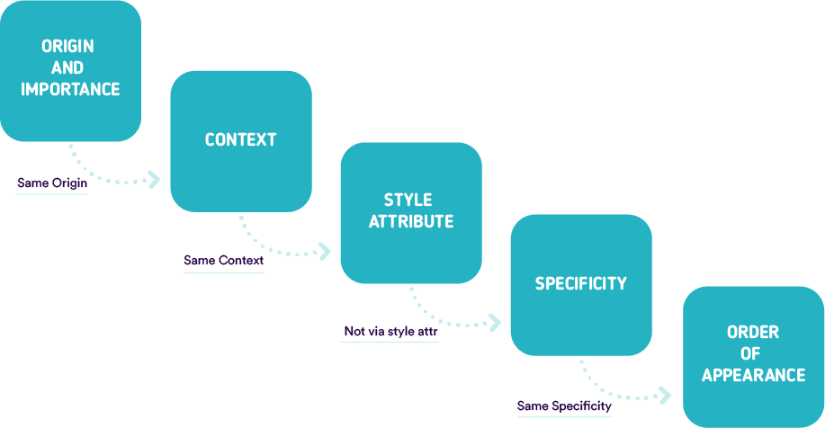
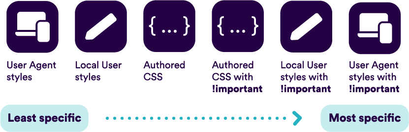
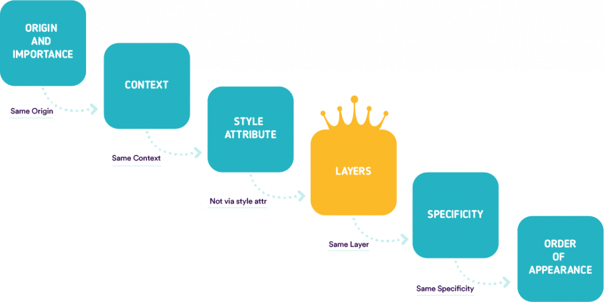

CSS emprega o algoritmo *CSS Cascade* para resolver declaracións en competencia que desexan ser aplicadas a un elemento determinado. 
A cascada considera algúns factores que se clasifican **de alta a baixa prioridade** para determinar que declaración se debe utilizar. Compróbanse un por un ata que se atopa unha declaración gañadora. A fervenza pasará ao seguinte nivel se non está claro que declaración de propiedade "gañará" nun nivel superior. 




## **Que é a orde en cascada?**

O CSS que creas non é o único CSS que usa unha páxina. A fervenza ten en conta a orixe do CSS: A folla de estilo interna do navegador, os estilos introducidos polas extensións do navegador ou o sistema operativo e o teu CSS de autor están todos involucrados. 

Orde da cascada:



O noso lugar como desenvolvedores web está obviamente **na fase de autor**. Como resultado, debemos tratar coa especificidade do selector e a orde de aparencia e o noso medio para controlar a fervenza. 

## **Especificidade e conflito de CSS**

Podes aplicar regras de estilo a calquera elemento usando os diferentes selectores dispoñibles. Os elementos, por exemplo, son menos particulares que as clases ou os atributos, que son menos específicos que os ID. 
Iso é o que chamamos **especificidade.** Podes velo como unha puntuación que determina que declaracións de estilo se aplican finalmente a un elemento. 
Cando dúas declaracións para o mesmo elemento se centran en atributos distintos, os estilos combínanse e o elemento mostra as propiedades de ambas as declaracións. **Así, cando dúas afirmacións non se contradín, fúndense.** 

Pero ás veces podes atoparte con algúns conflitos.  

**O HTML lese de arriba a abaixo** e o CSS vai do mesmo xeito. Cando se definen dous estilos separados para un elemento, **a declaración da parte inferior sempre gaña** . 
Podes anulalo usando o valor CSS especial **`!important`** pero debes ter moito coidado co seu uso. Esta palabra clave úsase para dar a maior especificidade á propiedade á que se aplica, anulando así as regras normais da cascada. 

## **Que é a denominación BEM?**

Para contrarrestar isto, algúns desenvolvedores web poden usar, por exemplo, o estándar de nomenclatura BEM para evitar anular accidentalmente a especificidade. 

Basicamente, cada "bloque" ten un único nome de clase no HTML e segue o estándar de **Bloque - Elemento - Modificador** . 
BEM impón unha metodoloxía que fai que a creación de CSS sexa máis ríxida pero tamén máis segura. É bastante sinxelo utilizar as diferentes clases producidas en todas as páxinas sen preocuparse polos conflitos. 
O código considérase entón como un conxunto de **ladrillos reutilizables, modulares e extensibles** . Mesmo é posible reutilizar certos ladrillos dun proxecto a outro sen atopar conflitos. 

Tamén comunica o propósito ou función dun compoñente, así como un baixo nivel de especificidade constante para os selectores de estilo. 

## **Onde encaixan as capas de cascada CSS na orde de cascada e por que é necesaria?** 

Non obstante, [manter estes estilos ordenados non sempre é posible](https://css.oddbird.net/layers/explainer/%23goals-or-motivating-use-cases-or-scenarios) , especialmente cando se trata de códigos de terceiros e sistemas de deseño complexos. 
Usar `!important`, por outra banda, é **unha mala práctica** e debe evitarse xa que complica a depuración ao interromper a cascada natural das follas de estilo. 
Cando dúas instrucións coa regra  `!important` chocan, a declaración coa maior especificidade aplícase ao elemento. 
É por iso que **as capas - layers- en cascada** pretenden resolver este problema introducindo **unha nova capa na cascada**: 



## **Cales son as capas en cascada CSS e como implementalas?**

Unha `@layer` en cascada pódese crear de [**3 formas diferentes**](https://translate.google.com/website?sl=auto&tl=gl&hl=es&u=https://developer.mozilla.org/en-US/docs/Web/CSS/@layer) . 

A primeira forma de especificalo é poñendo as regras CSS para esa capa **dentro dunha @layer at-rule** : 

```css
@layer base {
  /* algunhas regras css */
}
```

Tamén podes especificalo **cunha importación** : 

```css
@import(base.css) layer(base); 
```

E, finalmente, podes crear unha capa de cascada con nome sen asignar ningún estilo como este:

```css
@layer base;
```

### **Capas aniñadas** 

As capas pódense **agrupar, aniñar e organizar** como queiras: 

```css
@layer layer-1 {  
  p { color: red; } 
} 
@layer layer-2 {  
  p { color: yellow; } 
} 
@layer layer-3 { 
  @layer sub-layer-1 {  
    p { color: pink; }  
  } 
  @layer sub-layer-2 {  
    p { color: green; }  
  } 
  /* non aniñado */ 
  p { color: blue; } 
} 
```

### **@layer explicado cun exemplo**

A partir de aí, tes a posibilidade de crear **varias capas** e organizalas do xeito que queiras: 

```css
@layer base { 
  a { 
    color: red; /* ignorado */ 
  } 
  .link { 
    color: blue; /* ignorado */ 
  } 
} 
 
@layer typography { 
  a { 
    color: green; /* estilo de tódolos enlaces */ 
  } 
} 

@layer utilities { 
  .orange { 
    color: orange;  /* todos son laranxa */ 
  } 
}
```

Digamos que temos a seguinte pila de capas **na parte superior** do ficheiro CSS: 

```css
@layer base, typography, utilities;
```

Fará que todas as ligazóns aparezan en verde, excepto a *.orange* que será laranxa: 


Digamos agora que queres **inverter a orde** deste xeito: 

```css
@layer base, typography, utilities;
```

Como xa adiviñaches, todas as ligazóns serán vermellas e azuis, como podes ver na seguinte captura de pantalla: 


A precedencia da capa supera a especificidade do elemento.

### **Un caso de uso moi sinxelo**

Hai un caso de uso sinxelo para iso: **o reinicio de CSS** .

Algúns restablecementos - *resets*- fixérono previamente envolvendo cada selección **na pseudo-clase `:where()`** .
A pseudo-clase funcional `:where()` toma como argumento **unha lista de selectores** e apunta a calquera elemento que poida ser seleccionado por un dos selectores da lista.
A diferenza entre `:where()` e `:is()` é que `:where()` sempre terá **cero especificidade** mentres que `:is()` toma a especificidade do selector máis específico pasado como argumento.
A pesar de que `:where()` elimina toda a especificidade dos selectores aos que se aplica, ten que facerse **para cada selector por separado**. Dentro do reset, os conflitos deben ser abordados sen especificidade.

Usando capas, podemos encapsular a folla de estilo de restablecemento completa máis facilmente **usando a regra `@layer`**:

```css
/* reset.css */
@layer reset {
  /* todolos estilos de restablecemento aquí */
}
```

Debido a que os estilos en capas teñen unha prioridade máis baixa que os estilos "sen capas", este é un xeito sinxelo de comezar coas capas en cascada **sen ter que reescribir toda a base de código CSS** e sen encapsular cada selector individual.

## **Debemos usar capas en cascada CSS?**

[É cedo para usalas?](https://caniuse.com/css-cascade-layers) As capas en cascada son unha das novas caracteristicas de CSS 2022. Encetaron empregandose nas versións máis recentes de Firefox, pero tamén Chrome e Edge, engadiron o soporte completo para a partires da versión 99.


Xoga coas capas en cascada para entender mellor como usalas.
Todos os navegadores principais parecen estar integrados nesta especificación, polo que se espera un soporte máis amplo nun futuro próximo.
En calquera caso índa dispoñemos dalgunhas alternativas como as pseudoclases **`:where()`** e **`:is()`**.

## Máis Recursos

Para obter máis información sobre as capas en cascada CSS, podes botarlle unha ollada a isto:

- [MDN Web Docs](https://developer.mozilla.org/en-US/docs/Web/CSS/@layer) : @layer
- [Explicación das capas en cascada](https://css.oddbird.net/layers/explainer/)
- [O futuro do CSS](https://www.bram.us/2021/09/15/the-future-of-css-cascade-layers-css-at-layer/): capas en cascada

---

OUT 2023