Ata fai uns anos, se o teu desenvolvemento requiría ser compatible coas versións antigas dos navegadores, deseñar módulos web sensibles como listados en filas de N bloques implicaba crear unha interminable lista de estilos CSS e chamadas a medios que cambiaban dependendo da resolución dos distintos dispositivos aos que se quería chegar. E buscar a solución, a base de elementos “flotantes” ou manipulando as marxes laterais, ou usando elementos como bloques en liña - `inline-block`- non sempre era unha solución efectiva e moito menos elegante. 

Entón chegou Flexbox, para solucionar estes métodos e os seus inconvenientes.

 

## Que é Flexbox e como usalo.

Lembrar que, ante todo, hai que dispoñer de versións actualizados dos navegadores para poder acceder sen problemas ás últimas ferramentas.

[Flexbox](https://developer.mozilla.org/en-US/docs/Web/CSS/CSS_flexible_box_layout/Basic_concepts_of_flexbox), ou "*caixa flexible* ", ofrece unha solución para os desenvolvementos "responsivos". Permitindo crear un conxunto de elementos flexibles que se adaptan automaticamente ao contedor e cos que podemos controlar parámetros como a aliñación, a dirección (horizontal/vertical), o axuste da fila segundo tamaños,… que imos ver a continuación.

Flexbox é **compatible cos navegadores web máis importantes** desde xa fai bastantes versións atrás, aínda que nalgúns debamos utilizar prefixos CSS para o seu correcto funcionamento (ver [caniuse.com](https://caniuse.com/?search=flexbox) ). É pois unha tecnoloxía xa madura da que tamén dispoñemos de ferramentas de compilación como "[Autoprefixer](https://github.com/postcss/autoprefixer) " que podemos integrar no desenvolvementos que se poden integrar nos fluxos de traballo con manexadores de paquetes como Webpack, Parcel, Grunt, Gulp e outros… 

No momento de redactar este artigo, a [última definición de Flexbox publicada polo W3C](https://www.w3.org/TR/css-flexbox-1/) é do 19 de novembro de 2018.

Ata a aparición de Flexbox se empregaban catro formas de ordenar os elementos, tres de presentación (con variantes alternativas) e outra de posición:

- Elementos en liña (`display:inline`)
- Elementos de bloque (`display:block`)
- Elementos da táboa (`display:table`)
- Tipos de posición (`position: absolute/relative/fixed`)

Flexbox ben a ser unha mestura de todos eles en termos de como afecta ao deseño dunha estrutura de elementos contidos nunha capa principal ou contedor, e defínese como "flex" na propiedade "display" (`display:flex`). Podemos crear unha estrutura en liña de elementos semellante a unha táboa, ou facer que funcionen como un bloque ou en orde inversa, para adaptar automaticamente os contidos ao tamaño que necesitamos, tanto ao ancho como ao alto.

O W3C define esta estrutura como un "*fluxo flexible*" de elementos en dirección (arriba/abaixo/esquerda/dereita) e tamaño (ancho/alto) segundo os **eixes principal (horizontal) e transversal (vertical)** .


Imos logo a ver algúns exemplos.

 

## Exemplos de deseño usando Flexbox.

***IMPORTANTE:** Se non ves correctamente os seguintes exemplos, o máis probable é que o teu navegador non admita esta propiedade CSS. Tenta actualizalo ou velo noutro navegador.*

Para probar todas as posibilidades que ofrece Flexbox CSS, imos crear unha capa **`class="container"`** que actuará como a capa principal e sete **`class="element"`** numeradas . E por que sete? Aínda que pódese probar a colocar calquera número de elementos, para os exemplos, convénnos ter un número impar para ver tanto a ordenación como a adaptación e o seu resultado, e tamén para ter unha lista de elementos non moi curta. 

**HTML:**

```html
<div class="contedor">
  <div class="elemento">1</div>
  <div class="elemento">2</div>
  <div class="elemento">3</div>
  <div class="elemento">4</div>
  <div class="elemento">5</div>
  <div class="elemento">6</div>
  <div class="elemento">7</div>
</div>
```

Máis aló dos estilos de deseño definidos para a visualización dos exemplos, imos establecer inicialmente un tamaño de ancho do 25% para os elementos en relación co contedor principal. Para comezar a usar Flexbox engadimos a propiedade **"display:flex" ao contedor.**

**CSS EXEMPLO 1:**

```css
.contedor { display:flex; }
.elemento { width:25%; }
```

**EXEMPLO 1:**


Dado que aínda non definimos a dirección e o comportamento de tamaño que terán os elementos no noso contedor, e aínda que temos definido un ancho de elementos do 25%, este ancho adáptanse ao seu proxenitor, ocupando o 100% do ancho, entre a suma de todos eles. Por defecto, ten ese comportamento "flexible" como o seu nome indica.

Pero Flexbox é moito máis. 

### flex-direction / dirección flexible:

Vexamos a propiedade "**`flex-direction`**", que pode tomar 4 valores e aplícase ao contedor pai:

- **`flex-direction: row;`**  &rarr; **fila**: os elementos móstranse **de esquerda a dereita** (valor predeterminado, semellante ao exemplo 1)
- **`flex-direction: row-reverse;`**  &rarr; **fila inversa**: os elementos móstranse **de dereita a esquerda** .
- **`flex-direction: column`;**  &rarr; **columna**: os elementos móstranse **de arriba abaixo** .
- **`flex-direction: column-reverse;`** &rarr; **columna inversa**: os elementos móstranse **de abaixo arriba** .

**CSS EXEMPLO 2:**

```css
.contedor { 
  display:flex; 
  flex-direction:row-reverse; 
}
```

**EXEMPLO 2:**


Os elementos inverten a súa orde de visualización de dereita a esquerda, independentemente da orde de disposición.

 

**CSS EXEMPLO 3:**

```css
.contedor {
  display:flex;
  flex-direction:column;
}
```

**EXEMPLO 3:**

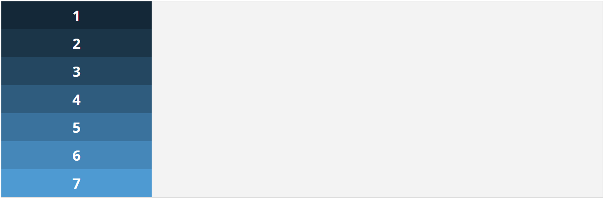

Os elementos móstranse nunha columna de arriba abaixo. Neste caso, dado que os elementos miden o 25% do contedor, a súa anchura si toma o valor indicado. Se eliminamos o ancho, as capas axustaranse ao tamaño do contedor, ocupando o 100% do ancho.

 

**EXEMPLO CSS 4:**

```css
.contedor {
  display:flex;
  flex-direction:column-reverse;
}
```

**EXEMPLO 4:**

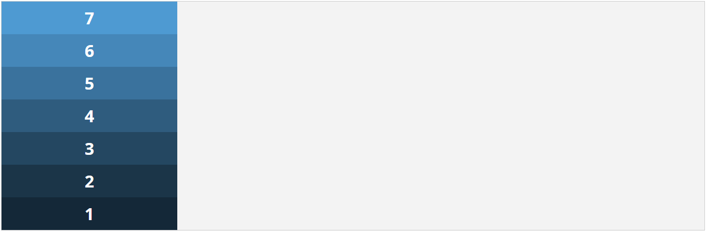

Os elementos móstranse formando unha columna de abaixo arriba, sen ter en conta a orde da disposición no código. O ancho funciona de forma similar ao exemplo 3.

 

### flex-wrap / envoltura flexible:

A continuación imos ver a propiedade " **flex-wrap** ", cuxo valor afecta a forma en que se distribúen os elementos nunha fila e, en consecuencia, o seu tamaño. Os posibles valores son:

-  **`flex-wrap:nowrap;`** &rarr; os elementos móstranse en liña, nunha soa fileira, e o seu tamaño encaixa no contedor sempre que a suma de todos eles sexa maior ou igual ao 100% do ancho do contedor. Se é máis pequeno, aínda se mostran en liña pero conservan o seu tamaño. Este é o valor predeterminado, e como vimos no *exemplo 1* , aínda que a anchura dos elementos é do 25% do contedor, todos aparecen en liña, modificando o seu tamaño para que a suma total non sexa superior ao 100% do contedor.
- **`flex-wrap:wrap;`** &rarr;  Os elementos móstranse en liña, pero se a súa anchura supera a do contedor, distribúense en varias filas.
- **`flex-wrap:wrap-reverse;`** &rarr;  Os elementos móstranse en liña, pero se a súa anchura supera a do contedor, distribúense en varias filas, e tamén o fan na orde inversa do esquema.

**CSS EXEMPLO 5:**

```css
.contedor {
  display:flex;
  flex-wrap:wrap;
}
```

**EXEMPLO 5:**


Como mencionamos nos valores de propiedade, neste caso os elementos móstranse en liña, pero como lle deramos un valor de ancho do 25% do contedor aos elementos, cando remata a fila os elementos continúan noutra, etc.

 

**CSS EXEMPLO 6:**

```css
.contedor{
  display:flex;
  flex-wrap:wrap-reverse;
}
```

**EXEMPLO 6:**


Este exemplo de ordenación Flexbox é moi curioso, xa que, ademais de adaptar tamaños por filas como no caso anterior, realiza a súa ordenación ao revés, de abaixo a arriba, e neste caso de esquerda a dereita (que é o seu significado por defecto).

Podemos modificar a dirección da orientación horizontal se tamén usamos **`flex-direction:row-reverse`**  como podemos ver no seguinte exemplo:

**CSS EXEMPLO 7:**

```css
.contedor{
  display:flex;
  flex-direction:row-reverse;
  flex-wrap:wrap-reverse;
}
```

**EXEMPLO 7:** 

### flex-flow / fluxo flexible:

Podemos especificar estas mesmas propiedades nun contedor usando  **`flex-flow`**  do seguinte xeito:

**fluxo flexible: <direction flexible> <envoltura flexible>** &rarr; **``flex-flow: <flex-direction> <flex-wrap>``**

Polo tanto, o código anterior podería verse así:

**CSS:**

```css
.contedor{
  display:flex;
  flex-flow:row-reverse wrap-reverse;
}
```

 

### justify-content / xustificar contido:

En canto á **aliñación horizontal** dos elementos en Flexbox, atopamos a propiedade **`justify-content`**, que aliña os elementos ao longo do eixe principal (*main axis*) do contedor, pero a diferenza do aliñamento dun texto, en Flexbox tamén hai que ter en conta a dirección dos elementos. Veremos isto máis claramente cos seguintes exemplos despois de definir os seus valores máis utilizados:

- **`justify-content:flex-start;`** &rarr; Aliña os elementos horizontalmente desde o inicio da dirección do eixe principal do contedor (a partir do inicio da liña). Este é o valor predeterminado. É importante ter en conta que, como veremos máis adiante, **a dirección establecida en "flex-direction" afecta ao aliñamento** .
- **`justify-content:flex-end;`** &rarr; Aliña os elementos horizontalmente desde o final da dirección do eixe principal do contedor (a partir do final da liña)
- **`justify-content:center;`** &rarr; Aliña os elementos co centro do eixe principal docontedor. Similar ao texto aliñado ao centro.
- **`justify-content:space-between;`** &rarr; Aliña os elementos xustificándoos ao longo do eixe principal do contedor. Similar ao texto xustificado. Os elementos laterais péganse aos extremos e o resto distribúense ao longo do eixe principal deixando o mesmo espazo entre eles.
- **`justify-content:space-around;`** &rarr; Aliñar os elementos distribuíndo os seus centros horizontalmente polo eixe principal do contedor, deixando o mesmo espazo de separación lateral ao principio, ao final e entre eles.

Esta propiedade enténdese mellor a través dun exemplo, xa que se tentamos  **`justify-content: flex-start`**  co resto das propiedades predeterminadas, obteremos un resultado similar ao de aliñar o texto á esquerda. Pero... e se a dirección é inversa? Neste caso obteriamos que a aliñación sería á dereita, xa que **o que Flexbox ten en conta para a aliñación dos elementos é o inicio da dirección do eixe** (sexa principal -horizontal- ou transversal -vertical-, como verá máis tarde).

**EXEMPLO CSS 8:**

```css
.contedor{  
  display:flex;
  flex-direction:row;
  flex-wrap:wrap;
  justify-content:flex-start;
}
```

**EXEMPLO 8:**

Neste caso vemos que a aliñación dos elementos está á esquerda do contedor. Agora imos invertir a súa dirección usando **`flex-direction:row-reverse`**  e ver que pasa:

**CSS EXEMPLO 9:**

```css
.contedor{
  display:flex;
  flex-direction:row-reverse;
  flex-wrap:wrap;
  justify-content:flex-start;
}
```

**EXEMPLO 9:**

Vemos que neste caso os elementos están aliñados á dereita. Podes pensar que **`justify-content:flex-start`**  non está a facer nada, xa que nos *exemplos 1 e 2* xa obtivemos estes resultados sen necesitar esta propiedade, pero... e se queremos que a dirección dos elementos sexa inversa pero aliñado á esquerda? Se cambiamos a propiedade a  **`justify-content:flex-end`**  obtemos este resultado, comprobando que realmente funciona:

**CSS EXEMPLO 10:**

```css
.contedor{
  display:flex;
  flex-direction:row-reverse;
  flex-wrap:wrap;
  justify-content:flex-end;
}
```

**EXEMPLO 10:**

A continuación comprobamos os valores de aliñación horizontal que xa vimos mediante exemplos, facendo modificacións no ancho dos elementos para entender mellor os seus efectos. Primeiro unha aliñación co centro:

**CSS EXEMPLO 11:**

```css
.contedor{
  display:flex;
  flex-direction:row;
  flex-wrap:wrap;
  justify-content:center;
}
.elemento{
  width:21%;
}
```

**EXEMPLO 11:**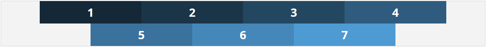

Agora veremos un aliñamento "xustificado". A separación entre a liña superior e inferior é diferente debido ao número de elementos entre elas:

**CSS EXEMPLO 12:**

```css
.contedor{
  display:flex;
  flex-direction:row;
  flex-wrap:wrap;
  justify-content:space-between;
}
.elemento{
  width:21%;
}
```

**EXEMPLO 12:**

E agora unha aliñación distribuíndo os seus centros horizontais. Neste caso podemos ver que se crean unha especie de “marxes laterais semellantes” entre os elementos (e entre liñas, dependendo do número de elementos que existan en cada unha delas).

**CSS EXEMPLO 13:**

```css
.contedor{
  display:flex;
  flex-direction:row;
  flex-wrap:wrap;
  justify-content:space-around;
}
.elemento{
  width:21%;
}
```

**EXEMPLO 13:**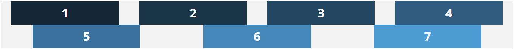

 

### elementos do aliñamento | aliñarse | aliñar contido / align-items | align-self | align-content:

O **aliñamento vertical** realízase a través do chamado **"eixe transversal"** , e para iso temos tres propiedades diferentes, "align-items", "align-self" e "align-content". Aquí vén o problema, xa que se non se entende o concepto, moitas veces obtéñense resultados inesperados. Vexamos o que nos di o W3C sobre estas propiedades:

- **"`align-items`"** establece o aliñamento predeterminado para todos os elementos do contedor, incluídos os elementos autónomos.
- **“`align-self`”** permite aliñar elementos independentes do contedor.
- **"`align-content`"** aliña as liñas/filas de elementos nun contedor.

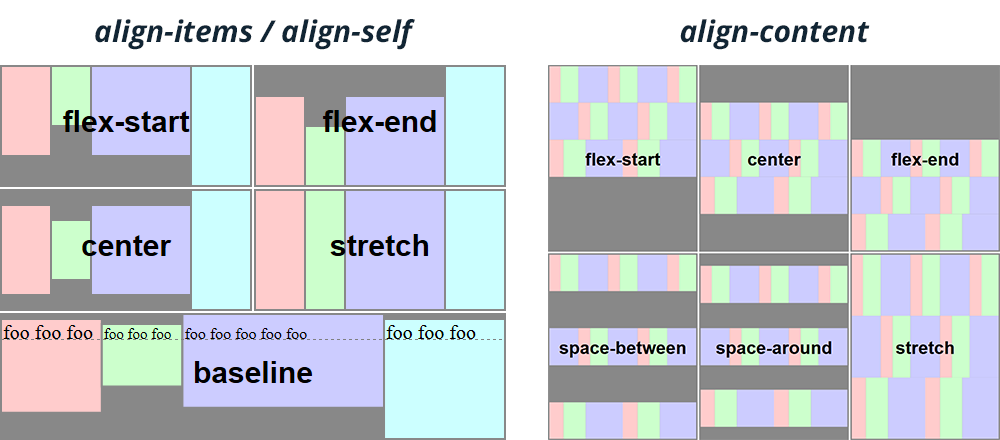

Polo tanto, **`align-items`** axuda **a aliñar os elementos** e  **`align-content`**  a **aliñar as súas filas**, mentres que **`align-self`**  permítenos **aliñar os elementos de forma independente** . Sabendo isto, podemos deducir que "`align-content`" só funciona cando temos máis dunha fila de elementos. A imaxe de arriba representa moi ben como funcionan estas propiedades. A continuación veremos os valores que pode tomar cada un deles (os valores de "`align-items`" son válidos para "`align-self`"):

- **`align-items:stretch;`** &rarr; Valor predeterminado. A altura dos elementos axústase ao tamaño do contedor (ou fila), dividindo o exceso de espazo entre todos os elementos por igual.

**EXEMPLO CSS 14:**

```css
.contedor{
  height:240px;
  display:flex;
  flex-flow:row wrap;
  justify-content:flex-start;
  align-items:stretch;
}
.elemento{
  width:21%;
}
```

**EXEMPLO 14:**

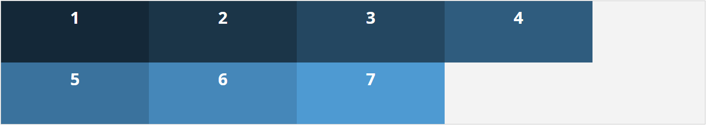

- **`align-items:flex-start;`** &rarr; Aliña os elementos verticalmente desde o inicio da dirección do eixe transversal do contedor (igual que ocorreu horizontalmente). Tamén **afecta o valor de "`flex-direction`" para a dirección da aliñación vertical** .

**EXEMPLO CSS 15:**

```css
.contedor{
  height:240px;
  display:flex;
  flex-flow:row wrap;
  align-items:flex-start;
}
.elemento{
  width:21%;
}
```

**EXEMPLO 15:** 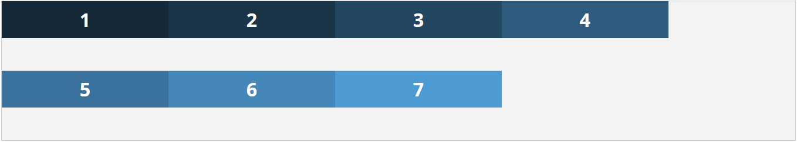

- **`align-items:flex-end;`** &rarr; Aliña os elementos verticalmente desde o final da dirección do eixe transversal do contedor (igual que ocorreu horizontalmente).

**EXEMPLO CSS 16:**

```css
.contedor{
  height:240px;
  display:flex;
  flex-flow:row wrap;
  align-items:flex-end;
}
.elemento{
  width:21%;
}
```

**EXEMPLO 16:**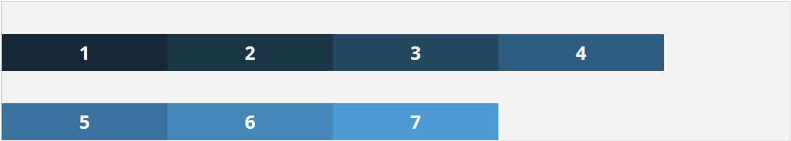

- **`align-items:center;`** &rarr; Aliña os elementos co centro vertical ao longo do eixe transversal do contedor.

**CSS EXEMPLO 17:**

```css
.contedor{
  height:240px;
  display:flex;
  flex-flow:row wrap;
  align-items:center;
}
.elemento{
  width:21%;
}
```

**EXEMPLO 17:**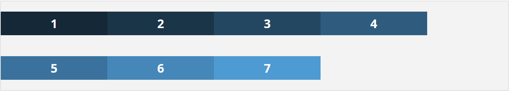

- **`align-items:baseline;`** &rarr; Aliña as "liñas de base" dos elementos verticalmente ao longo do eixe transversal do contedor. Para entender este exemplo, imos engadir algúns estilos diferentes aos elementos:

**CSS EXEMPLO 18:**

```css
.contedor{
  height:240px;
  display:flex;
  flex-flow:row wrap;
  align-items:baseline;
}
.elemento{
  width:21%;
  line-height:2rem;
}
.elemento:first-child{
  line-height:4rem;
}
.elemento:nth-child(3){
  font-size:1rem;
  line-height:1.2rem;
}
.elemento:nth-child(6){
  font-size:3rem;
  line-height:5rem;
}
.elemento:last-child{
  line-height:3rem;
}
```

**EXEMPLO 18:**

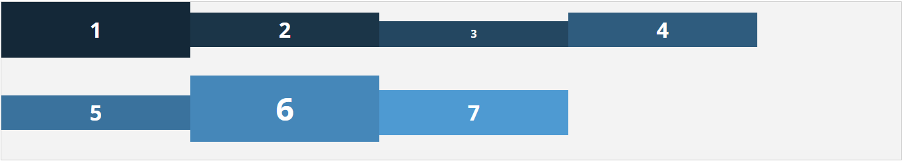

Como podemos ver, o que está aliñado verticalmente é a liña base do contido de cada elemento, neste caso, a liña base de cada número, aínda que teñen diferentes alturas ou tamaños de liña entre eles.

Vexamos a descrición dos valores da propiedade "`align-content`":

- **`align-content:stretch;`** &rarr; Valor predeterminado. A altura das filas axústase ao tamaño do contedor, dividindo o exceso de espazo entre todas as liñas por igual.

**CSS EXEMPLO 19:**

```css
.contedor{
  height:240px;
  display:flex;
  flex-flow:row wrap;
  align-content:stretch;
}
.elemento{
  width:21%;
}
```

**EXEMPLO 19:** 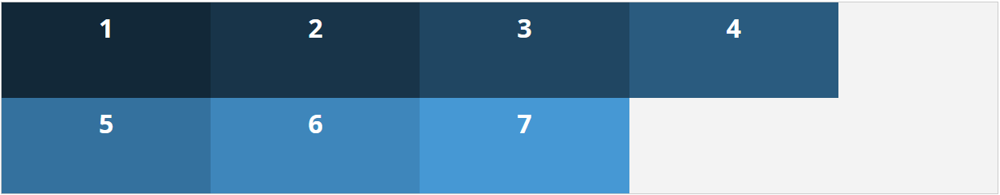

- **`align-content: flex-start;`** &rarr; Aliña as filas verticalmente desde o inicio da dirección do eixe transversal do contedor.

**CSS EXEMPLO 20:**

```css
.contedor{
  height:240px;
  display:flex;
  flex-flow:row wrap;
  align-content:flex-start;
}
.elemento{
  width:21%;
}
```

**EXEMPLO 20:** 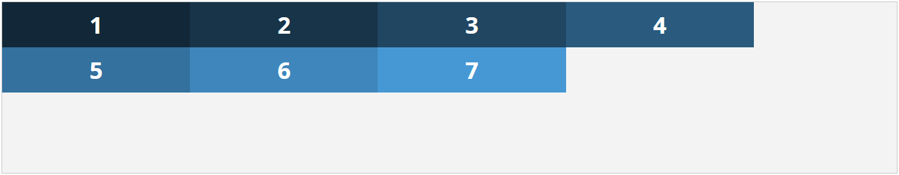

- **`align-content: flex-end;`** &rarr; Aliña as filas verticalmente desde o final da dirección do eixe transversal do contedor.

**EXEMPLO CSS 21:**

```css
.contedor{
  height:240px;
  display:flex;
  flex-flow:row wrap;
  align-content:flex-end;
}
.elemento{
  width:21%;
}
```

**EXEMPLO 21:**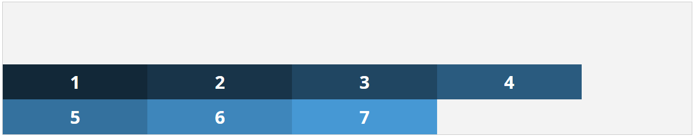

- **`align-content:center;`** &rarr; Aliña as filas co centro vertical ao longo do eixe transversal do contedor.

**CSS EXEMPLO 22:**

```css
.contedor{
  height:240px;
  display:flex;
  flex-flow:row wrap;
  align-content:center;
}
.elemento{
  width:21%;
}
```

**EXEMPLO 22:** 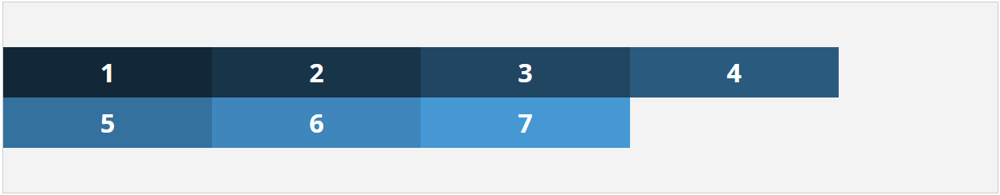

- **`align-content: space-between;`** &rarr; Aliña as filas xustificándoas ao longo do eixe transversal do contedor. Similar ao texto xustificado verticalmente. As filas superior e inferior están pegadas aos seus extremos e o resto distribúense ao longo do eixe transversal deixando o mesmo espazo entre elas.

**CSS EXEMPLO 23:**

```css
.contedor{
  height:240px;
  display:flex;
  flex-flow:row wrap;
  align-content:space-between;
}
.elemento{
  width:21%;
}
```

**EXEMPLO 23:**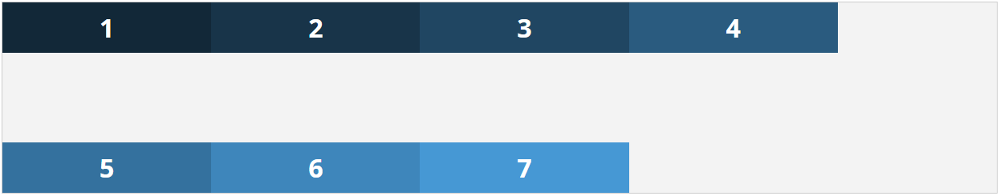

- **`align-content:space-around;`** &rarr; Aliñar as liñas distribuíndo os seus centros verticalmente ao longo do eixe transversal do contedor, deixando o mesmo espazo de separación vertical na parte superior, inferior e entre elas.

**CSS EXEMPLO 24:**

```css
.contedor{
  height:240px;
  display:flex;
  flex-flow:row wrap;
  align-content:space-around;
}
.elemento{
  width:21%;
}
```

**EXEMPLO 24:**

 

## Outras curiosas propiedades de Flexbox.

Ata agora vimos propiedades que inflúen na dirección, a aliñación e o tamaño dos elementos, filas e columnas (sen entrar en moitos detalles ) dun contedor Flexbox. Pero a continuación imos ver outras propiedades coas que podemos modificar elementos de forma independente, aumentando as posibilidades de presentación de sitios web e interfaces. 

### order:

Como vimos, con Flexbox non importa a orde de disposición dos elementos, e podemos alterar esa orde cunha soa instrución.

- **order:** &rarr; Coloca un elemento na orde asignada polo enteiro especificado na propiedade, tendo en conta o valor asignado ao resto dos elementos, cuxo valor por defecto é 0 (cero). Isto significa que, a non ser que se especifique unha orde para todos os elementos, calquera número aplicado a un só elemento levarao á última posición. Isto débese a que por defecto todos teñen “cero”, polo que se lle asignamos, por exemplo, “`order:3`” a calquera elemento, este colocarase ao final da lista. En lugar dunha orde, poderiamos chamalo "valor de posición de ordenación". O seguinte exemplo pode axudarnos a comprender mellor esta propiedade:

**CSS EXEMPLO 25:**

```css
.contedor{
  display:flex;
}
.elemento:nth-child(even){
  order:1;
}
```

**EXEMPLO 25:** 

Con este exemplo podemos entender mellor como funciona esta propiedade, e estamos asignando a orde/posición "1" a todos os elementos pares, que se colocan despois dos elementos impares, que por defecto terían o valor "0". 

### flex:

A propiedade “ **flex** ” se aplica aos elementos do contedor e, á súa vez, está estruturada por tres propiedades diferentes que se poden presentar por separado, **“flex-grow”, “flex-shrink”** e **“flex-base”**:

- **`flex: none | <flex-grow> <flex-shrink> <flex-basis>`**

Vexamos as propiedades por separado:

- **`flex-grow: <número>`** &rarr; crecemento flexible. Determina o factor de aumento de tamaño dun ou varios elementos en relación co resto, tendo en conta o espazo “baleiro” ou “libre” entre eles. Como espazo “baleiro/libre” referímonos ao espazo que non ocupan os elementos en relación coa súa fila. Cando se omite este valor, establécese en 1.
- **`flex-shrink: <número>;`** &rarr; Determina o factor de redución de tamaño dun ou varios elementos en relación co resto, tendo en conta o espazo “baleiro” ou “libre” entre eles. Cando se omite este valor, establécese en 1.
- **`flex-basis: auto | 0 | <width>`** &rarr; Especifica o tamaño principal inicial dos elementos tendo en conta o espazo "baleiro" ou "libre" entre eles. Cando se omite este valor, establécese en 0. Esta propiedade fai que, dependendo do valor asignado, o tamaño "base" se interprete como "todo o espazo" do elemento ou como o "**espazo sobrante**" do elemento. A continuación vemos un gráfico que explica como se interpretan estes valores en relación co tamaño do elemento.


Esta propiedade "flex" pode funcionar de diferentes xeitos dependendo do valor que establezamos e non podemos presentar todos os exemplos posibles que poidan ocorrer. O mellor neste caso é que intentes modificar directamente os seus valores cun esquema básico e así poder observar o seu comportamento. Ofrecémosche un punto de partida como o seguinte exemplo co que podes comezar a xogar co inspector de contido do teu navegador:

**CSS EXEMPLO 26:**

```css
.contedor{
  display:flex;
}
.elemento{
  flex:1 1 0;
}
.elemento:nth-child(4){
  flex-grow:3;
}
```

**EXEMPLO 26:** 

## Solución óptima para o deseño responsive.

Como vimos neste artigo, Flexbox é o complemento perfecto para a disposición de diferentes módulos de contido nunha lista e mediante pequenas propiedades para poder cambiar o seu aspecto, distribución, tamaño e aliñación para que se adapte sen problemas ao dispositivo. Aínda que aquí soó vexamos os exemplos mínimos de todo o que se pode facer. Con imaxinación e práctica pódese aplicar a multitude de casos e reducir moito o tempo de desenvolvemento. 

Feliz codificación!

 