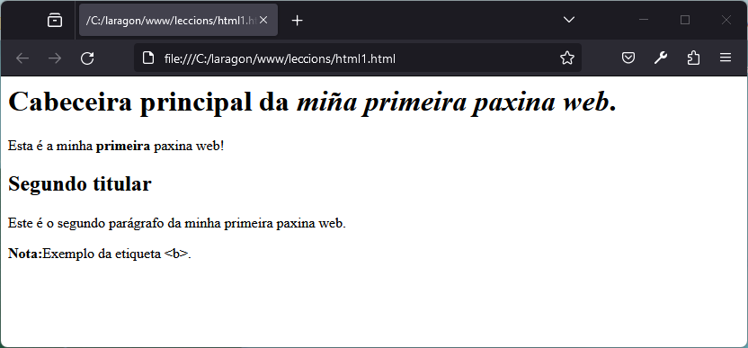
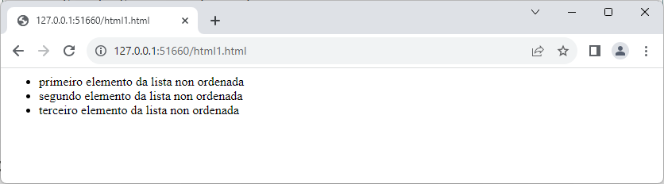
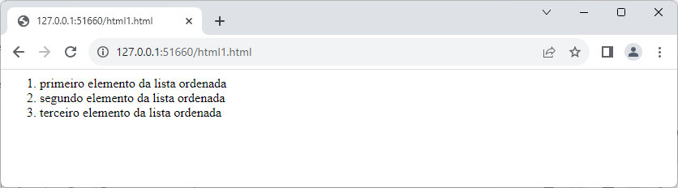
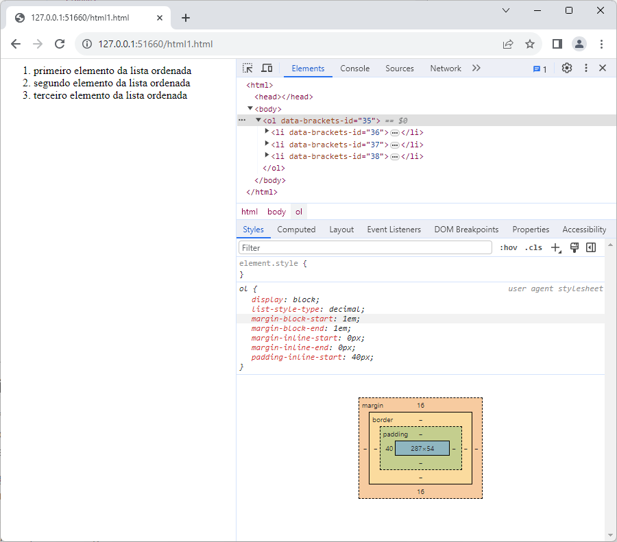

A finais dos anos 80, Tim Berners-Lee traballaba nun proxecto interno da Organización Europea para a Investigación Nuclear (CERN) que ía permitir o intercambio transnacional de información na súa rede de laboratorios, distribuídos entre Francia e Suíza. Aquel proxecto interno acabaría por converterse nas bases do que pronto acabaría por coñecerse como Internet ou World Wide Web. 

Como base daquela infraestrutura de intercambio de datos a traves das redes de comunicación, Berners-Lee utilizou unha linguaxe de hipertexto, un tipo de escritura baseado nunha linguaxe de marcado que buscaba transmitir información a través de documentos entrelazados por hipervínculos ao que denominou Hypertext Markup Language ou HTML.

Esta linguaxe, xunto a outros compoñentes como o protocolo de transferencia HTTP, o localizador de URL, ou os navegadores e servidores web, pronto se converterían na pedra angular da interconexión dixital global. 

Agora, trinta e poucos anos máis tarde, aprender a usar esta linguaxe de marcado é unha das primeiras tarefas que acometer se queres converterte nun desenvolvedor web.

Esta introdución repasa os principios básicos desta linguaxe de marcado, e apunta algúns consellos para novizos, co fin de que poidas encetar con coñecementos sólidos e que os teus primeiros pasos no desenvolvemento web sexan o máis firmes posible.

## HTML non é unha linguaxe de programación

En principio, HTML non é unha linguaxe de programación. Alo menos non no sentido de que a HTML non se lle pode pedir que resolva funcionalidades operacionais ou algoritmos de resolución de problemas.

HTML describe a estrutura dos contidos dunha páxina web cunha sintaxe estática baseada en texto, mentras as linguaxes de programación crean contido dinámico, resolven tarefas lóxicas complexas, e empregan de xeito funcional comandos e algoritmos. 

A diferenza das linguaxes de programación e scripts como PHP, JavaScript ou Python, HTML non se pode usar para crear algoritmos, tarefas, condicións ou bucles debido á súa falta de estrutura de comandos. Polo tanto, HTML pertence ás que se coñecen como **[linguaxes de marcado](https://www.bibliopos.es/Biblion-A2-Biblioteconomia/10Lenguajes-de-marcado.pdf)** [+](https://universidadeuropea.com/blog/que-es-lenguaje-marca/). 

## *Hyper Text Markup Language*

HTML é o acrónimo de "*Hyper Text Markup Language*" e, é unha das [linguaxes de marcado](https://www.wikiwand.com/es/Lenguaje_de_marcado) baseada en texto máis utilizadas no mundo. 

Tim Berners-Lee, inventor da World Wide Web, sentou as súas bases en 1992 coa primeira especificación HTML. O World Wide Web Consortium (W3C) declarou HTML 4.0 como estándar oficial en decembro de 1999.

A linguaxe HTML ten, entre outras, as seguintes características:

- HTML utiliza [etiquetas](https://developer.mozilla.org/en-US/docs/Web/HTML/Element) para describir e estruturar os elementos dun documento é convertelo nunha paxina web.
- A sintaxe de HTML é textual e uniforme, e estrutura un documento en seccións lóxicas. Estas seccións constan dunha etiqueta de apertura, ao inicio, e unha etiqueta de peche, ao final.
- HTML é unha *linguaxe de marcado* que transporta, a un tempo, a información e as instrucións para a súa presentación na pantalla, e incluindo enlaces que permiten relacionar distintos documentos entre eles.

## Marcado HTML

A **linguaxe de marcado de hipertexto** forma parte desas linguaxes informáticas que as máquinas poden comprender e que facilitan a interacción cos humanos. 

O marcado [HTML](https://www.ionos.es/digitalguide/paginas-web/desarrollo-web/que-es-html/) permite definir e articular **títulos, parágrafos, listas, táboas ou gráficos** nunha paxina, documento ou sitio web, de tal xeito que calquera navegador que poida interpretar ese código pode tamén mostrar visualmente cada elemento que conforma dito documento. 

HTML tamén pode proporcionar información adicional sobre o documento, o autor, a codificación de caracteres,... usando **metadatos**. 

Nos seus inicios HTML chegou a plantexarse como unha liguaxe completa de presentación. Máis agora, ao contrario do que acontecía nos seus inicios, HTML se emprega só para estruturar internamente a páxina e non para definir o seu aspecto visual, algo do que se ocupan linguaxes como [CSS (Cascading Style Sheets)](https://developer.mozilla.org/es/docs/Learn/CSS) .

HTML foi desenvolvido a partir da metanlinguaxe **SGML** (Standard Generalized Markup Language), un recoñecido estándar ISO (8879:1986) do que herdou a súa forma de escribir. Esta escritura baséase en definir cada elemento cun par de etiquetas ou etiquetas rodeadas de corchetes angulares, compostas por unha apertura `< >` e un peche ``</ >``. Ademáis tamén herdaría outras caracteristicas que lembran ao seu predecesor:

- **[Declaración do tipo de documento](https://www.freecodecamp.org/espanol/news/que-es-la-declaracion-en-html/)**: esta declaración, ao inicio do documento, proporciona información sobre o tipo de documento e a versión de HTML que se emprega para darlle forma: 

  ```html
  <!DOCTYPE HTML PUBLIC "-//W3C//DTD HTML 4.01//EN" "http://www.w3.org/TR/html4/strict.dtd">
  ```
  
-  **Uso de entidades**: para que poidan ser interpretadas correctamente e ser mostradas no navegador, os signos de puntuación, os caracteres acentuados ou os símbolos especiais tradúcense a [entidades HTML](https://developer.mozilla.org/es/docs/Glossary/Entity) (por exemplo, `&ntilde;` *para* "ñ" ou `&eacute;` para "é").

- **Comentarios**: usando determinado marcado integrado no mesmo documento, os desenvolvedores poden incluir comentarios que quedarán ocultos para as persoas que visualizan o documento nun navegador, pero que serán visibles e útiles para outros desenvolvedores que accedan ao código dese mesmo documento.

  ```html
  <!-- o navegador non representa os comentarios, aínda que o programador si pode velos cando edita o seu código -->
  ```
  
- **Atributos**: os elementos HTML teñen **atributos**, os atributos amplían a definición dos elementos e seguen o esquema 

  ```html
  <elemento atributo="valor">
  ```

## Que se necesita para escribir código HTML?

HTML é texto, un tipo especial de texto pero texto ao fin e ao cabo. Isto fai que non exixa grandes requirimentos, abonda con contar cun editor de texto plano ou *bloc de notas*, que se pode atopar en calquera sistema operativo.

Certo é que existen aplicacións especiais que ofrecen facilidades á hora de escribir: os editores de código.  Son aqueles editores con funcionalidades como:

- o **resaltado cromático** das etiquetas, que ofrece unha visión máis clara do código e permite detectar erros sintácticos ou de aniñado. 
- o **autocompletado**, que propón formas de expander ou completar etiquetas, incluso pechalas automaticamente.

Tamén existen os editores **WYSIWYG** - *"What You See Is What You Get" ("O que ves é o que obtés")*-, que permiten escribir e ver o resultado en tempo real. Desenvolvidos co obxectivo de permitir crear código HTML sen *case* coñecementos de linguaxe de marcado. Estes editores funcionan de forma similar a un procesador de textos, o texto articúlase mediante **funcións predeterminadas** dispoñibles nun menú, e sen necesidade de escribir manualmente as etiquetas, que o editor xera en segundo plano.

:eye: Descartados os editores de texto tipo *Office*!! :bomb:

## HTML básico: como estruturar texto con etiquetas

Se queres crear unha paxina web, a solución pasa inevitablemente en marcar todos os compoñentes formais do texto como tales utilizando os elementos estruturantes axeitados, o que non é outra cousa que entrar no mundo das etiquetas HTML.

### Define parágrafos coa etiqueta `<p>`

Este elemento, cuxa nomenclatura procede do inglés "paragraph", é necesario para crear separacións de parágrafos. A etiqueta de inicio `<p>` marca onde comeza o parágrafo e a etiqueta de peche `</p>` marca onde remata. O texto está escrito entre estas dúas etiquetas.

```html
<p>Este é un parágrafo.</p>
<p>E este outro parágrafo máis.</p>
```

### Engade títulos e subtítulos coa etiqueta `<h*>`

Os títulos tamén están entre os elementos básicos dun texto ben estruturado. Grazas aos marcadores estruturais non só podes marcar un título como tal senón que tamén tes a posibilidade de crear unha xerarquía de títulos principais e secundarios. Para iso tes as etiquetas de `<h1>` a `<h6>`.

`<h1>` representa o título principal da páxina, e é recomendable usalo só unha vez.

É importante manter unha **xerarquía correcta** e non utilizar os distintos niveis ao chou para que tanto o lector como o buscador poidan comprender a estrutura do texto a partir dos distintos títulos.

Para engadir un título principal e un título secundario a esta primeira páxina de proba podes usar os seguintes comandos:

```html
<h1>Cabeceira principal</h1>
<p>Este é un parágrafo.</p>
<h2>Segundo titular</h2>
<p>E este outro parágrafo máis</p>
```

**Nota**: nun documento HTML sen metadatos, algúns navegadores, como Firefox, non mostran correctamente acentos ou caracteres especiais. Polo que sería recomendable traducilos a [entidades HTML](http://ascii.cl/es/codigos-html.htm).

### Resaltar palabras ou fragmentos de texto: `<i>`, `<em>`, `<b>` e `<strong>`

Entre os elementos básicos do formato HTML tamén se atopan aquelas etiquetas que permiten destacar dalgún xeito palabras, frases ou fragmentos de texto, coa finalidade de dirixir a atención do lector sobre contidos clave ou elementos funcionais e axudalos a percibilos. Para **destacar** frases, expresións técnicas, comiñas ou reflexións **en cursiva** podemos utilizar as etiquetas `<i>` (itálica) ou `<em>` (énfase). Para destacar en negriña elementos sobre os que se debe chamar a atención do usuario podemos empregar os elementos `<b>` (negriña) e `<strong>`(forte énfase).

```html
<h1>Cabeceira principal da <i>miña primeira paxina web</i>.</h1>
<p>Esta é a minha <strong>primeira</strong> paxina web!</p>
<h2>Segundo titular</h2>
<p>Este é o segundo parágrafo da minha <en>primeira paxina web</em>.</p>
<p><b>Nota:</b>Exemplo da etiqueta &lt;b&gt;.</p>
```

**Nota**: para que o exemplo de código HTML non apareza como texto plano, escribimos os corchetes (< e >) como entidades HTML (\&lt; *e* \&gt;). 



<center><small>Vista do navegador da páxina de proba formateada</small></center>

### Crea listas con etiquetas `<ul>`, `<ol>` e `<li>`

Na edición de textos as listas son un medio moi útil para **desconxestionar parágrafos** e optimizar a lectura. Con HTML pódense crear listas con ou sen numeración, coas etiquetas `<ol>`(*ordered list*&rarr;lista ordeada) ou `<ul>`(*unordered list*&rarr;lista desordeada) respectivamente. Para definir os elementos da lista, emprégase `<li>`, que **só se pode usar se se combina coas dúas etiquetas de listas mencionadas** .

```html
<ul>
  <li>primeiro elemento da lista non ordenada</li>
  <li>segundo elemento da lista non ordenada</li>
  <li>terceiro elemento da lista non ordenada</li>
</ul>
```



Se queres crear unha lista numerada, só tes que cambiar a etiqueta que define o tipo de lista e marcala como lista ordenada con `<ol>`:

```html
<ol>
  <li>primeiro elemento da lista ordenada</li>
  <li>segundo elemento da lista ordenada</li>
  <li>terceiro elemento da lista ordenada</li>
</ol>
```



## Estrutura dunha páxina web con HTML

Os documentos HTML non só conteñen texto, ligazóns e outro tipo de contidos como imaxes ou vídeos, senón información que revelan non só ao navegador senón tamén aos **rastrexadores dos buscadores**, entre outros. Son os **metadatos**.

Algúns destes metadatos son invisibles para o usuario que abre unha páxina, pero outros móstranse na pestana do título, no historial ou como título nos resultados do buscador.

Reducido aos seus mínimos elementos necesarios, o código básico dunha páxina HTML sería algo así:

```html
<!DOCTYPE html>
<html lang="en">
<head>
  <meta charset="UTF-8">
  <meta name="viewport" content="width=device-width, initial-scale=1.0">
  <meta name="description" content="Aquí podes inserir toda a información sobre o marco básico HTML.">
  <title>Aprende HTML: o marco básico</title>
</head>
<body>
	<!-- Aqui iran os contidos da páxina -->
</body>
</html>
```

Un documento HTML está formado, segundo este exemplo, por tres seccións 

- Declaración do tipo de documento: `<!DOCTYPE html>`

- Datos de información para o navegador e metadatos: `<head>` 

- Corpo do documento: `<body>`

A primeira,  a **definición do tipo de documento**, é única. Debe aparecer antes da etiqueta `<html>` que encerra o contido do arquivo. DOCTYPE permite que a aplicación que le o documento - o navegador- saiba que estándar seguiu o programador. Neste caso HTML5, un tipo de documento que calquera navegador pode recoñecer e que permite utilizar tanto código actual como máis antigo.

**Na cabeceira** - `<head>` -, se inclúen a codificación de caracteres que debe utilizar o navegador ( *meta charset* ), a meta descrición, relevante para o motor de busca (`meta name="description"`) ou o título da páxina web (`<title>...</title>`), que aparece na parte superior do navegador. Ademais destes, que aínda que optativos son moi recomendables para favorecer unha boa avaliación por parte do buscador, tamén se poden engadir numerosos metadatos. A única excepción é o elemento `<title>` , xa que é o único obrigatorio nun documento HTML, xunto coa definición do tipo de documento. Máis tarde engadirase á cabeceira unha **ligazón ao arquivo CSS** onde se inclúen os aspectos de deseño e formato.

A etiqueta `<body>` marca o que o navegador ten que mostrar ao usuario.

**Nota**: *as etiquetas para a estrutura HTML básica son opcionais, é dicir, en teoría poderían non incluírse. Neste caso, o navegador crearía automaticamente as etiquetas `<html>` , `<head>` e `<body>` e subordinaría a elas os elementos correspondentes. Non obstante, é normal crealos. O desglose facilita a lectura do documento, o que beneficia especialmente aos principiantes.*



## Como incluír imaxes, vídeos ou gráficos nun sitio web

Non cabe dúbida de que o texto é o principal compoñente de calquera páxina web, pero os estímulos visuais en forma de imaxes, fotos ou gráficos teñen unha gran influencia na experiencia do usuario, o que os fai imprescindibles se queres deseñar unha páxina atraente... 

Cando se usan imaxes nun sitio web hai que ter en conta:

1. Que os navegadores soporten o formato de imaxe que imos a empregar. Os formatos selecionados deben ser compatibles con todos os navegadores.
2. O tamaño da imaxe. O peso da imaxe é un asunto moi debatido pois non debe supoñer un lastre na transmisión de datos - debe pesar o menos posible- pero mantendo a maior calidade posible; algo que non sempre é fácil de conseguir pois a resolución de pantalla dos dispositivos xoga tamén un papel relevante en como se presenta a imaxe.

### Formatos gráficos compatibles

Existen distintos formatos de imaxe que son plenamente soportados ou aceptados polos distintos navegadores. O máis complexo é acertar ao **elixir o formato axeitado**. Cada formato ten as súas avantaxas e os seus inconvenientes segundo o caso.

#### Vectores vs. mapa bits

Antes de analizar os formatos de imaxe compatibles para web, **é importante comprender a diferenza entre unha imaxe vectorial e un mapa de bits.** 

##### 1. Mapas de bits

**As imaxes de mapa de bits están formadas por píxeles ou cuadrículas que forman unha imaxe**. Cada un destes píxeles contén información de cor para un espazo específico da imaxe. Coñecidas tamén como imaxes *raster*, teñen o inconveniente de que ao agrandalas se compromete facilmente a calidade da imaxe.

Os formatos máis coñecidos de imaxes de mapas de bits usados na web son JPEG, GIF ou PNG. A maioría das fotos que podes ver en liña adoitan ter unha destas extensións, á que se lle engadiu máis tarde WebP.


##### 2. Vectores

Pola súa banda os gráficos vectoriais usan puntos, liñas e polígonos definidos aritmeticamente para representar unha imaxe. Os gráficos vectoriais non cambian a calidade ou definición aínda que se escalen. Son moi prácticos en gráficos con paletas de cor definidas como logos, gráficas ou ilustracións de debuxo dixital. Pódense axustar sen perda de calidade a múltiples contextos. **Algúns formatos son EPS, PDF, SVG e AI.**

### Cales son os mellores formatos de imaxe para a web?

#### JPG|JPEG

 *Joint Photographic Experts Group*, ou máis habitualmente **JPG**, ou tamén **JPEG**, é un dos formatos máis comúns, non só na web, senón tamén noutros medios. Se tes confusión entre JPG e JPEG, saber que en realidade son o mesmo formato, a diferenza está no xeito de referir o formato segundo o caso. O formato  JPG utilízase para fotografías, ou gráficos tipo fotográfico, con forte contraste e gran diversidade cromática, xa que pode representar máis de 16 millóns de cores. 

JPG é un dos formatos de imaxe web estándar. **Unha desvantaxe de JPG é a súa forma de compresión con perdas**, o que significa que, se poden comprimir considerablemente os arquivos - p.ex. para que pesen menos-, aínda que iso implica a unha perda de calidade da imaxe. O mellor e gardalas coa resolución e tamaño precisos. Moitas redes sociais teñen as súas propias medidas co fin de non comprometer a calidade da imaxe. 

#### PNG

*Portable Network Graphic* ou PNG é outro dos formatos de imaxe web estándar. Este é o formato para gráficos e logotipos, xa que pode representar entre 256 (PNG8) e 16,7 millóns de cores (PNG24). A diferenza do JPG, comprime sen perda cualitativa. E se parecen a a JPG en que non soportan ben o escaldo da imaxe. polo que é mellor que as imaxes se garden co tamaño no que se agarda que sexan usadas.

Un aspecto diferencial de PNG é que soporta a transparencia - parcial ou total- de zonas concretas do gráfico.

#### GIF

Os arquivos en formato GIF só poden representar ata 256 cores. Pero teñen algunhas avantaxes que os fan moi útiles no desenvolvemento web:  son óptimos para gráficos con poucos cores como elementos de navegación ou iconas e gráficos sinxelos, permiten crear pequenas animacións e admiten transparencia total de partes elixidas da imaxe. Permiten o uso de paletas selectivas de poucas cores e soen pesar moi pouco.

#### WebP

Outro formato popular aínda que algo menos coñecido. Creado por Google en 2010 como formato capaz de limitar a perda de calidade das imaxes empregadas na web. WebP é un formato de imaxe (baseado no formato de vídeo VP8) que admite compresión con  perdas e sen perdas, así como animación e transparencia alfa. WebP xeralmente ten mellor compresión que JPEG, PNG ou GIF e está deseñado para substituílos.

Outros formatos de maps de bits aínda que con un grao de soporte e penetración menor son: **[AVIF](https://caniuse.com/avif)** ou **[JPEG XL](https://jpeg.org/jpegxl/documentation.html)**. Con soporte Apple, ambos parecen deseñados para competir e/ou substituír WebP.

#### SVG

Dentro dos formatos de imaxe para web, SVG - *Scalable Vector Graphic-* **é o formato predeterminado para os gráficos vectoriais**. Compatible cos editores de imaxes, conserva as propiedades dos gráficos vectoriais, son escalables, admiten estilo, transparencia e animación. 

É o formato máis axeitado para logos, iconas ou ilustracións, que van a presentarse en distintos tamaños sen perda de calidade. Non é un formato axeitado para imaxes complexas ou cunha paleta complexa.

### Inserir unha imaxe nun documento HTML  

A etiqueta que permite engadir unha imaxe a un arquivo HTML é ``, á que se lle engade o atributo `src` onde se declara a dirección onde se almacena a imaxe para que o navegador saiba onde ir buscala.

Por cuestións de orde é recomendable crear un subcartafol do teu proxecto onde gardes tódalas imaxes que vas a empregar no teu sitio. Chámalle como desexes aínda que `images`, `img` ou `assets` parecen opcións consolidadas.

Supón que a imaxe chámase `graphic1.png` e está situada no cartafol `images`. A liña de código que debes escribir para integrar este elemento visual na túa páxina web sería:

```html

```

A etiqueta imaxe - `img`- ten outros atributos de imaxe, como ancho - `width`- ou alto - `height`- ( usados en contadas ocasións dado que convén crear gráficos co tamaño axeitado e porque estes valores soen ser ditados en todo caso polas follas de estilo); ou texto alternativo - `alt`-, este último de uso moi recomendable.

O atributo `alt`, permite escribir un texto alternativo para a imaxe. Este texto ten distintos obxectivos:

-  Aparece cando non se pode mostrar a imaxe.

- Mellora a **accesibilidade** da páxina xa que ofrece información sobre a fotografía en caso de problemas de visualización.

- Axuda aos robots **buscadores** a clasificar a imaxe.

- E conta como contido relevante para o posicionamento de contidos.


Ampliado con estes atributos, a inclusión dunha imaxe en HTML quedaría así:

```html

```

**Nota**: Se as variables de ancho e alto se corresponden coa medida orixinal da imaxe gráfica, declaralas é opcional.

## Os hipervínculos: como enlazar páxinas e contidos

Os hipervínculos - hyperlink- coñecidos popularmente como "ligazóns" ou "enlaces" - unha das principais razóns do éxito da World Wide Web-  son referencias electrónicas que **articulan os contidos** dun sitio e **levan ao usuario dunha páxina a outra** ou que inician algunha acción: descarga dun documento, envío dun formulario,... Sen hipervínculos non podería haber unha interacción nin unha interconexión como a que ofrece a rede de redes. 

Pódense distinguir tres tipos de ligazóns:

- **Internas**: as ligazóns internas articulan unha páxina web e orientan ao usuario na súa navegación. Esta estrutura interna pode ter varias formas, dende unha lineal, por exemplo, na que o usuario pode ir dunha páxina a outra dentro do sitio web nunha orde determinada, ata unha tipo árbore, na que dende a páxina principal o usuario elixe onde ir. Tamén é posible utilizar ligazóns internas na mesma páxina, cuxa función podería ser dirixir ao usuario ao comezo do texto unha vez que chegou ao final, saltar de sección en sección, apertura de xanelas modais...
- **Externas**: son ligazóns que envían ao usuario a outra páxina web e serven para ofrecer un valor engadido ou recomendar un servizo diferente. Neste caso, se se quere evitar unha avaliación negativa no buscador, é recomendable evitar un exceso de ligazóns externas, así como controlar regularmente a calidade do contido que se enlaza e o funcionamento da propia ligazón.
- **Outras ligazóns**: non todas as ligazóns enlazan a documentos HTML. Algúns tamén se refiren as descargas de documentos    , abrir o cliente de correo electrónico ou activar o visor de PDF.

Para xerar unha ligazón utilízase a etiqueta HTML `<a>`, que deriva de *anchor* - áncora-, e cuxa función é simplemente indicar que a información enmarcada alí é unha ligazón. A etiqueta ten un atributo obrigado `href` (hiperreferencia), que sinala a onde nos leva a ligazón. O texto da ligazón, o que o navegador mostra, por defecto aparece noutra cor - azul, se non se lle da estilo- e subliñado - tamén se non se determina o estilo-.

Ao incluír unha ligazón na páxina - paxina de referencia- enlazámola a outra páxina - páxina de destino-.

```html
<a href="targetpage.html">Ir á paxina de destino</a>
```

Se a páxina que se vai ligar non está no directorio principal, debes indicar o camiño que leva ao subcartafol onde está gardada, *subcartafol/targetpage.html*: 

```html
<a href="./subcartafol/targetpage.html">
```

Se é unha paxina externa noutro dominio, a ligazón apuntará a URL de destino:
```html
<a href="https://www.bitsolto.com/targetpage.html">
```

Os hipervínculos a contidos externos afastan aos visitantes da túa páxina e, aínda que poden volver **premendo o botón "atrás" do navegador** (←), non se pode confiar en que o fagan. Non obstante, existe a posibilidade de que a páxina enlazada se abra automaticamente nunha nova pestana ou xanela, de xeito que a primeira páxina (a túa páxina) permaneza aberta. Para isto engadimos o atributo `target` que se encargará de describir como se debe abrir o documento ligado. Por exemplo co valor ``_blank`` (en branco) se indica que se abrirá o contido nunha nova xanela.

```html
<a href="https://www.bitsolto.com/targetpage.html" target="_blank">Blog Bitsolto</a>
```

## Recta final

Nesta introdución ao HTML, vimos como introducir contidos e como crear e ligar documentos HTML, pero só poderás ver as páxinas que crees no teu navegador. Se queres ensinalos a outras persoas, verás que non é posible, porque tanto as paxinas HTML como as imaxes que incluíches nelas están **situadas no teu ordenador**, polo que non se poderán entregar a un navegador que realiza o solicitude desde outro ordenador. Se queres mostrar ao mundo os teus contidos, debes rexistrar un novo dominio en Internet, contratar un servizo de hospedaxe, e aloxar alí o teu proxecto.

O primeiro paso é buscar un dominio (*enderezo web*) para o proxecto e rexistralo nun provedor de Internet. Unha vez feito isto, o seguinte paso é proporcionar a base máis adecuada para o proxecto configurando o teu propio **servidor web** ou alugándoo a un provedor de hospedaxe web. Ao alugar un servidor web evitas ter que ocuparte ti mesmo da **selección, instalación e mantemento** do software do servidor, podes escoller o paquete que mellor se adapte ao teu proxecto - espazo, recursos,...-.

Por último, deberás subir os documentos HTML que compoñen a túa web ao espazo web que tes á túa disposición. Para iso necesitas un **programa de transferencia de arquivos ou FTP** (File Transfer Protocol). Este programa cliente permítelle intercambiar datos co servidor FTP do teu provedor mediante o protocolo que lle dá o seu nome. Toda a información que precisa para acceder ao servidor FTP, así como outro tipo de instrucións, será proporcionada polo provedor onde alugas o espazo web.

## CSS e JavaScript: por que HTML é só o comezo

Aínda que HTML constitúe a base de toda páxina web, o seu papel no desenvolvemento web moderno non actúa só. HTML xa non inclúe indicacións de deseño visual. Esta tarefa recae na linguaxe de follas de estilo CSS ou as follas de estilo en cascada. CSS permite definir a **cor** dos distintos elementos da páxina, a súa **composición** básica ou o **formato** de pasaxes de texto, títulos ou outros elementos de contido, dándolle ás páxinas un aspecto visual atractivo e contemporáneo. Esta estrita separación entre contido e deseño facilita moito a análise e o mantemento dos proxectos máis complexos. Todo isto fai que sexa necesario tratar con esta linguaxe web unha vez que xa estea familiarizado co HTML.

Outro compoñente básico do deseño web moderno é JavaScript, coa axuda do cal se inclúen **elementos dinámicos** nas páxinas HTML que permiten aos usuarios interactuar coa páxina.

É recomendable desenvolver un certo grao de comprensión básica destes tres piares da programación web para poder empregalas correctamente ou saber atopar o erro en caso de que te atopes con problemas.

---

OUT 2023