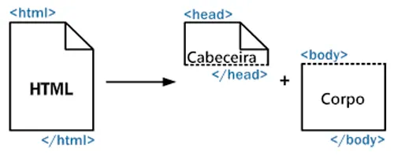
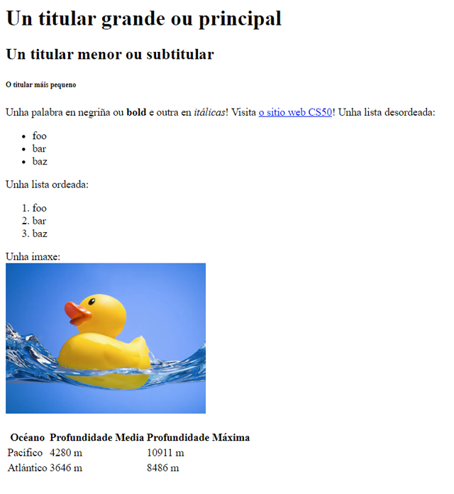
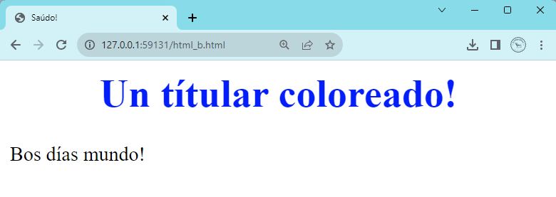
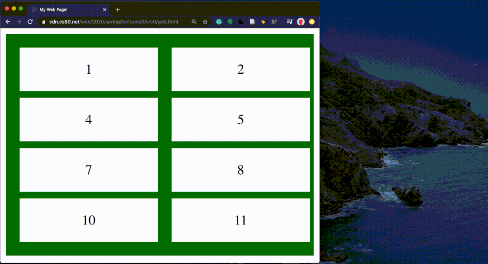
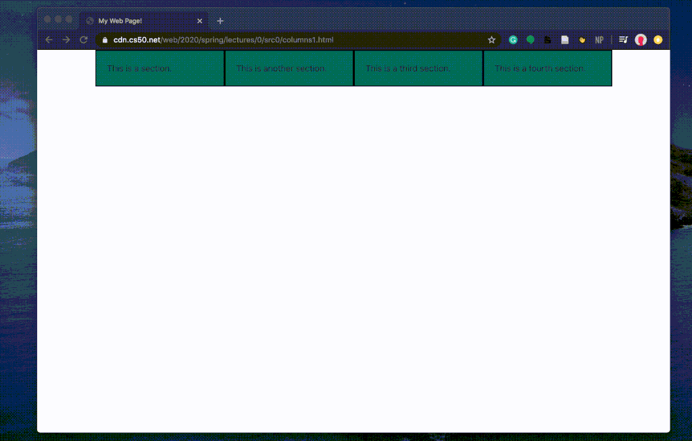
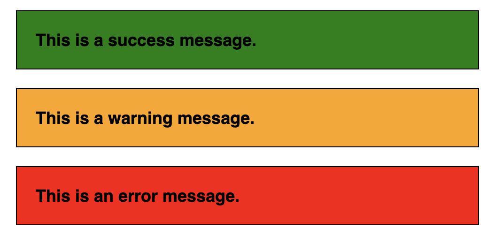

HTML é unha linguaxe de marcado que define a estrutura dunha páxina web. É unha linguaxe que o teu navegador web (Brave, Safari, Chrome, Firefox, etc.) interpreta para mostrar contido na pantalla.

- Un arquivo HTML sinxelo:

```html
<!DOCTYPE html>
<html lang="gl">
  <head>
    <title>Saúdo</title>
  </head>
  <body>
    Bos días mundo!
  </body>
</html>
```

- Cando abrimos este arquivo no noso navegador, obtemos:


Analizamos o arquivo que acabamos de crear:
- Na primeira liña, declaramos (ao navegador web) que estamos fronte a un documento escrito na última versión de HTML: [HTML5](https://html.spec.whatwg.org/multipage/).

- Despois diso, a páxina consta de algúns **[elementos HTML](https://developer.mozilla.org/es/docs/Web/HTML/Element)** aniñados (como `html`, `head` ou `body`), cada un cunha **etiqueta de apertura e outra de peche** marcada coma `<elemento>` para a apertura e `</elemento>` para o peche.



- Os elementos HTML poden incluír **atributos** , que proporcionan ao navegador información adicional sobre dito elemento. Por exemplo, cando incluímos `lang="gl"` na etiqueta `html` inicial, estamos indicándolle ao navegador cal vai ser o idioma principal dos contidos e axudaremos aos buscadores a indexalos mellor.

- Dentro do elemento HTML, por norma, incluiremos unha etiqueta `head` e outra `body`. O elemento `head` incluirá información sobre a páxina - aínda que dita información non se destine a ser amosada necesariamente - e o elemento `body` conterá o que finalmente resultará visible para as persoas que visitan o sitio.

- Dentro do elemento `head`, se inclúe un elemento `title` que contén o título da páxina web. Verás que ese título é o que aparece na pestana da xanela que amosa a páxina no navegador web.

- Finalmente, inclúese o texto "Bos días mundo!" no corpo ou `body`, que é a parte que contén a información visible da páxina.

- Notarás que no marcado, cada un dos elementos internos se sangra un pouco en relación co anterior. Aínda que iso non é necesario e será ignorado polo navegador, será moi útil para ler, entender e manter o propio código.

### Modelo de obxectos do documento (DOM)


O DOM é un xeito cómodo de visualizar a forma en que os elementos HTML se relacionan entre si mediante unha estrutura tipo árbore. Arriba se amosa un exemplo do deseño DOM para a páxina que acabamos de crear.

### Máis elementos HTML

Hai moitos elementos HTML que podes querer usar para personalizar a túa páxina, incluíndo títulos, listas e seccións,... Neste seguinte exemplo, veremos algúns destes elementos en acción.

Como tamén se poden engadir comentarios empregando o marcado `<!-- -->` , usarémolos a continuación para explicar algúns dos elementos.

```html
<!DOCTYPE html>
<html lang="gl">
    <head>
        <title>Elementos HTML</title>
    </head>
    <body>
        <!-- Se poden crear titulares - headings - usando as etiquetas h1, h2,... até h6. -->
        <h1>Un titular grande ou principal</h1>
        <h2>Un titular menor ou subtitular</h2>
        <h6>O titular máis pequeno</h6>

        <!-- As etiquetas strong e i devolven texto en negriñas ou itálicas respectivamente. -->
        Unha palabra en negriña ou <strong>bold</strong> e outra en <i>itálicas</i>! Aínda que para estás últimas poidas empregar <em>... </em>; e reservar <i> para declarar iconas - coma no caso de Fontawesome ou as iconas de de Bootstrap, entre outras.

        <!-- Se pode enlazar outra paxina (como a paxina de CS50) usando a etiqueta anchor: a -->
        Visita <a href="https://cs50.harvard.edu/">o sitio web CS50</a>!

        <!-- Se poden crear listas desordeadas con ul ou kistas ordenadoas con ol. ambos tipos de lista conteñen elementos li, ou items da lista. -->
        Unha lista desordeada:
        <ul>
            <li>foo</li>
            <li>bar</li>
            <li>baz</li>
        </ul>
        Unha lista ordeada:
        <ol>
            <li>foo</li>
            <li>bar</li>
            <li>baz</li>
        </ol>

        <!-- As imaxes requiren o atributo src, que pode ser un arquivo do teu ordenador ou un enlace a unha imaxe en liña. Tamén inclúen o atributo alt, que prové unha descrición no caso de que a imaxe non se poida cargar. -->
        Unha imaxe:
        
        <!-- Neste elemento img pódese ver como en algúns elementos, que non conteñen a outros, non se precisa a etiqueta de peche. -->

        <!-- A seguir, se emprega a etiqueta br para engadir un salto de liña en branco. -->
        <br/> <br/>

        <!-- As táboas requiren un grupo de etiquetas organizadas para determinar as filas e columnas que as conforman. -->
        <table>
            <thead>
                <th>Océano</th>
                <th>Profundidade Media</th>
                <th>Profundidade Máxima</th>
            </thead>
            <tbody>
                <tr>
                    <td>Pacífico</td>
                    <td>4280 m</td>
                    <td>10911 m</td>
                </tr>
                <tr>
                    <td>Atlántico</td>
                    <td>3646 m</td>
                    <td>8486 m</td>
                </tr>
            </tbody>
        </table>
    </body>
<html>
```

Esta páxina, cando se *renderiza*, ten un aspecto así:



No caso de que te preocupen tantas etiquetas, debes saber que non terás que memorizar estes elementos. É moi sinxelo buscar simplemente algo como *"imaxe en HTML"* para atopar documentación sobre a etiqueta `img`. Un recurso que te pode resultar útil para coñecer estes elementos é a paxina da [MDN](https://developer.mozilla.org/en-US/docs/Web/HTML/Element) ou a [W3 Schools](https://www.w3schools.com/tags/default.asp) .

### Formularios

Un obxectivo de moitos sitios web é recoller información dos usuarios. HTML dispón dun conxunto de elementos realmente importante para este cometido e á hora de crear os coñecidos [formularios web](https://developer.mozilla.org/en-US/docs/Learn/Forms).

Os formularios poden permitir que as persoas introduzan información. Poden conter varios tipos de entrada ou recompilación de datos. Hai que decir que os formularios HTML non completan a acción de envío e recepción de datos, que dependen de linguaxes de guión preparados para eses cometidos.

Do mesmo xeito que con outros elementos HTML, non hai necesidade de memorizalos. A práctica axudaráche a familiarizarte cos elementos máis comúns e senón en Internet atoparás excelentes recursos para aprender máis sobre eles.

```html
<!DOCTYPE html>
<html lang="gl">
  <head>
    <title>Formularios HTML</title>
  </head>
  <body>
    <form>
      <input type="text" placeholder="Nome" name="nome">
      <input type="password" placeholder="Contrasinal" name="contrasinal">
      <div>
        Cor favorito:
        <input name="color" type="radio" value="azul"> Azul
        <input name="color" type="radio" value="verde"> Verde
        <input name="color" type="radio" value="amarelo"> Amarelo
        <input name="color" type="radio" value="vermello"> Vermello
      </div>
      <input type="submit">
    </form>
  </body>
</html>
```


## CSS (follas de estilo en cascada)

- CSS úsase para personalizar a aparencia dun sitio web.
- Mentres estamos creando un sitio podemos engadir un atributo de estilo a calquera elemento HTML para aplicarlle algo de CSS.
- Podemos cambiar o estilo dun elemento alterando as propiedades CSS. Por exemplo escribindo algo como `color: blue` ou `text-align: center`
- No seguinte marcado, facemos un lixeiro cambio no primeiro arquivo de exemplo para incluír un título de cor azul:

```html
<!DOCTYPE html>
<html lang="gl">
  <head>
    <title>Saúdo!</title>
  </head>
  <body>
    <h1 style="color: blue; text-align: center;">Un títular coloreado!</h1>
    Bos días mundo!
  </body>
</html>
```



- Se aplicamos estilo un elemento tódolos elementos internos [adoptan automaticamente ese estilo](https://developer.mozilla.org/es/docs/Web/CSS/Inheritance). Podes ver isto se moves o estilo que acabamos de aplicar desde a etiqueta `h1` á etiqueta `body`:

```html
<!DOCTYPE html>
<html lang="gl">
  <head>
    <title>Saúdo!</title>
  </head>
  <body style="color: blue; text-align: center;">
    <h1>Un títular coloreado!</h1>
    Bos días mundo!
  </body>
</html>
```


- Aínda que podemos darlle estilo á nosa páxina web con estilos en liña mesturándoo co marcado HTML, esta non é unha boa práctica e non se recomenda. O axeitado e separar o estilo nun bloque de código ou nun arquivo independente.

  - Unha forma de facelo é engadir o estilo entre as etiquetas `<style>` ...`</style>` dentro do elemento `head`. Dentro destas etiquetas, escribimos a que elementos queremos aplicar estilo e o estilo que queremos aplicarlles. Por exemplo:

  ```html
  <!DOCTYPE html>
  <html lang="gl">
    <head>
      <title>Saúdo!</title>
      <style>
        h1 {
          color: blue;
          text-align: center;
        }
      </style>
    </head>
    <body>
      <h1>Un títular coloreado!</h1>
      Bos días mundo!
    </body>
  </html>
  ```

  - Outra forma de engadir estilo con CSS é incluír un elemento `<link>` no `head` do documento HTML cunha ligazón a un arquivo `styles.css` que conteña o estilo desexado. Entón, o arquivo HTML se vería así:

  ```html
  <html lang="gl">
    <!DOCTYPE html>
    <head>
      <title>Saúdo!</title>
        <link rel="stylesheet" href="styles.css">
    </head>
    <body>
      <h1>Un títular coloreado!</h1>
      Bos días mundo!
    </body>
  </html>
  ```

  E o arquivo chamado `styles.css` contería un código así:

  ```css
  h1 {
    color: blue;
    text-align: center;
  }
  ```

- Hai demasiadas [propiedades CSS](https://carontestudio.com/blog/listado-de-propiedades-css/) para enumeralas agora aquí, pero do mesmo xeito que cos elementos HTML, é fácil buscar algo en Internet como *"cambiar a cor do texto con CSS"* para obter resultados orientadores. Aínda así, enumeramos aquí algunhas das máis comúns:

  - `color`: a [cor](https://developer.mozilla.org/es/docs/Web/CSS/color) do texto
  - `text-align`: [aliñado](https://developer.mozilla.org/es/docs/Web/CSS/text-align) dos elementos na páxina
  - `background-color`: determinar calquera cor para usar no [fondo da paxina](https://developer.mozilla.org/es/docs/Web/CSS/background)
  - `width`: en píxels ou porcentaxes da páxina
  - `height`: en píxels ou porcentaxes da páxina
  - `padding`: canto espazo ou [acolchado](https://developer.mozilla.org/es/docs/Web/CSS/padding) debe quedar entre un contido e o seu [contedor](https://developer.mozilla.org/es/docs/Learn/CSS/Building_blocks/The_box_model)
  - `margin`: canto espazo ou [marxe](https://developer.mozilla.org/es/docs/Web/CSS/margin) se debe deixar fóra dun elemento ou contedor
  - `font-family`: [tipo de letra](https://developer.mozilla.org/es/docs/Web/CSS/font) para o texto da páxina
  - `font-size`: tamaño do texto en píxels ou outras [unidades de medida](https://developer.mozilla.org/es/docs/Learn/CSS/Building_blocks/Values_and_units) compatibles
  - `border`: [grosor](https://developer.mozilla.org/es/docs/Web/CSS/border-width), [tipo](https://developer.mozilla.org/es/docs/Web/CSS/border-style) (sólido, discontinuo, etc.) e [cor](https://developer.mozilla.org/es/docs/Web/CSS/border-color) do [bordo](https://developer.mozilla.org/es/docs/Web/CSS/border)

Usemos algo do que acabamos de aprender para mellorar a nosa táboa de océanos que empregamos de exemplo antes. Ao que lle engadiremos un pouco de estilo CSS:

```html
<!DOCTYPE html>
<html lang="gl">
  <head>
    <title>Táboa con estilo</title>
    <style>
      table {
        border: 1px solid black;
        border-collapse: collapse;
      }

      td {
        border: 1px solid black;
        padding: 2px;
      }

      th {
        border: 1px solid black;
        padding: 2px;
      }
    </style>
  </head>
  <body>
    <table>
      <thead>
        <th>Océano</th>
        <th>Profundidade Media</th>
        <th>Profundidade Máxima</th>
      </thead>
      <tbody>
        <tr>
          <td>Pacífico</td>
          <td>4280 m</td>
          <td>10911 m</td>
        </tr>
        <tr>
          <td>Atlántico</td>
          <td>3646 m</td>
          <td>8486 m</td>
        </tr>
      </tbody>
    </table>
 </body>
</html>
```

O que nos deixa unha táboa con mellor aspecto:


- Quizais notes que hai algunha repetición innecesaria neste CSS, xa que `td` e `th` teñen o mesmo estilo. Podemos (e debemos) condensar isto ata obter un *código máis limpo*, por exemplo uníndoos nunha soa declaración e usando unha coma entre eles para mostrar que o estilo debería aplicarse a máis dun tipo de elemento.

```css
table {
  border: 1px solid black;
  border-collapse: collapse;
}

td, th {
  border: 1px solid black;
  padding: 2px;
}
```

Esta é unha breve introdución ao que se coñece como **selectores CSS**.

Hai moitas formas de determinar cales son os elementos HTML aos que vamos a dar estilo. As máis habituais son:

- **etiqueta ou tipo de elemento**: isto é o que estivemos facendo ata agora: dar estilo a todos os elementos do mesmo tipo.

- **id**: Outra opción é darlle aos nosos elementos HTML un atributo `id`: `<h1 id="first-header">Bos días mundo!</h1>` e despois aplicar un estilo usando o hashtag `#first-header{...}` para indicar que estamos a sinalar o elemento polo seu identificador único. É importante destacar que non debería haber dous elementos co mesmo ID e que ningún elemento pode ter máis dun ID.

- **class**: Declaramos unha clase usando un punto antes do nome da mesma en lugar dun hashtag:

  `.muted {...}`.

  Ao contrario dos identificadores `id`, unha clase pode ser compartida por máis dun elemento e un só elemento pode ter máis dunha clase. Engadimos clases a un elemento HTML como este: `<h1 class="page-text muted">Saúdo!</h1>` (ver que acabamos de engadir dúas clases - `page-text`e `muted` - ao elemento `h1`).

### [Depurar CSS](https://developer.mozilla.org/es/docs/Learn/CSS/Building_blocks/Debugging_CSS)

*Que ocorre cando un encabezado debe ser vermello segundo a súa clase pero azul segundo o seu ID?*

Moitas veces deberás tratar co problema dos CSS potencialmente conflitivos.

CSS ten a característica da [especificidade](https://developer.mozilla.org/es/docs/Web/CSS/Specificity) que controla dalgún xeito a resolución de conflitos entre as declaracións asociadas a un documento HTML discernindo entre cal delas é mási especifica. A especificidade ten unha orde de máis especificidade a menos:

1. **estilo en liña** - moi especifico - aínda que se considere unha non moi boa práctica
2. **id** - menor especificidade e de uso limitado
3. **clase** - aínda menos especifico pero moi extensivo
4. **tipo de elemento** - xenérico e de menor especificidade

- Ademais da coma para varios selectores, hai varias outras formas de especificar cales son os elementos aos que se quere aplicar estilo. Esta táboa ofrece algunhas posibilidades máis comúns:


| selectores | descrición |
| :--- | :--- |
| `a`, `b` | Selector de elementos múltiples |
| `a b` | Selector de descendentes |
| `a > b` | Selector de fillos |
| `a + b` | selector de irmáns adxacentes |
| `[a=b]` | Selector de atributo |
| `a:b` | Selector de pseudoclase |
| `a::b` | Selector de pseudoelemento |

- **Selector descendente**: aquí, usamos o selector descendente para aplicar un estilo só aos elementos da lista que se atopan nunha lista sen ordenar:

```html
<!DOCTYPE html>
<html lang="gl">
  <head>
    <title>Usando selectores</title>
    <style>
      ul li {
        color: blue;
      }
    </style>
  </head>
  <body>
    <ol>
      <li>foo</li>
      <li>
        bar
        <ul>
          <li>ola</li>
          <li>chao</li>
          <li>benvida</li>
        </ul>
      </li>
      <li>baz</li>
    </ol>
  </body>
<html>
```


- **Atributos como selectores** : tamén podemos reducir a nosa selección en función dos atributos que asignamos aos elementos HTML mediante corchetes. Por exemplo, na seguinte lista de ligazóns, escollemos que só a ligazón a Amazon sexa vermella:

```html
<!DOCTYPE html>
<html lang="gl">
  <head>
    <title>Usando Selectores</title>
    <style>
      a[href="https://www.amazon.com/"] {
        color: red;
      }
    </style>
  </head>
  <body>
    <ol>
      <li><a href="https://www.google.com/">Google</a></li>
      <li><a href="https://www.amazon.com/">Amazon</a></li>
      <li><a href="https://www.facebook.com/">Facebook</a></li>
    </ol>
  </body>
</html>
```


- Non só podemos usar CSS para cambiar o aspecto dun elemento de forma permanente, senón tamén o seu aspecto en determinadas condicións. Por exemplo, se queremos que un botón cambie de cor cando pasamos o rato sobre el, podemos conseguilo usando unha [pseudoclase CSS](https://developer.mozilla.org/es/docs/Learn/CSS/Building_blocks/Selectors/Pseudo-classes_and_pseudo-elements) , que proporciona estilo adicional en circunstancias especiais. Escribimos isto engadindo dous puntos despois do noso selector e despois engadindo a circunstancia que activará a aplicación do estilo.
- No seguinte caso, un botón, engadiriamos `:hover` ao selector de botóns para especificar o deseño só ao pasar o rato:

```html
<!DOCTYPE html>
<html lang="gl">
  <head>
    <title>Pseudoclasses</title>
    <style>
      button {
        background-color: red;
        width: 200px;
        height: 50px;
        font-size: 24px;
      }

      button:hover {
        background-color: green;
      }
    </style>
  </head>
  <body>
    <button>Botón 1</button>
    <button>Botón 2</button>
    <button>Botón 3</button>
  </body>
</html>
```


### Deseño receptivo ou *responsive*

Hoxe, moitas persoas ven sitios web en dispositivos distintos dos ordenadores, como teléfonos intelixentes e tabletas. É importante asegurarse de que o noso sitio web sexa lexible para as persoas en todos os dispositivos.

Unha forma de conseguir isto é co coñecemento da **ventana gráfica**. A ventana gráfica é a parte da pantalla que é realmente visible para o usuario en cada momento. Por defecto, moitas páxinas web asumen que a ventana gráfica é a mesma en calquera dispositivo, o que fai que moitos sitios (especialmente os máis antigos) sexan difíciles de interactuar en dispositivos móbiles.

Unha forma sinxela de mellorar a aparencia dun sitio nun dispositivo móbil é engadir a seguinte liña na cabeceira dos nosos arquivos HTML. Esta liña indica ao dispositivo móbil que utilice unha ventana gráfica que teña a mesma anchura que a do dispositivo que estás a usar en lugar dunha moito maior.

```html
<meta name="viewport" content="width=device-width, initial-scale=1.0">
```

Outra forma de tratar con diferentes dispositivos é mediante [consultas multimedia](https://developer.mozilla.org/es/docs/Web/CSS/CSS_media_queries/Using_media_queries). As consultas multimedia ou *media queries* son formas de cambiar o estilo dunha páxina en función de que condicións de dispositivo se empregan para ver a páxina.

Para obter un exemplo dunha consulta multimedia, intentemos simplemente cambiar a cor da pantalla cando se encolle ata un determinado tamaño. Sinalizamos unha consulta multimedia escribindo `@media`seguido do tipo de consulta entre parénteses:

```html
<!DOCTYPE html>
<html lang="gl">
  <head>
    <title>Tamaño da pantalla</title>
    <style>
      @media (min-width: 600px) {
        body {
          background-color: red;
        }
      }

      @media (max-width: 599px) {
        body {
          background-color: blue;
        }
      }
    </style>
  </head>
  <body>
    <h1>Welcome to the page!</h1>
  </body>
</html>
```


Outra forma de tratar con diferentes tamaños de pantalla é usar un novo atributo CSS coñecido como [flexbox](https://developer.mozilla.org/es/docs/Learn/CSS/CSS_layout/Flexbox). Isto permítenos que os elementos se despreguen facilmente á seguinte liña se non encaixan horizontalmente. Facemos isto poñendo todos os nosos elementos nun contedor  `div`  que, no exemplo, denominaremos `container`. Despois engadimos un estilo a ese `div` especificando que queremos usar unha modelo *flexbox* para os elementos contidos nel. Tamén engadimos algún estilo adicional aos *divs* internos para ilustrar mellor o envolvemento que se está a producir aquí.

```html
<!DOCTYPE html>
<html lang="gl">
  <head>
    <title>Tamaño de pantalla</title>
    <style>
      #container {
        display: flex;
        flex-wrap: wrap;
      }

      #container > div {
        background-color: green;
        font-size: 20px;
        margin: 20px;
        padding: 20px;
        width: 200px;
      }
    </style>
  </head>
  <body>
    <div id="container">
      <div>Some text 1!</div>
      <div>Some text 2!</div>
      <div>Some text 3!</div>
      <div>Some text 4!</div>
      <div>Some text 5!</div>
      <div>Some text 6!</div>
      <div>Some text 7!</div>
      <div>Some text 8!</div>
      <div>Some text 9!</div>
      <div>Some text 10!</div>
      <div>Some text 11!</div>
      <div>Some text 12!</div>
    </div>
  </body>
</html>
```


Outra forma popular de deseñar unha páxina é usar unha [grella](https://developer.mozilla.org/es/docs/Web/CSS/CSS_grid_layout) HTML. Nesta grade, podemos especificar atributos de estilo como anchos de columnas e ocos entre columnas e filas, como se demostra a continuación. Ter en conta que cando especificamos anchos de columna, dicimos que a terceira é `auto`, o que significa que debería encher o resto da páxina.

```html
<!DOCTYPE html>
<html lang="gl">
  <head>
    <title>Miña paxina web</title>
        <meta name="viewport" content="width=device-width, initial-scale=1.0">
    <style>
      .grid {
        background-color: green;
        display: grid;
        padding: 20px;
        grid-column-gap: 20px;
        grid-row-gap: 10px;
        grid-template-columns: 200px 200px auto;
      }

      .grid-item {
        background-color: white;
        font-size: 20px;
        padding: 20px;
        text-align: center;
      }
    </style>
  </head>
  <body>
    <div class="grid">
      <div class="grid-item">1</div>
      <div class="grid-item">2</div>
      <div class="grid-item">3</div>
      <div class="grid-item">4</div>
      <div class="grid-item">5</div>
      <div class="grid-item">6</div>
      <div class="grid-item">7</div>
      <div class="grid-item">8</div>
      <div class="grid-item">9</div>
      <div class="grid-item">10</div>
      <div class="grid-item">11</div>
      <div class="grid-item">12</div>
    </div>
  </body>
</html>
```



### Bootstrap

Resulta que hai moitas bibliotecas que outras persoas xa escribiron e que poden facer aínda máis sinxelo darlle estilo a unha páxina web. Unha biblioteca popular que seguro atoparás ao longo do teu currículo profesional é a coñecida [Bootstrap](https://getbootstrap.com/docs/5.3/getting-started/download/) .

Podemos incluír Bootstrap no noso código engadindo unha soa liña á cabeceira do noso arquivo HTML:

```html
<link
  href="https://cdn.jsdelivr.net/npm/bootstrap@5.3.2/dist/css/bootstrap.min.css"
  rel="stylesheet"
  integrity="sha384-T3c6CoIi6uLrA9TneNEoa7RxnatzjcDSCmG1MXxSR1GAsXEV/Dwwykc2MPK8M2HN"
  crossorigin="anonymous"
/>
```

A continuación, podemos ver algunhas das funcións de Bootstrap navegando ata a parte de [documentación](https://getbootstrap.com/docs/5.3/customize/components/#base-classes) no seu sitio web. Nesta páxina atoparás moitos exemplos de clases que podes engadir aos elementos da túa e dar estilo con Bootstrap.

Unha característica Bootstrap é o seu [sistema de grella](https://getbootstrap.com/docs/5.3/layout/css-grid/). Bootstrap divide automaticamente unha páxina en 12 columnas, e podemos decidir cantas columnas ocupa un elemento engadindo a clase `col-x` onde `x` é un número entre 1 e 12. Por exemplo, na páxina seguinte, temos unha fila de columnas de igual ancho, e despois unha fila onde a columna central é maior:

```html
<!DOCTYPE html>
<html lang="gl">
  <head>
    <title>Miña paxina web!</title>
    <link
      rel="stylesheet"
      href="https://stackpath.bootstrapcdn.com/bootstrap/4.4.1/css/bootstrap.min.css"
      integrity="sha384-Vkoo8x4CGsO3+Hhxv8T/Q5PaXtkKtu6ug5TOeNV6gBiFeWPGFN9MuhOf23Q9Ifjh"
      crossorigin="anonymous"
    />
    <style>
      .row > div {
        padding: 20px;
        background-color: teal;
        border: 2px solid black;
      }
    </style>
  </head>
  <body>
    <div class="container">
      <div class="row">
        <div class="col-4">Esta é unha sección.</div>
        <div class="col-4">Esta é outra sección.</div>
        <div class="col-4">Esta é a terceira sección.</div>
      </div>
    </div>
    <br />
    <div class="container">
      <div class="row">
        <div class="col-3">Esta é unha sección.</div>
        <div class="col-6">Esta é outra sección.</div>
        <div class="col-3">Esta é a terceira sección.</div>
      </div>
    </div>
  </body>
</html>
```


Para mellorar a capacidade de resposta no móbil, Bootstrap tamén nos permite especificar tamaños de columna que varían segundo o tamaño da pantalla. No seguinte exemplo, usamos `col-lg-3` para mostrar que un elemento debe ocupar 3 columnas nunha pantalla grande e `col-sm-6` para mostrar que un elemento debe ocupar 6 columnas cando a pantalla é pequena:

```html
<!DOCTYPE html>
<html lang="gl">
  <head>
    <title>My Web Page!</title>
    <link
      rel="stylesheet"
      href="https://stackpath.bootstrapcdn.com/bootstrap/4.4.1/css/bootstrap.min.css"
      integrity="sha384-Vkoo8x4CGsO3+Hhxv8T/Q5PaXtkKtu6ug5TOeNV6gBiFeWPGFN9MuhOf23Q9Ifjh"
      crossorigin="anonymous"
    />
    <style>
      .row > div {
        padding: 20px;
        background-color: teal;
        border: 2px solid black;
      }
    </style>
  </head>
  <body>
    <div class="container">
      <div class="row">
        <div class="col-lg-3 col-sm-6">Esta é unha sección.</div>
        <div class="col-lg-3 col-sm-6">Esta é outra sección.</div>
        <div class="col-lg-3 col-sm-6">Esta é a terceira sección.</div>
        <div class="col-lg-3 col-sm-6">Esta é a cuarta sección.</div>
      </div>
    </div>
  </body>
</html>
```



### Sass (follas de estilo sintacticamente impresionantes)

Ata agora, atopamos algunhas formas de eliminar a redundancia en CSS, como movela a arquivos separados ou usar [librarías como Bootstrap](https://2023.stateofcss.com/es-ES/css-frameworks/), pero inda hai bastantes lugares nos que aínda podemos facer melloras.

Por exemplo, e se queremos que varios elementos teñan estilos diferentes, pero que todos sexan da mesma cor? Se máis tarde decidimos que queremos cambiar a cor, teríamos que cambiala dentro de varios elementos diferentes.

- [Sass](https://sass-lang.com/) é unha linguaxe que nos permite escribir CSS de forma máis eficiente de varias maneiras, unha delas é permitirnos ter [variables](https://sass-lang.com/documentation/variables/), como no seguinte exemplo.
- Ao escribir en Sass, creamos un novo arquivo coa extensión `filename.scss`. Neste arquivo, podemos crear unha nova variable engadindo un `$` antes dun nome, logo dous puntos e despois un valor. Por exemplo, escribiriamos `$color: red` para establecer a cor da variable co valor vermello. Despois accedemos a esa variable usando `$color`. Aquí tes un exemplo do noso arquivo `variables.scss`:

```css
$color: red;

ul {
  font-size: 14px;
  color: $color;
}

ol {
  font-size: 18px;
  color: $color;
}
```

- Agora, para vincular este estilo ao noso arquivo HTML, non podemos simplemente vincular o arquivo `.scss` xa que a maioría dos navegadores web só recoñecen arquivos `.css`. Para solucionar este problema, temos que empregar un compilador ou [descargar o programa interprete de Sass](https://sass-lang.com/install) ao noso ordenador. Despois, na terminal, escribimos

  `sass variables.scss:variables.css`

  Con este comando compilaremos un arquivo .scss nomeado `variables.scss` par xerar un arquivo .css chamado `variables.css`, que xa podes engadir á túa páxina HTML.

- Para acelerar este proceso, podemos usar o comando `sass --watch variables.scss:variables.css` que cambia automaticamente o arquivo `.css` cada vez que se detecta un cambio no arquivo `.scss`.

- Mentres usamos Sass, tamén podemos aniñar fisicamente o noso estilo en lugar de usar os selectores CSS dos que falamos anteriormente. Por exemplo, se queremos aplicar algún estilo só a parágrafos e listas non ordenadas dentro dun div, podemos escribir o seguinte:

```scss
div {
  font-size: 18px;

  p {
    color: blue;
  }

  ul {
    color: green;
  }
}
```

Unha vez compilado en CSS, obteriamos un arquivo que presentaría o css despregado:

```css
div {
  font-size: 18px;
}

div p {
  color: blue;
}

div ul {
  color: green;
}
```

- Unha característica máis que nos ofrece Sass é a coñecida [herdanza](https://sass-lang.com/guide/#inheritance). Isto permítenos crear un conxunto básico de estilo que pode ser compartido por varios elementos diferentes. Facemos isto engadindo `%` antes do nome dunha clase, engadindo algún estilo e despois engadindo a liña `@extend %classname` ao comezo dalgún estilo. Por exemplo, o seguinte código aplica o estilo dentro da clase `message` a cada unha das diferentes clases a continuación, o que resulta nunha páxina web que se parece á seguinte.

```css
%message {
  font-family: sans-serif;
  font-size: 18px;
  font-weight: bold;
  border: 1px solid black;
  padding: 20px;
  margin: 20px;
}

.success {
  @extend %message;
  background-color: green;
}

.warning {
  @extend %message;
  background-color: orange;
}

.error {
  @extend %message;
  background-color: red;
}
```



E así remata esta breve introdución ao desenvolvemento web.

Continuará!

---

_\_ref:_

- _https://cs50.harvard.edu/web/2020/notes/0/#html-hypertext-markup-language_

- _https://lenguajehtml.com/html/_

- _https://lenguajecss.com/css/_

