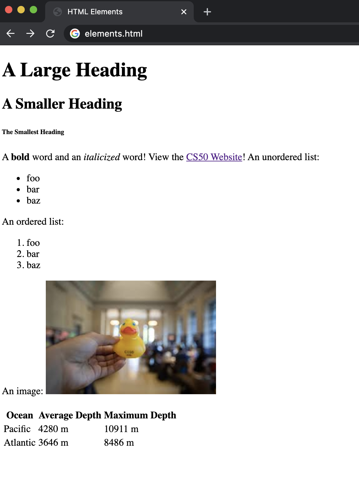
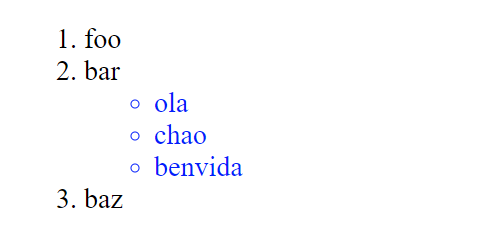

HTML é unha linguaxe de marcado que define a estrutura dunha páxina web. É unha linguaxe que o teu navegador web (Safari, Google Chrome, Firefox, etc.) interpreta para mostrar contido na pantalla.
- Un arquivo HTML sinxelo!

```
<!DOCTYPE html>
<html lang="en">
    <head>
        <title>Hello!</title>
    </head>
    <body>
        Hello, world!
    </body>
<html>
```

- Cando abrimos este arquivo no noso navegador, obtemos:


- Agora, dediquemos un tempo a falar do arquivo que acabamos de escribir, que parece ser bastante complicado para unha páxina tan sinxela.
  - Na primeira liña, declarámoslle (ao navegador web) que estamos escribindo o documento na última versión de HTML: HTML5.
  - Despois diso, a páxina consta de **elementos HTML** anidados (como html e corpo), cada un cunha **etiqueta de apertura e peche** marcada con tanto `<element>`para unha apertura como `</element>`para un peche.
  - Observe como cada un dos elementos internos está sangría un pouco máis lonxe que o anterior. Aínda que isto non é necesariamente necesario polo navegador, será moi útil manter isto no seu propio código.
  - Os elementos HTML poden incluír **atributos** , que proporcionan ao navegador información adicional sobre o elemento. Por exemplo, cando incluímos `lang="en"`na nosa etiqueta inicial, dicímoslle ao navegador que estamos a usar o inglés como idioma principal.
  - Dentro do elemento HTML, normalmente queremos incluír unha etiqueta `head`e unha `body`. O elemento head incluirá información sobre a túa páxina que non se mostra necesariamente e o elemento body conterá o que é realmente visible para os usuarios que visitan o sitio.
  - Dentro da cabeza, incluímos un `title`para a nosa páxina web, que notarás que aparece na pestana da parte superior do noso navegador web.
  - Finalmente, incluímos o texto "Ola, mundo!" no corpo, que é a parte visible da nosa páxina.


### Modelo de obxectos de documento (DOM)


- O DOM é un xeito cómodo de visualizar a forma en que os elementos HTML se relacionan entre si mediante unha estrutura tipo árbore. Arriba hai un exemplo do deseño DOM para a páxina que acabamos de escribir.


### Máis elementos HTML

- Hai moitos elementos HTML que pode querer usar para personalizar a súa páxina, incluíndo títulos, listas e seccións en negra. Neste seguinte exemplo, veremos algúns destes en acción.
- Unha cousa máis a ter en conta: `<!-- -->` dános un comentario en HTML, polo que o usaremos a continuación para explicar algúns dos elementos.

```HTML
<!DOCTYPE html>
<html lang="en">
    <head>
        <title>HTML Elements</title>
    </head>
    <body>
        <!-- We can create headings using h1 through h6 as tags. -->
        <h1>A Large Heading</h1>
        <h2>A Smaller Heading</h2>
        <h6>The Smallest Heading</h6>

        <!-- The strong and i tags give us bold and italics respectively. -->
        A <strong>bold</strong> word and an <i>italicized</i> word!

        <!-- We can link to another page (such as cs50's page) using a. -->
        View the <a href="https://cs50.harvard.edu/">CS50 Website</a>!

        <!-- We used ul for an unordered list and ol for an ordered one. both ordered and unordered lists contain li, or list items. -->
        An unordered list:
        <ul>
            <li>foo</li>
            <li>bar</li>
            <li>baz</li>
        </ul>
        An ordered list:
        <ol>
            <li>foo</li>
            <li>bar</li>
            <li>baz</li>
        </ol>

        <!-- Images require a src attribute, which can be either the path to a file on your computer or the link to an image online. It also includes an alt attribute, which gives a description in case the image can't be loaded. -->
        An image:
        
        <!-- We can also see above that for some elements that don't contain other ones, closing tags are not necessary. -->

        <!-- Here, we use a br tag to add white space to the page. -->
        <br/> <br/>

        <!-- A few different tags are necessary to create a table. -->
        <table>
            <thead>
                <th>Ocean</th>
                <th>Average Depth</th>
                <th>Maximum Depth</th>
            </thead>
            <tbody>
                <tr>
                    <td>Pacific</td>
                    <td>4280 m</td>
                    <td>10911 m</td>
                </tr>
                <tr>
                    <td>Atlantic</td>
                    <td>3646 m</td>
                    <td>8486 m</td>
                </tr>
            </tbody>
        </table>
    </body>
<html>
```

Esta páxina, cando se renderiza, ten un aspecto así:



- No caso de que estea preocupado por iso, sabe que nunca terás que memorizar estes elementos. É moi sinxelo buscar simplemente algo como "imaxe en HTML" para atopar a `img`etiqueta. Un recurso que é especialmente útil para coñecer estes elementos é [W3 Schools](https://translate.google.com/website?sl=auto&tl=es&hl=es&u=https://www.w3schools.com/html/html_elements.asp) .

### Formularios

- Outro conxunto de elementos que é realmente importante á hora de crear un sitio web é como recoller información dos usuarios. Pode permitir que os usuarios introduzan información mediante un formulario HTML, que pode conter varios tipos de entrada diferentes. Máis adiante durante o curso, aprenderemos a manexar a información unha vez que se envía un formulario.
- Do mesmo xeito que con outros elementos HTML, non hai necesidade de memorizalos, e W3 Schools é un excelente recurso para aprender sobre eles.

```html
<!DOCTYPE html>
<html lang="en">
<head>
    <title>Forms</title>
</head>
<body>
    <form>
        <input type="text" placeholder="First Name" name="first">
        <input type="password" placeholder="Password" name="password">
        <div>
            Favorite Color:
            <input name="color" type="radio" value="blue"> Blue
            <input name="color" type="radio" value="green"> Green
            <input name="color" type="radio" value="yellow"> Yellow
            <input name="color" type="radio" value="red"> Red

        </div>
        <input type="submit">
    </form>
</body>
</html>
```


## CSS (follas de estilo en cascada)

- CSS úsase para personalizar a aparencia dun sitio web.
- Mentres estamos comezando, podemos engadir un atributo de estilo a calquera elemento HTML para aplicarlle algo de CSS.
- Cambiamos de estilo alterando as propiedades CSS dun elemento, escribindo algo como `color: blue`ou`text-align: center`
- Neste exemplo a continuación, facemos un lixeiro cambio no noso primeiro arquivo para darlle un título colorido:

```html
<!DOCTYPE html>
<html lang="en">
    <head>
        <title>Hello!</title>
    </head>
    <body>
        <h1 style="color: blue; text-align: center;">A Colorful Heading!</h1>
        Hello, world!
    </body>
<html>
```


- Se deseñamos un elemento exterior, todos os elementos internos adoptan automaticamente ese estilo. Podemos ver isto se movemos o estilo que acabamos de aplicar desde a etiqueta de cabeceira á etiqueta do corpo:

```html
<!DOCTYPE html>
<html lang="en">
    <head>
        <title>Hello!</title>
    </head>
    <body style="color: blue; text-align: center;">
        <h1 >A Colorful Heading!</h1>
        Hello, world!
    </body>
<html>
```


- Aínda que podemos estilizar a nosa páxina web como fixemos anteriormente, para conseguir un mellor deseño, deberíamos poder afastar o noso estilo das liñas individuais.

  - Unha forma de facelo é engadir o seu estilo entre `<style>`as etiquetas do `head`. Dentro destas etiquetas, escribimos que tipos de elementos queremos que sexan de estilo e o estilo que queremos aplicarlles. Por exemplo:

  ```html
    <html lang="en">
    <!DOCTYPE html>
    <head>
        <title>Hello!</title>
        <style>
            h1 {
                color: blue;
                text-align: center;
            }
        </style>
    </head>
    <body>
        <h1 >A Colorful Heading!</h1>
        Hello, world!
    </body>
    </html>
  ```

  - Outra forma é incluír un `<link>`elemento do teu `head`cunha ligazón a un arquivo styles.css que conteña algún estilo. Isto significa que o arquivo HTML se vería así:

  ```html
    <html lang="en">
    <!DOCTYPE html>
    <head>
        <title>Hello!</title>
        <link rel="stylesheet" href="styles.css">
    </head>
    <body>
        <h1 >A Colorful Heading!</h1>
        Hello, world!
    </body>
    </html>
  ```

  E o noso arquivo chamado `styles.css`sería así:

  ```css
    h1 {
        color: blue;
        text-align: center;
    }
  ```

- Hai demasiadas propiedades CSS para ir aquí, pero do mesmo xeito que os elementos HTML, normalmente é fácil buscar algo en Google como "cambiar a fonte a CSS azul" para obter o resultado. Non obstante, algúns dos máis comúns son:

  - `color`: a cor do texto
  - `text-align`: onde se colocan os elementos na páxina
  - `background-color`: pódese configurar en calquera cor
  - `width`: en píxeles ou por cento dunha páxina
  - `height`: en píxeles ou por cento dunha páxina
  - `padding`: canto espazo debe quedar dentro dun elemento
  - `margin`: canto espazo se debe deixar fóra dun elemento
  - `font-family`: tipo de letra para o texto da páxina
  - `font-size`: en píxeles
  - `border`: tipo de tamaño (sólido, discontinuo, etc.) cor

- Usemos algo do que acabamos de aprender para mellorar a nosa táboa dos océanos desde arriba. Aquí tes algo de HTML para comezar:

```html
<!DOCTYPE html>
<html lang="en">
    <head>
        <title>Nicer Table</title>
    </head>
    <body>
        <table>
            <thead>
                <th>Ocean</th>
                <th>Average Depth</th>
                <th>Maximum Depth</th>
            </thead>
            <tbody>
                <tr>
                    <td>Pacific</td>
                    <td>4280 m</td>
                    <td>10911 m</td>
                </tr>
                <tr>
                    <td>Atlantic</td>
                    <td>3646 m</td>
                    <td>8486 m</td>
                </tr>
            </tbody>
        </table>
    </body>
<html>
```


- O anterior parécese moito ao que tiñamos antes, pero agora, xa sexa incluíndo unha `style`etiqueta ou a `link`nunha folla de estilo no elemento head, engadimos o seguinte css:

```css
table {
    border: 1px solid black;
    border-collapse: collapse;
}

td {
    border: 1px solid black;
    padding: 2px;
}

th {
    border: 1px solid black;
    padding: 2px;
}
```

O que nos deixa esta táboa máis bonita:


- Quizais xa esteas pensando que hai algunha repetición innecesaria no noso CSS neste momento, xa que `td`ten `th`o mesmo estilo. Podemos (e debemos) condensar isto ata o seguinte código, usando unha coma para mostrar que o estilo debería aplicarse a máis dun tipo de elemento.

```css
table {
    border: 1px solid black;
    border-collapse: collapse;
}

td, th {
    border: 1px solid black;
    padding: 2px;
}
```

- Esta é unha boa introdución ao que se coñece como 

  selectores CSS

   . Hai moitas formas de determinar cales son os elementos HTML que está a crear, algunhas das cales mencionaremos aquí:

  - **tipo de elemento** : isto é o que estivemos facendo ata agora: dar estilo a todos os elementos do mesmo tipo.
  - **id** : Outra opción é darlle aos nosos elementos HTML un id como este: `<h1 id="first-header">Hello!</h1>`e despois aplicar un estilo usando `#first-header{...}`o hashtag para mostrar que estamos a buscar por id. É importante destacar que non hai dous elementos que teñan o mesmo ID e ningún elemento pode ter máis dun ID.
  - **class** : é semellante ao id, pero unha clase pode ser compartida por máis dun elemento e un só elemento pode ter máis dunha clase. Engadimos clases a un elemento HTML como este: `<h1 class="page-text muted">Hello!</h1>`(ten en conta que acabamos de engadir dúas clases ao elemento: `page-text`e `muted`). Despois aplicamos un estilo baseado na clase usando un punto en lugar dun hashtag:`.muted {...}`

- Agora, tamén temos que tratar co problema dos CSS potencialmente conflitivos. Que ocorre cando un encabezado debe ser vermello segundo a súa clase pero azul segundo o seu ID? CSS ten unha orde de especificidade que vai:

  1. Estilo en liña
  2. id
  3. clase
  4. tipo de elemento

- Ademais da coma para varios selectores, hai varias outras formas de especificar cales son os elementos que quere aplicar estilo. Esta táboa da charla ofrece algunhas, e imos repasar algúns exemplos a continuación:


**Selector descendente** : aquí, usamos o selector descendente para aplicar un estilo só aos elementos da lista que se atopan nunha lista sen ordenar:

```html
<!DOCTYPE html>
<html lang="en">
    <head>
        <title>Using Selectors</title>
        <style>
            ul li {
                color: blue;
            }
        </style>
    </head>
    <body>
        <ol>
            <li>foo</li>
            <li> bar
                <ul>
                    <li>hello</li>
                    <li>goodbye</li>
                    <li>hello</li>
                </ul>
            </li>
            <li>baz</li>
        </ol>

    </body>
<html>
```



**Atributos como selectores** : tamén podemos reducir a nosa selección en función dos atributos que asignamos aos elementos HTML mediante corchetes. Por exemplo, na seguinte lista de ligazóns, escollemos que a ligazón a Amazon só sexa vermella:

```html
<!DOCTYPE html>
<html lang="en">
    <head>
        <title>Using Selectors</title>
        <style>
            a[href="https://www.amazon.com/"] {
                color: red;
            }
        </style>
    </head>
    <body>
        <ol>
            <li><a href="https://www.google.com/">Google</a></li>
            <li><a href="https://www.amazon.com/">Amazon</a> </li>
            <li><a href="https://www.facebook.com/">Facebook</a></li>
        </ol>

    </body>
<html>
```


- Non só podemos usar CSS para cambiar o aspecto dun elemento de forma permanente, senón tamén o seu aspecto en determinadas condicións. Por exemplo, e se quixeramos que un botón cambiase de cor cando pasamos o rato sobre el? Podemos conseguilo usando unha [pseudoclase CSS](https://translate.google.com/website?sl=auto&tl=es&hl=es&u=https://www.w3schools.com/css/css_pseudo_classes.asp) , que proporciona estilo adicional en circunstancias especiais. Escribimos isto engadindo dous puntos despois do noso selector e despois engadindo a circunstancia despois dese dous puntos.
- No caso do botón, engadiriamos `:hover`ao selector de botóns para especificar o deseño só ao pasar o rato:

```html
<!DOCTYPE html>
<html lang="en">
    <head>
        <title>Pseudoclasses</title>
        <style>
            button {
                background-color: red;
                width: 200px;
                height: 50px;
                font-size: 24px;
            }

            button:hover {
                background-color: green;
            }
        </style>
    </head>
    <body>
        <button>Button 1</button>
        <button>Button 2</button>
        <button>Button 3</button>

    </body>
<html>
```


## Deseño receptivo ou *responsive*

- Hoxe, moitas persoas ven sitios web en dispositivos distintos dos ordenadores, como teléfonos intelixentes e tabletas. É importante asegurarse de que o seu sitio web sexa lexible para as persoas en todos os dispositivos.
- Unha forma de conseguir isto é co coñecemento da **ventana gráfica** . A ventana gráfica é a parte da pantalla que é realmente visible para o usuario en cada momento. Por defecto, moitas páxinas web asumen que a ventana gráfica é a mesma en calquera dispositivo, o que fai que moitos sitios (especialmente os máis antigos) sexan difíciles de interactuar en dispositivos móbiles.
- Unha forma sinxela de mellorar a aparencia dun sitio nun dispositivo móbil é engadir a seguinte liña na cabeceira dos nosos arquivos HTML. Esta liña indica ao dispositivo móbil que utilice unha ventana gráfica que teña a mesma anchura que a do dispositivo que estás a usar en lugar dunha moito maior.

```html
<meta name="viewport" content="width=device-width, initial-scale=1.0">
```

- Outra forma de tratar con diferentes dispositivos é mediante [consultas multimedia](https://translate.google.com/website?sl=auto&tl=es&hl=es&u=https://www.w3schools.com/cssref/css3_pr_mediaquery.asp) . As consultas multimedia son formas de cambiar o estilo dunha páxina en función de como se ve a páxina.
- Para obter un exemplo dunha consulta multimedia, intentemos simplemente cambiar a cor da pantalla cando se encolle ata un determinado tamaño. Sinalizamos unha consulta multimedia escribindo `@media`seguido do tipo de consulta entre parénteses:

```html
<!DOCTYPE html>
<html lang="en">
    <head>
        <title>Screen Size</title>
        <style>
            @media (min-width: 600px) {
                body {
                    background-color: red;
                }
            }

            @media (max-width: 599px) {
                body {
                    background-color: blue;
                }
            }
        </style>
    </head>
    <body>
        <h1>Welcome to the page!</h1>
    </body>
</html>
```


- Outra forma de tratar con diferentes tamaños de pantalla é usar un novo atributo CSS coñecido como [flexbox](https://translate.google.com/website?sl=auto&tl=es&hl=es&u=https://www.w3schools.com/css/css3_flexbox.asp) . Isto permítenos que os elementos envolvan facilmente a seguinte liña se non encaixan horizontalmente. Facemos isto poñendo todos os nosos elementos nun `div`recipiente que chamaremos. Despois engadimos un estilo a ese div especificando que queremos usar unha pantalla flexbox para os elementos dentro del. Tamén engadimos algún estilo adicional aos divs internos para ilustrar mellor o envoltorio que se está a producir aquí.

```html
<!DOCTYPE html>
<html lang="en">
    <head>
        <title>Screen Size</title>
        <style>
            #container {
                display: flex;
                flex-wrap: wrap;
            }

            #container > div {
                background-color: green;
                font-size: 20px;
                margin: 20px;
                padding: 20px;
                width: 200px;
            }
        </style>
    </head>
    <body>
        <div id="container">
            <div>Some text 1!</div>
            <div>Some text 2!</div>
            <div>Some text 3!</div>
            <div>Some text 4!</div>
            <div>Some text 5!</div>
            <div>Some text 6!</div>
            <div>Some text 7!</div>
            <div>Some text 8!</div>
            <div>Some text 9!</div>
            <div>Some text 10!</div>
            <div>Some text 11!</div>
            <div>Some text 12!</div>
        </div>
    </body>
</html>
```


- Outra forma popular de deseñar unha páxina é usar unha [grella](https://translate.google.com/website?sl=auto&tl=es&hl=es&u=https://www.w3schools.com/css/css_grid.asp) HTML . Nesta grade, podemos especificar atributos de estilo como anchos de columnas e ocos entre columnas e filas, como se demostra a continuación. Teña en conta que cando especificamos anchos de columna, dicimos que a terceira é `auto`, o que significa que debería encher o resto da páxina.

```html
<!DOCTYPE html>
<html lang="en">
    <head>
        <title>My Web Page!</title>
        <meta name="viewport" content="width=device-width, initial-scale=1.0">
        <style>
            .grid {
                background-color: green;
                display: grid;
                padding: 20px;
                grid-column-gap: 20px;
                grid-row-gap: 10px;
                grid-template-columns: 200px 200px auto;
            }

            .grid-item {
                background-color: white;
                font-size: 20px;
                padding: 20px;
                text-align: center;
            }
        </style>
    </head>
    <body>
        <div class="grid">
            <div class="grid-item">1</div>
            <div class="grid-item">2</div>
            <div class="grid-item">3</div>
            <div class="grid-item">4</div>
            <div class="grid-item">5</div>
            <div class="grid-item">6</div>
            <div class="grid-item">7</div>
            <div class="grid-item">8</div>
            <div class="grid-item">9</div>
            <div class="grid-item">10</div>
            <div class="grid-item">11</div>
            <div class="grid-item">12</div>
        </div>
    </body>
</html>
```


## Bootstrap

- Resulta que hai moitas bibliotecas que outras persoas xa escribiron que poden facer aínda máis sinxelo o estilo dunha páxina web. Unha biblioteca popular que usaremos ao longo do curso é a coñecida como [Bootstrap](https://getbootstrap.com/docs/5.3/getting-started/download/) .
- Podemos incluír Bootstrap no noso código engadindo unha soa liña á cabeceira do noso arquivo HTML:

```html
<link href="https://cdn.jsdelivr.net/npm/bootstrap@5.3.2/dist/css/bootstrap.min.css" rel="stylesheet" integrity="sha384-T3c6CoIi6uLrA9TneNEoa7RxnatzjcDSCmG1MXxSR1GAsXEV/Dwwykc2MPK8M2HN" crossorigin="anonymous">
```

- A continuación, podemos ver algunhas das funcións de Bootstrap navegando ata a parte de [documentación](https://translate.google.com/website?sl=auto&tl=es&hl=es&u=https://getbootstrap.com/docs/4.5/components/) do seu sitio web. Nesta páxina atoparás moitos exemplos de clases que podes engadir aos elementos que lles permiten estilizar con Bootstrap.
- Unha característica de arranque popular é o seu [sistema de reixa](https://translate.google.com/website?sl=auto&tl=es&hl=es&u=https://getbootstrap.com/docs/4.0/layout/grid/) . Bootstrap divide automaticamente unha páxina en 12 columnas, e podemos decidir cantas columnas ocupa un elemento engadindo a clase `col-x`onde `x`hai un número entre 1 e 12. Por exemplo, na páxina seguinte, temos unha fila de columnas de igual ancho. , e despois unha fila onde a columna central é maior:

```html
<!DOCTYPE html>
<html lang="en">
    <head>
        <title>My Web Page!</title>
        <link rel="stylesheet" href="https://stackpath.bootstrapcdn.com/bootstrap/4.4.1/css/bootstrap.min.css" integrity="sha384-Vkoo8x4CGsO3+Hhxv8T/Q5PaXtkKtu6ug5TOeNV6gBiFeWPGFN9MuhOf23Q9Ifjh" crossorigin="anonymous">
        <style>
            .row > div {
                padding: 20px;
                background-color: teal;
                border: 2px solid black;
            }
        </style>
    </head>
    <body>
        <div class="container">
            <div class="row">
                <div class="col-4">
                    This is a section.
                </div>
                <div class="col-4">
                    This is another section.
                </div>
                <div class="col-4">
                    This is a third section.
                </div>
            </div>
        </div>
        <br/>
        <div class="container">
            <div class="row">
                <div class="col-3">
                    This is a section.
                </div>
                <div class="col-6">
                    This is another section.
                </div>
                <div class="col-3">
                    This is a third section.
                </div>
            </div>
        </div>
    </body>
</html>
```


- Para mellorar a capacidade de resposta do móbil, Bootstrap tamén nos permite especificar tamaños de columna que varían segundo o tamaño da pantalla. No seguinte exemplo, usamos `col-lg-3`para mostrar que un elemento debe ocupar 3 columnas nunha pantalla grande e `col-sm-6`para mostrar un elemento debe ocupar 6 columnas cando a pantalla é pequena:

```html
<!DOCTYPE html>
<html lang="en">
    <head>
        <title>My Web Page!</title>
        <link rel="stylesheet" href="https://stackpath.bootstrapcdn.com/bootstrap/4.4.1/css/bootstrap.min.css" integrity="sha384-Vkoo8x4CGsO3+Hhxv8T/Q5PaXtkKtu6ug5TOeNV6gBiFeWPGFN9MuhOf23Q9Ifjh" crossorigin="anonymous">
        <style>
            .row > div {
                padding: 20px;
                background-color: teal;
                border: 2px solid black;
            }
        </style>
    </head>
    <body>
        <div class="container">
            <div class="row">
                <div class="col-lg-3 col-sm-6">
                    This is a section.
                </div>
                <div class="col-lg-3 col-sm-6">
                    This is another section.
                </div>
                <div class="col-lg-3 col-sm-6">
                    This is a third section.
                </div>
                <div class="col-lg-3 col-sm-6">
                    This is a fourth section.
                </div>
            </div>
        </div>
    </body>
</html>
```


## Sass (follas de estilo sintácticamente impresionantes)

- Ata agora, atopamos algunhas formas de eliminar a redundancia en CSS, como movela a arquivos separados ou usar o bootstrap, pero aínda hai bastantes lugares nos que aínda podemos facer melloras. Por exemplo, e se queremos que varios elementos teñan estilos diferentes, pero que todos sexan da mesma cor? Se máis tarde decidimos que queremos cambiar a cor, teríamos que cambiala dentro de varios elementos diferentes.
- [Sass](https://translate.google.com/website?sl=auto&tl=es&hl=es&u=https://sass-lang.com/) é unha linguaxe que nos permite escribir CSS de forma máis eficiente de varias maneiras, unha delas é ao permitirnos ter variables, como no seguinte exemplo.
- Ao escribir en Sass, creamos un novo arquivo coa extensión `filename.scss`. Neste arquivo, podemos crear unha nova variable engadindo un `$`antes dun nome, logo dous puntos e despois un valor. Por exemplo, escribiriamos `$color: red`para establecer a cor da variable co valor vermello. Despois accedemos a esa variable usando `$color`. Aquí tes un exemplo do noso arquivo variables.scss:

```css
$color: red;

ul {
    font-size: 14px;
    color: $color;
}

ol {
    font-size: 18px;
    color: $color;
}
```

- Agora, para vincular este estilo ao noso arquivo HTML, non podemos simplemente vincular o `.scss`arquivo porque a maioría dos navegadores web só recoñecen `.css`arquivos. Para solucionar este problema, temos que [descargar un programa chamado Sass](https://translate.google.com/website?sl=auto&tl=es&hl=es&u=https://sass-lang.com/install) nos nosos ordenadores. Despois, no noso terminal, escribimos `sass variables.scss:variables.css`Este comando compilará un arquivo .scss nomeado `variables.scss`nun arquivo .css chamado `variables.css`, ao que podes engadir unha ligazón na túa páxina HTML.
- Para acelerar este proceso, podemos usar o comando `sass --watch variables.scss:variables.css`que cambia automaticamente o `.css`arquivo cada vez que se detecta un cambio no `.scss`arquivo.
- Mentres usamos Sass, tamén podemos aniñar fisicamente o noso estilo en lugar de usar os selectores CSS dos que falamos anteriormente. Por exemplo, se queremos aplicar algún estilo só a parágrafos e listas non ordenadas dentro dun div, podemos escribir o seguinte:

```scss
div {
    font-size: 18px;

    p {
        color: blue;
    }

    ul {
        color: green;
    }
}
```

Unha vez compilado en CSS, obteriamos un arquivo que parece:

```css
div {
    font-size: 18px;
}

div p {
    color: blue;
}

div ul {
    color: green;
}
```

- Unha característica máis que nos ofrece Sass é a coñecida como [herdanza](https://translate.google.com/website?sl=auto&tl=es&hl=es&u=https://sass-lang.com/guide) . Isto permítenos crear un conxunto básico de estilo que pode ser compartido por varios elementos diferentes. Facemos isto engadindo un `%`antes do nome dunha clase, engadindo algún estilo e despois engadindo a liña `@extend %classname`ao comezo dalgún estilo. Por exemplo, o seguinte código aplica o estilo dentro da `message`clase a cada unha das diferentes clases a continuación, o que resulta nunha páxina web que se parece á seguinte.

```css
%message {
    font-family: sans-serif;
    font-size: 18px;
    font-weight: bold;
    border: 1px solid black;
    padding: 20px;
    margin: 20px;
}

.success {
    @extend %message;
    background-color: green;
}

.warning {
    @extend %message;
    background-color: orange;
}

.error {
    @extend %message;
    background-color: red;
}
```


E así remata esta breve introdución ao desenvolvemento web.

_\_ref: https://cs50.harvard.edu/web/2020/notes/0/#html-hypertext-markup-language_