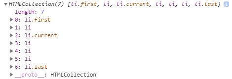

# Obter o elemento principal parentNode

**Resumo** : neste tutorial, aprenderás a obter o nodo pai dun elemento usando o `parentNode`atributo JavaScript do `Node`obxecto.

## Introdución ao atributo parentNode

Para obter o nodo pai dun nodo especificado na árbore DOM, usa a `parentNode`propiedade:

```
let parent = node.parentNode;
```

É de `parentNode`só lectura.

Os nodos `Document`e `DocumentFragment`non teñen un pai. Polo tanto, o `parentNode`será sempre `null`.

Se crea un novo nodo pero non o anegou á árbore DOM, o `parentNode`dese nodo tamén será `null`.

## Exemplo de JavaScript parentNode

Consulte o seguinte documento HTML:

```
<!DOCTYPE html>
<html>
<head>
<meta charset="utf-8">
<title>JavaScript parentNode</title>
</head>
<body>
    <div id="main">
        <p class="note">This is a note!</p>
    </div>

    <script>
        let note = document.querySelector('.note');
        console.log(note.parentNode);
    </script>
</body>
</html>

```

A seguinte imaxe mostra a saída na Consola:


Cómo funciona:

- En primeiro lugar, selecciona o elemento coa `.note`clase mediante o `querySelector()`método.
- En segundo lugar, busque o nodo pai do elemento.

## Resumo

- Devolve `node.parentNode`o nodo pai de só lectura dun nodo especificado ou `null`se non existe.
- Os `document`e `DocumentFragment`non teñen un nodo pai.


# Irmáns JavaScript

**Resumo** : neste titorial, aprenderás a seleccionar os irmáns seguintes, os irmáns anteriores e todos os irmáns dun elemento.

Digamos que tes a seguinte lista de elementos:

```
<ul id="menu">
    <li>Home</li>
    <li>Products</li>
    <li class="current">Customer Support</li>
    <li>Careers</li>
    <li>Investors</li>
    <li>News</li>
    <li>About Us</li>
</ul>

```

## Obtén os próximos irmáns

Para obter o seguinte irmán dun elemento, usa o `nextElementSibling`atributo:

```
let nextSibling = currentNode.nextElementSibling;
```

Devolve se o elemento especificado é `nextElementSibling`o `null`último da lista.

O seguinte exemplo usa a `nextElementSibling`propiedade para obter o seguinte irmán do elemento da lista que ten a `current`clase:

```
let current = document.querySelector('.current');
let nextSibling = current.nextElementSibling;

console.log(nextSibling);
```

Saída:

```
<li>Careers</li>

```

Neste exemplo:

- En primeiro lugar, seleccione o elemento da lista cuxa clase está `current`a usar o `querySelector()`.
- En segundo lugar, obtén o seguinte irmán dese elemento da lista usando a `nextElementSibling`propiedade.

Para obter todos os próximos irmáns dun elemento, podes usar o seguinte código:

```
let current = document.querySelector('.current');
let nextSibling = current.nextElementSibling;

while(nextSibling) {
    console.log(nextSibling);
    nextSibling = nextSibling.nextElementSibling;
}
```

## Obtén os irmáns anteriores

Para obter os irmáns anteriores dun elemento, usa o `previousElementSibling`atributo:

```
let current = document.querySelector('.current');
let prevSibling = currentNode.previousElementSibling;
```

A `previousElementSibling`propiedade devolve `null`se o elemento actual é o primeiro da lista.

O seguinte exemplo usa a `previousElementSibling`propiedade para obter os irmáns anteriores do elemento da lista que ten a `current`clase:

```
let current = document.querySelector('.current');
let prevSiblings = current.previousElementSibling;

console.log(prevSiblings);
```

E o seguinte exemplo selecciona todos os irmáns anteriores do elemento da lista que ten a `current`clase:

```
let current = document.querySelector('.current');
let prevSibling = current.previousElementSibling;
while(prevSibling) {
    console.log(prevSibling);
    prevSibling = current.previousElementSibling;
}

```

## Obter todos os irmáns dun elemento

Para obter todos os irmáns dun elemento, usaremos a lóxica:

- En primeiro lugar, selecciona o pai do elemento cuxos irmáns queres atopar.
- En segundo lugar, seleccione o primeiro elemento fillo dese elemento pai.
- En terceiro lugar, engade o primeiro elemento a unha matriz de irmáns.
- En cuarto lugar, selecciona o seguinte irmán do primeiro elemento.
- Finalmente, repite os pasos 3 e 4 ata que non queden irmáns. No caso de que o irmán sexa o elemento orixinal, omita o terceiro paso.

A seguinte función ilustra os pasos:

```
let getSiblings = function (e) {
    // for collecting siblings
    let siblings = []; 
    // if no parent, return no sibling
    if(!e.parentNode) {
        return siblings;
    }
    // first child of the parent node
    let sibling  = e.parentNode.firstChild;
    
    // collecting siblings
    while (sibling) {
        if (sibling.nodeType === 1 && sibling !== e) {
            siblings.push(sibling);
        }
        sibling = sibling.nextSibling;
    }
    return siblings;
};

```

Xúntao todo:

```
<!DOCTYPE html>
<html>
<head>
    <meta charset="utf-8">
    <title>JavaScript Siblings</title>
</head>
<body>
    <ul id="menu">
        <li>Home</li>
        <li>Products</li>
        <li class="current">Customer Support</li>
        <li>Careers</li>
        <li>Investors</li>
        <li>News</li>
        <li>About Us</li>
    </ul>
    
    <script>
        let getSiblings = function (e) {
            // for collecting siblings
            let siblings = []; 
            // if no parent, return no sibling
            if(!e.parentNode) {
                return siblings;
            }
            // first child of the parent node
            let sibling  = e.parentNode.firstChild;
            // collecting siblings
            while (sibling) {
                if (sibling.nodeType === 1 && sibling !== e) {
                    siblings.push(sibling);
                }
                sibling = sibling.nextSibling;
            }
            return siblings;
        };

        let siblings = getSiblings(document.querySelector('.current'));
        siblingText = siblings.map(e => e.innerHTML);
        console.log(siblingText);
    </script>
</body>
</html>

```

Saída:

```
["Home", "Products", "Careers", "Investors", "News", "About Us"]
Idioma do código:  JSON/JSON con comentarios  ( json )
```

## Resumo

- Devolve `nextElementSibling`o seguinte irmán dun elemento ou `null`se o elemento é o último da lista.
- Devolve `previousElementSibling`o irmán anterior dun elemento ou `null`se o elemento é o primeiro da lista.
- Para obter todos os irmáns dun elemento, podes usar unha función auxiliar que utilice a `nextElementSibling`propiedade.


# Obtención de elementos fillos dun nodo en JavaScript

**Resumo** : neste tutorial, aprenderás a obter o primeiro elemento fillo, o último elemento fillo e todos os fillos dun elemento especificado.

Supoña que tes o seguinte fragmento HTML:

```
<!DOCTYPE html>
<html>
<head>
  <meta charset="utf-8">
  <title>JS Get Child Elements</title>
</head>
<body>
  <ul id="menu">
    <li class="first">Home</li>
    <li>Products</li>
    <li class="current">Customer Support</li>
    <li>Careers</li>
    <li>Investors</li>
    <li>News</li>
    <li class="last">About Us</li>
  </ul>
</body>
</html>
```

## Obter o primeiro elemento fillo

Para obter o primeiro elemento fillo dun elemento especificado, usa a `firstChild`propiedade do elemento:

```
let firstChild = parentElement.firstChild; 

```

Se `parentElement`non ten ningún elemento fillo, `firstChild`devolve `null`. A `firstChild`propiedade devolve un nodo fillo que pode ser calquera tipo de nodo, como un nodo de elementos, un nodo de texto ou un nodo de comentarios. O seguinte script mostra o primeiro fillo do `#menu`elemento:

```
let content = document.getElementById('menu');
let firstChild = content.firstChild.nodeName;
console.log(firstChild);
```

Saída:

```css
#text
```

A xanela da consola móstrase `#text`porque se insire un nodo de texto para manter o espazo en branco entre a apertura `<ul>`e `<li>`as etiquetas. Este espazo en branco crea un `#text`nodo.

Teña en conta que calquera espazo en branco, como un único espazo, varios espazos, retornos e tabulacións creará un `#text`nodo. Para eliminar o `#text`nodo, pode eliminar os espazos en branco do seguinte xeito:

```html
<article id="content"><h2>Heading</h2><p>First paragraph</p></article>
```

Ou para obter o primeiro fillo só co nodo Element, pode usar a `firstElementChild`propiedade:

```js
let firstElementChild = parentElement.firstElementChild;
```

O seguinte código devolve o primeiro elemento da lista que é o primeiro elemento fillo do menú:

```js
let content = document.getElementById('menu');
console.log(content.firstElementChild);
```

Saída:

```html
<li class="first">Home</li>
```

Neste exemplo:

- En primeiro lugar, seleccione o `#menu`elemento mediante o `getElementById()` método.
- En segundo lugar, obtén o primeiro elemento fillo usando a `firstElementChild` propiedade.

## Obter o último elemento fillo

Para obter o último elemento fillo dun nodo, usa a `lastChild`propiedade:

```js
let lastChild = parentElement.lastChild; 

```

No caso de que `parentElement`non teña ningún elemento fillo, `lastChild`devolve `null`. Do mesmo xeito que a `firstChild`propiedade, a `lastChild`propiedade devolve o primeiro nodo de elemento, nodo de texto ou nodo de comentario. Se queres seleccionar só o último elemento fillo co tipo de nodo de elemento, usa a `lastElementChild`propiedade:

```js
let lastChild = parentElement.lastElementChild;
```

O seguinte código devolve o elemento da lista que é o último elemento fillo do menú:

```js
let menu = document.getElementById('menu');
console.log(main.lastElementChild);
```

Saída:

```html
<li class="last">About Us</li>
```

## Obter todos os elementos fillos

Para obter unha vida `NodeList`de elementos fillos dun elemento especificado, usa a `childNodes`propiedade:

```js
let children = parentElement.childNodes;
```

A `childNodes`propiedade devolve todos os elementos fillos con calquera tipo de nodo. Para obter o elemento fillo só co tipo de nodo de elemento, usa a `children`propiedade:

```js
let children = parentElement.children;
```

O seguinte exemplo selecciona todos os elementos fillos do elemento co Id `main`:

```js
let menu = document.getElementById('menu');
let children = menu.children;
console.log(children);
```

Saída:



## Resumo

- Os `firstChild`e `lastChild`devolven o primeiro e o último fillo dun nodo, que pode ser calquera tipo de nodo, incluído o nodo de texto, o nodo de comentario e o nodo de elementos.
- Os `firstElementChild`e `lastElementChild`devolven o primeiro e o último nodo Element fillo.
- O `childNodes`devolve un vivo `NodeList`de todos os nodos fillos de calquera tipo de nodo dun nodo especificado. Os fillos devolven todos `Element`os nodos fillos dun nodo especificado.