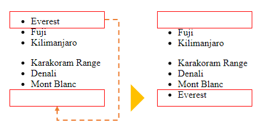
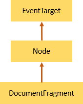
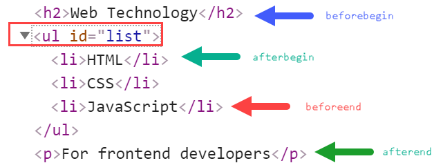
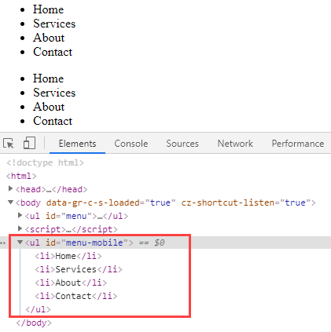

# `CreateElement`

**Resumo** : neste tutorial, aprenderás a usar o JavaScript `document.createElement()`para crear un novo elemento HTML e anexalo á árbore DOM.

Para crear un elemento HTML, usa o `document.createElement()`método:

```
let element = document.createElement(htmlTag); 
```

Acepta `document.createElement()`un nome de etiqueta HTML e devolve un novo `Node`co `Element`tipo.

## 1) Creando un novo exemplo div

Supoña que tes o seguinte documento HTML:

```html
<!DOCTYPE html>
<html>
<head>
    <meta charset="utf-8">
    <title>JS CreateElement Demo</title>
</head>
<body>

</body>
</html> 
```

O seguinte exemplo usa o `document.createElement()`para crear un novo `<div>`elemento:

```
let div = document.createElement('div'); 
```

E engade un fragmento HTML a `div`:

```
div.innerHTML = '<p>CreateElement example</p>'; 
```

Para anexar o `div`documento ao documento, utiliza o `appendChild()`método:

```
document.body.appendChild(div); 
```

Xúntao todo:

```html
<!DOCTYPE html>
<html>
<head>
    <meta charset="utf-8">
    <title>JS CreateElement Demo</title>
</head>
<body>
    <script>
        let div = document.createElement('div');
        div.id = 'content';
        div.innerHTML = '<p>CreateElement example</p>';
        document.body.appendChild(div);
    </script>
</body>
</html> 
```

### Engadindo un ID ao div

Se queres engadir un id a un `div`, estableces o `id`atributo do elemento nun valor, como este:

```js
let div = document.createElement('div');
div.id = 'content';
div.innerHTML = '<p>CreateElement example</p>';

document.body.appendChild(div); 
```

### Engadir unha clase ao div

O seguinte exemplo establece a clase CSS dun novo div `note`:

```js
let div = document.createElement('div');
div.id = 'content';
div.className = 'note';
div.innerHTML = '<p>CreateElement example</p>';

document.body.appendChild(div); 
```

### Engadir texto a un div

Para engadir un anaco de texto a un `<div>`, podes usar a `innerHTML`propiedade como o exemplo anterior ou crear un novo `Text`nodo e engadilo a `div`:

```js
// create a new div and set its attributes
let div = document.createElement('div');
div.id = 'content';
div.className = 'note';

// create a new text node and add it to the div
let text = document.createTextNode('CreateElement example');
div.appendChild(text);

// add div to the document
document.body.appendChild(div); 
```

### Engadir un elemento a un div

Para engadir un elemento a un `div`, crea un elemento e engádeo ao método `div`usando o `appendChild()`método:

```js
let div = document.createElement('div');
div.id = 'content';
div.className = 'note';

// create a new heading and add it to the div
let h2 = document.createElement('h2');
h2.textContent = 'Add h2 element to the div';
div.appendChild(h2);

// add div to the document
document.body.appendChild(div);
 
```

## 2) `li`Exemplo de creación de novos elementos de lista ( ).

Digamos que tes unha lista de elementos:

```html
<ul id="menu">
    <li>Home</li>
</ul>
 
```

O seguinte código engade dous `li`elementos ao `ul`:

```js
let li = document.createElement('li');
li.textContent = 'Products';
menu.appendChild(li);

li = document.createElement('li');
li.textContent = 'About Us';

// select the ul menu element
const menu = document.querySelector('#menu');
menu.appendChild(li);
 
```

Saída:

```html
<ul id="menu">
    <li>Home</li>
    <li>Products</li>
    <li>About Us</li>
</ul> 
```

## 3) Creación dun `script`exemplo de elemento

Ás veces, pode querer cargar un ficheiro JavaScript de forma dinámica. Para iso, podes usar o `document.createElement()`para crear o `script`elemento e engadilo ao documento.

O seguinte exemplo ilustra como crear un novo `script`elemento e cargar o `/lib.js`ficheiro no documento:

```js
let script = document.createElement('script');
script.src = '/lib.js';
document.body.appendChild(script); 
```

Primeiro podes crear unha nova función auxiliar que cargue un ficheiro JavaScript desde un URL:

```js
function loadJS(url) {
    let script = document.createElement('script');
    script.src = url;
    document.body.appendChild(script);
} 
```

E despois use a función auxiliar para cargar o `/lib.js`ficheiro:

```js
loadJS('/lib.js'); 
```

Para cargar un ficheiro JavaScript de forma asíncrona, establece o `async`atributo do `script`elemento en `true`:

```js
function loadJSAsync(url) {
    let script = document.createElement('script');
    script.src = url;
    script.async = true;
    document.body.appendChild(script);
} 
```

## Resumo

- Crea `document.createElement()`un novo elemento HTML.
- Engade `element.appendChild()`un elemento HTML a un elemento existente.


# `appendChild`

**Resumo** : neste tutorial, aprenderás a usar o `appendChild()`método JavaScript para engadir un nodo ao final da lista de nodos fillos dun nodo pai especificado.

## Introdución ao `appendChild()`método JavaScript

É `appendChild()`un método da `Node`interface. O `appendChild()`método permítelle engadir un nodo ao final da lista de nodos fillos dun nodo pai especificado.

O seguinte ilustra a sintaxe do `appendChild()`método:

```
parentNode.appendChild(childNode); 
```

Neste método, `childNode`é o nodo a engadir ao nodo pai dado. O `appendChild()`devolve o fillo anexo.

Se `childNode`é unha referencia a un nodo existente no documento, o `appendChild()`método moverá `childNode`desde a súa posición actual á nova.

## `appendChild()`Exemplos de JavaScript

Poñamos algúns exemplos de uso do `appendChild()`método.

### 1) `appendChild()`Exemplo sinxelo

Supoña que tes o seguinte marcado HTML:

```
<ul id="menu">
</ul> 
```

O seguinte exemplo usa o `appendChild()`método para engadir tres elementos de lista ao `<ul>` elemento:

```js
function createMenuItem(name) {
    let li = document.createElement('li');
    li.textContent = name;
    return li;
}
// get the ul#menu
const menu = document.querySelector('#menu');
// add menu item
menu.appendChild(createMenuItem('Home'));
menu.appendChild(createMenuItem('Services'));
menu.appendChild(createMenuItem('About Us'));
 
```

 Como funciona:

- En primeiro lugar, a `createMenuItem()`función crea un novo elemento de lista cun nome especificado mediante o `createElement()`método.
- En segundo lugar, selecciona o `<ul>`elemento con id `menu`usando o `querySelector()`método.
- En terceiro lugar, chame á `createMenuItem()`función para crear un novo elemento de menú e use o `appendChild()`método para engadir o elemento de menú ao `<ul>`elemento

Saída:

```html
<ul id="menu">
    <li>Home</li>
    <li>Services</li>
    <li>About Us</li>
</ul> 
```

Xúntao todo:

```html
<!DOCTYPE html>
<html>

<head>
    <meta charset="utf-8">
    <title>JavaScript appendChild() Demo</title>
</head>
<body>
    <ul id="menu">
    </ul>
    
    <script>
        function createMenuItem(name) {
            let li = document.createElement('li');
            li.textContent = name;
            return li;
        }
        // get the ul#menu
        const menu = document.querySelector('#menu');
        // add menu item
        menu.appendChild(createMenuItem('Home'));
        menu.appendChild(createMenuItem('Services'));
        menu.appendChild(createMenuItem('About Us'));
    </script>
</body>
</html>
 
```

### 2) Mover un nodo dentro do exemplo de documento

Asumindo que tes dúas listas de elementos:

```html
<ul id="first-list">
    <li>Everest</li>
    <li>Fuji</li>
    <li>Kilimanjaro</li>
</ul>

<ul id="second-list">
    <li>Karakoram Range</li>
    <li>Denali</li>
    <li>Mont Blanc</li>
</ul>
 
```

O seguinte exemplo usa `appendChild()`para mover o primeiro elemento fillo da primeira lista á segunda:

```js
// get the first list
const firstList = document.querySelector('#first-list');
// take the first child element
const everest = firstList.firstElementChild;
// get the second list
const secondList = document.querySelector('#second-list');
// append the everest to the second list
secondList.appendChild(everest)
 
```

 Como funciona:

- En primeiro lugar, seleccione o primeiro elemento polo seu id ( `first-list`) usando o `querySelector()`método.
- En segundo lugar, seleccione o primeiro elemento fillo da primeira lista.
- En terceiro lugar, seleccione o segundo elemento polo seu id ( `second-list`) usando o `querySelector()`método.
- Finalmente, engade o primeiro elemento fillo da primeira lista á segunda lista usando o `appendChild()`método.

Aquí está a lista antes e despois de mudarse:



## Resumo

- Use `appendChild()`o método para engadir un nodo ao final da lista de nodos fillos dun nodo pai especificado.
- Pódese `appendChild()`usar para mover un nodo fillo existente á nova posición dentro do documento.

# `textContent`

**Resumo** : neste tutorial, aprenderás a usar a `textContent`propiedade JavaScript para obter o contido de texto dun nodo e os seus descendentes.

## Lectura `textContent`desde un nodo

Para obter o contido de texto dun nodo e os seus descendentes, usa a `textContent`propiedade:

```
let text = node.textContent; 
```

Supoña que tes o seguinte fragmento HTML:

```
<div id="note">
    JavaScript textContent Demo!
    <span style="display:none">Hidden Text!</span>
    <!-- my comment -->
</div>    
 
```

O seguinte exemplo usa a `textContent`propiedade para obter o texto do `<div>`elemento:

```
let note = document.getElementById('note');
console.log(note.textContent); 
```

 Como funciona.

- En primeiro lugar, selecciona o `div`elemento coa nota de identificación mediante o `getElementById()`método.
- A continuación, amosa o texto do nodo accedendo á `textContent`propiedade.

Saída:

```
JavaScript textContent Demo!
Hidden Text!
```

Como podes ver claramente na saída, a `textContent`propiedade devolve a concatenación de `textContent`cada [nodo fillo](https://www.javascripttutorial.net/javascript-dom/javascript-get-child-element/) , excluíndo os comentarios (e tamén as instrucións de procesamento).

### `textContent`vs.`innerText`

Por outra banda, `innerText`ten en conta o estilo CSS e devolve só texto lexible por humanos. Por exemplo:

```
let note = document.getElementById('note');
console.log(note.innerText); 
```

Saída:

```
JavaScript textContent Demo!
```

Como podes ver, o texto e os comentarios ocultos non son devoltos.

Dado que a `innerText`propiedade usa o CSS actualizado para calcular o texto, o acceso a el desencadeará un refluxo, que é caro computacionalmente.

Prodúcese un **refluxo** cando un navegador web precisa procesar e debuxar partes ou toda unha páxina web de novo.

## Configuración `textContent`para un nodo

Ademais de ler `textContent`, tamén podes usar a `textContent`propiedade para definir o texto dun nodo:

```
node.textContent = newText;
```

Cando se configura `textContent`nun nodo, todos os fillos do nodo serán eliminados e substituídos por un único nodo de texto co `newText`valor. Por exemplo:

```
let note = document.getElementById('note');
note.textContent = 'This is a note'; 
```

## Resumo

- Use a `textContent`propiedade para devolver a concatenación de `textContent`cada nodo fillo. Podes usalo para definir un texto para un nodo.
- O `innerText`devolve o texto lexible por humanos que ten en conta CSS.


# `innerHTML`

**Resumo** : neste tutorial, aprenderás a usar a `innerHTML`propiedade JavaScript dun elemento para obter ou establecer un marcado HTML contido no elemento.

É `innerHTML`unha propiedade do `Element`que che permite obter ou configurar o marcado HTML contido no elemento:

```
element.innerHTML = 'new content';
element.innerHTML; 
```

## Lendo a propiedade innerHTML dun elemento

Para obter o marcado HTML contido nun elemento, usa a seguinte sintaxe:

```
let content = element.innerHTML; 
```

Cando le `innerHTML`un elemento, o navegador web ten que serializar o fragmento HTML dos descendentes do elemento.

### 1) Exemplo simple de JavaScript interno

Supoña que tes o seguinte marcado:

```
 <ul id="menu">
    <li>Home</li>
    <li>Services</li>
</ul> 
```

O seguinte exemplo usa a `innerHTML`propiedade para obter o contido do `<ul>`elemento:

```
let menu = document.getElementById('menu');
console.log(menu.innerHTML); 
```

 Como funciona:

- En primeiro lugar, seleccione o `<ul>`elemento polo seu id ( `menu`) usando o `getElementById()`método.
- A continuación, obtén o contido HTML do `<ul>`elemento usando o `innerHTML`.

Saída:

```
<li>Home</li>
<li>Services</li> 
```

### 2) Examinando a fonte HTML actual

A `innerHTML`propiedade devolve a fonte HTML actual do documento, incluíndo todos os cambios que se fixeron desde que se cargou a páxina.

Vexa o seguinte exemplo:

```html
<!DOCTYPE html>
<html>
<head>
    <meta charset="utf-8">
    <title>JavaScript innerHTML</title>
</head>
<body>
    <ul id="menu">
        <li>Home</li>
        <li>Services</li>
    </ul>
    <script>
        let menu = document.getElementById('menu');

        // create new li element
        let li = document.createElement('li');
        li.textContent = 'About Us';
        // add it to the ul element
        menu.appendChild(li);

        console.log(menu.innerHTML);
    </script>
</body>
</html> 
```

Saída:

```html
<li>Home</li>
<li>Services</li>
<li>About Us</li> 
```

 Como funciona.

- Primeiro, obtén o `<ul>`elemento co id `menu`usando o `getElementById()`método.
- En segundo lugar, cree un `<li>`elemento novo e engádeo ao elemento <ul> usando os métodos `createElement()`and `appendChild()`.
- En terceiro lugar, obtén o HTML do `<ul>`elemento usando a propiedade innerHTML do elemento <ul>. Os contidos do elemento <ul> inclúen o contido inicial e o contido dinámico creado dinámicamente por JavaScript.

## Configurando a propiedade innerHTML dun elemento

Para establecer o valor da `innerHTML`propiedade, usa esta sintaxe:

```
element.innerHTML = newHTML;
```

A configuración substituirá o contido existente dun elemento polo contido novo.

Por exemplo, pode eliminar todo o contido do documento borrando o contido do `document.body`elemento:

```
document.body.innerHTML = ''; 
```

### ⚠️ Risco de seguridade

HTML5 especifica que unha etiqueta <script> inserida con innerHTML non debe executarse.

Supoña que tes o seguinte `index.html`documento:

```html
<!DOCTYPE html>
<html lang="en">

    <head>
        <meta charset="UTF-8">
        <meta name="viewport" content="width=device-width, initial-scale=1.0">
        <title>JS innerHTML example</title>
    </head>

    <body>
        <div id="main"></div>
        <script src="app.js"></script>
    </body>

</html> 
```

E o `app.js`ficheiro ten o seguinte aspecto:

```js
const scriptHTML = `<script>alert("Alert from innerHTML");</script>`;
const main = document.getElementById('main');

main.innerHTML = scriptHTML; 
```

Neste exemplo, o `alert()`interior da `<script>`etiqueta non se executará.

Non obstante, se cambia o código fonte do `app.js`seguinte:

```js
const main = document.getElementById('main');

const externalHTML = ``;
// shows the alert
main.innerHTML = externalHTML; 
```

Neste exemplo, a imaxe co src 1 non se cargará correctamente. Polo tanto, executarase o erro on que executa o [alert()](https://www.javascripttutorial.net/javascript-bom/javascript-alert/) .

En lugar de ter unha simple alerta(), os hackers poden incluír código malicioso, os usuarios que abran a páxina web serán vulnerables.

Polo tanto, non debe configurar os contidos que non ten control `innerHTML`ou se enfrontará a un risco potencial de seguridade.

Se queres inserir texto sinxelo no documento, podes usar a `textContent`propiedade en lugar do `innerHTML`. Non se `textContent`analizará como HTML senón como texto en bruto.

## Resumo

- Use `innerHTML`a propiedade dun elemento para obter ou definir o HTML contido no elemento.
- A `innerHTML`propiedade devolve a fonte HTML actual do elemento, incluíndo calquera cambio que se fixera desde que se cargou a páxina.
- Non o uses `innerHTML`para configurar novos contidos que non tes control para evitar un risco de seguridade.


# `innerHTML` vs `createElement`

**Resumo** : neste tutorial aprenderás a diferenza entre `innerHTML`e `createElement()`cando se trata de crear novos elementos na árbore DOM.

## #1) createElement é máis eficiente

Supoña que tes un `div`elemento co contedor de clases:

```
<div class="container"></div> 
```

Podes crear novos elementos ao `div`elemento creando un elemento e engadíndoo:

```js
let div = document.querySelector('.container');

let p = document.createElement('p');
p.textContent = 'JS DOM';
div.appendChild(p); 
```

Tamén podes manipular o HTML dun elemento directamente usando `innerHTML`o seguinte:

```js
let div = document.querySelector('.container');
div.innerHTML += '<p>JS DOM</p>'; 
```

O uso `innerHTML`é máis limpo e curto cando queres engadir atributos ao elemento:

```js
let div = document.querySelector('.container');
div.innerHTML += '<p class="note">JS DOM</p>'; 
```

Non obstante, o uso `innerHTML`fai que os navegadores web analisen e recreen todos os nós DOM dentro do elemento div. Polo tanto, é menos eficiente que crear un novo elemento e engadir ao div. Noutras palabras, crear un elemento novo e engadilo á árbore DOM proporciona un mellor rendemento que o `innerHTML`.

## #2) createElement é máis seguro

Como se menciona no tutorial innerHTML, só debes usalo cando os datos proveñan dunha fonte de confianza como unha base de datos.

Se estableces os contidos sobre os que non tes control no HTML interno, é posible que o código malicioso se inxecte e execute.

## #3) Usando DocumentFragment para compoñer nodos DOM

Asumindo que tes unha lista de elementos e necesitas en cada iteración:

```js
let div = document.querySelector('.container');

for (let i = 0; i < 1000; i++) {
   let p = document.createElement('p');
   p.textContent = `Paragraph ${i}`;
   div.appendChild(p);
} 
```

Este código dá como resultado o recálculo de estilos, pintura e deseño en cada iteración. Isto non é moi eficiente.

Para superar isto, normalmente usa un `DocumentFragment`para compoñer nodos DOM e engádeo á árbore DOM:

```js
let div = document.querySelector('.container');

// compose DOM nodes
let fragment = document.createDocumentFragment();
for (let i = 0; i < 1000; i++) {
   let p = document.createElement('p');
   p.textContent = `Paragraph ${i}`;
   fragment.appendChild(p);
}

// append the fragment to the DOM tree
div.appendChild(fragment); 
```

Neste exemplo, compuxemos os nodos DOM usando o `DocumentFragment`obxecto e engadimos o fragmento á árbore DOM activa unha vez ao final.

Un fragmento de documento non se vincula á árbore DOM activa, polo tanto, non incorre en ningún rendemento.

Consulte o [`DocumentFragment`tutorial](https://www.javascripttutorial.net/javascript-dom/javascript-documentfragment/) para obter máis detalles.


# `DocumentFragment`

**Resumo** : neste tutorial aprenderás sobre a `DocumentFragment`interface de JavaScript para compoñer nodos DOM e actualizalos á árbore DOM activa.

## Introdución á interface JavaScript DocumentFragment

A `DocumentFragment`interface é unha versión lixeira do `Document`que almacena unha peza da estrutura do documento como un documento estándar. Non obstante, a `DocumentFragment`non forma parte da árbore DOM activa.

Se realizas cambios no fragmento do documento, non afectará ao documento nin incorrerá en ningún rendemento.

Normalmente, úsase `DocumentFragment`para compoñer nodos DOM e engádelle ou insíreo á árbore DOM activa mediante `appendChild()`ou `insertBefore()`método.

Para crear un novo fragmento de documento, usa o `DocumentFragment`construtor deste xeito:

```
let fragment = new DocumentFragment(); 
```

Ou pode usar o `createDocumentFragment()`método do `Document`obxecto:

```
let fragment = document.createDocumentFragment(); 
```

Isto `DocumentFragment`herda os métodos do seu pai, `Node`, e tamén implementa os da `ParentNode`interface como `querySelector()`e `querySelectorAll()`.



## Exemplo de JavaScript DocumentFragment

Supoña que tes un `<ul>`elemento co id `language`:

```
<ul id="language"></ul> 
```

O seguinte código crea unha lista de `<li>`elementos ( `<li>`) e anexa cada un ao `<ul>`elemento usando `DocumentFragment`:

```js
let languages = ['JS', 'TypeScript', 'Elm', 'Dart','Scala'];

let langEl = document.querySelector('#language')

let fragment = new DocumentFragment();
languages.forEach((language) => {
    let li = document.createElement('li');
    li.innerHTML = language;
    fragment.appendChild(li);
})

langEl.appendChild(fragment); 
```

<iframe src="https://www.javascripttutorial.net/sample/dom/documentfragment/" height="150" style="box-sizing: border-box; margin: 0px; max-width: 100%; border: none; min-height: 70px; width: 1064px; padding: 1rem;"></iframe>

 Como funciona:

- En primeiro lugar, seleccione o `<ul>`elemento polo seu id usando o `querySelector()`método.
- En segundo lugar, cree un novo fragmento de documento.
- En terceiro lugar, para cada elemento da `languages`matriz, cree un elemento de lista, asigne os elementos da lista `innerHTML`a `language`, e engada todos os elementos de lista recén creados ao fragmento de documento.
- Finalmente, engade o fragmento de documento ao `<ul>`elemento.

Xúntao todo:

```html
<!DOCTYPE html>
<html lang="en">
<head>
    <meta charset="UTF-8">
    <meta name="viewport" content="width=device-width, initial-scale=1.0">
    <title>DocumentFragment Demo</title>
</head>
<body>
    <ul id="language"></ul>

    <script>
        let languages = ['JS', 'TypeScript', 'Elm', 'Dart', 'Scala'];

        let langEl = document.querySelector('#language');
        let fragment = new DocumentFragment();

        languages.forEach((language) => {
            let li = document.createElement('li');
            li.innerHTML = language;
            fragment.appendChild(li);
        })

        langEl.appendChild(fragment);
    </script>

</body>
</html> 
```

## Resumo

- Use o `DocumentFragment`para compoñer nodos DOM antes de actualizalos á árbore DOM activa para obter un mellor rendemento.


# `before()`

**Resumo** : neste tutorial, aprenderás a usar o `before()`método JavaScript para inserir un nodo antes dun elemento.

## Introdución ao método JavaScript before().

O `element.before()`método permítelle inserir un ou máis nós antes do `element`. O seguinte mostra a sintaxe do `before()`método:

```
Element.before(node) 
```

Nesta sintaxe, o `before()`método insire o nodo antes do Elemento na árbore DOM.

Por exemplo, supoña que tes un `<p>`elemento e queres inserir un `<h1>`elemento antes del, podes usar o `before()`método deste xeito:

```
p.before(h1) 
```

Para inserir varios nodos antes dun elemento, pasa os nodos ao `before()`método do seguinte xeito:

```
Element.before(node1, node2, ... nodeN) 
```

Ademais, o `before()`método acepta unha ou máis cadeas en lugar de nós. Neste caso, o `before()`método trata as cadeas como `Text`nós:

```
Element.before(str1, str2, ... strN) 
```

O `before()`método devolve `undefined`. Se non se pode inserir un nodo, o método before() lanza unha `HierarchyRequestError`excepción.

## Exemplos de JavaScript antes ().

Poñamos algúns exemplos de uso do `before()`método JavaScript.

### 1) Usando JavaScript before() para inserir un nodo antes dun elemento

O seguinte exemplo usa o `before()`método para inserir a `<h1>`antes dun parágrafo:

```
<!DOCTYPE html>
<html lang="en">

    <head>
        <meta charset="UTF-8">
        <meta name="viewport" content="width=device-width, initial-scale=1.0">
        <title>JavaScript DOM - before()</title>
    </head>

    <body>

        <p>This is JavaScript DOM before() method demo.</p>

        <script>
            const p = document.querySelector('p');

            // create a new h1 element
            const h1 = document.createElement('h1');
            h1.innerText = 'JavaScript DOM - before()';

            // insert the h1 before the paragraph
            p.before(h1);
        </script>
    </body>

</html> 
```

 Como funciona.

Primeiro, obtén o `<p>`elemento usando o `querySelector()`método:

```
const p = document.querySelector('p'); 
```

En segundo lugar, crea un novo elemento de título e establece o seu `innerText`:

```
const h1 = document.createElement('h1');
h1.innerText = 'JavaScript DOM - before()';
 
```

En terceiro lugar, insira o `<h1>`elemento antes do elemento parágrafo:

```
p.before(h1); 
```

### 2) Usando JavaScript before() para inserir varios nodos antes dun elemento

O seguinte exemplo usa o `before()`método para inserir varios nodos antes dun elemento:

```
<!DOCTYPE html>
<html lang="en">

    <head>
        <meta charset="UTF-8">
        <meta name="viewport" content="width=device-width, initial-scale=1.0">
        <title>JavaScript DOM - before()</title>
    </head>

    <body>
        <ul>
            <li>Angular</li>
            <li>Vue</li>
        </ul>
        <script>
            const list = document.querySelector('ul');

            const libs = ['React', 'Meteor', 'Polymer'];
            const items = libs.map((lib) => {
                const item = document.createElement('li');
                item.innerText = lib;
                return item;
            });

            list.firstChild.before(...items);

        </script>
    </body>

</html> 
```

 Como funciona:

En primeiro lugar, selecciona o elemento ul usando o `querySelector()`método:

```
 const list = document.querySelector('ul'); 
```

En segundo lugar, define unha matriz de cadeas. Na práctica, podes obtelo dunha chamada á API.

```
 const libs = ['React', 'Meteor', 'Polymer']; 
```

En terceiro lugar, transforma a matriz de cadeas nunha matriz de elementos li usando o `map()`método:

```
const items = libs.map((lib) => {
  const item = document.createElement('li');
  item.innerText = lib;
  return item;
}); 
```

Finalmente, insira os elementos do elemento da lista antes do primeiro fillo do elemento ul:

```
list.firstChild.before(...items); 
```

Teña en conta que `...items`usa o [operador spread](https://www.javascripttutorial.net/es6/javascript-spread/) para estender o elemento da `items`matriz.

O `<ul>`elemento terá o seguinte aspecto:

```
<ul>
    <li>React</li>
    <li>Meteor</li>
    <li>Polymer</li>
    <li>Angular</li>
    <li>Vue</li>
</ul> 
```

Os tres primeiros elementos (React, Meteor e Polymer) foron inseridos antes do elemento Angular, que foi o primeiro fillo do `<ul>`elemento.

### 3) Usando JavaScript antes () para inserir cadeas

Cando usa cadeas no `before()`método, o `before()`método trataráas como `Text`nós. Por exemplo:

```
<!DOCTYPE html>
<html lang="en">

    <head>
        <meta charset="UTF-8">
        <meta name="viewport" content="width=device-width, initial-scale=1.0">
        <title>JavaScript DOM - before()</title>
        <style>
            button {
                padding: 0.75em 1em;
                background-color: #F7DF1E;
                color: #000;
                cursor: pointer;
                border-radius: 50vw;
            }
        </style>
    </head>

    <body>
        <button>Donate Here</button>
        <script>
            const button = document.querySelector('button');
            button.firstChild.before('🧡 ');

        </script>
    </body>

</html> 
```

## Resumo

- Use o `element.before()`método para inserir un ou máis nós antes do elemento.


# `after()`

**Resumo** : neste tutorial, aprenderás a usar o `after()`método JavaScript para inserir un nodo despois dun elemento.

## Introdución ao método JavaScript after().

É `after()`un método do `Element`tipo. O `element.after()`método permítelle inserir un ou máis nodos despois do `element`.

Aquí está a sintaxe do `after()`método:

```
Element.after(node) 
```

Nesta sintaxe, o `after()`método insire o nodo despois do Elemento na árbore DOM.

Por exemplo, supoñamos que tes un `<h1>`elemento e queres inserir un `<p>`elemento despois del, podes usar o `after()`método deste xeito:

```
h1.after(p) 
```

Para inserir varios nodos despois dun elemento, pasa os nodos ao `after()`método do seguinte xeito:

```
Element.after(node1, node2, ... nodeN) 
```

O `after()`método tamén acepta unha ou máis cadeas. Neste caso, o `after()`método trata as cadeas como `Text`nós:

```
Element.after(str1, str2, ... strN) 
```

O `after()`método devolve `undefined`. Se non se pode inserir un nodo, xerará unha `HierarchyRequestError`excepción.

## Exemplos de JavaScript after().

Poñamos algúns exemplos de uso do `after()`método JavaScript.

### 1) Usando JavaScript after() para inserir un nodo despois dun elemento

O seguinte exemplo usa o `after()`método para inserir un parágrafo despois dun `<h1>`elemento:

```
<!DOCTYPE html>
<html lang="en">

    <head>
        <meta charset="UTF-8">
        <meta name="viewport" content="width=device-width, initial-scale=1.0">
        <title>JavaScript DOM - after()</title>
    </head>

    <body>
        <h1>JavaScript DOM - after()</h1>

        <script>
            const h1 = document.querySelector('h1');

            // create a new paragraph element
            const p = document.createElement('p');
            p.innerText = 'This is JavaScript DOM after() method demo';

            // insert the paragraph after the heading
            h1.after(p);
        </script>
    </body>

</html> 
```

 Como funciona.

En primeiro lugar, obtén o elemento de título usando o `querySelector()`método:

```
 const h1 = document.querySelector('h1'); 
```

En segundo lugar, crea un novo elemento de parágrafo e establece o seu `innerText`:

```
const p = document.createElement('p');
p.innerText = 'This is JavaScript DOM after() method demo'; 
```

En terceiro lugar, insira o `<p>`elemento despois do `<h1>`elemento:

```
h1.after(p); 
```

### 2) Usando JavaScript after() para inserir varios nodos despois dun elemento

O seguinte exemplo usa o `after()`método para inserir varios nodos despois dun elemento:

```
<!DOCTYPE html>
<html lang="en">
    <head>
        <meta charset="UTF-8">
        <meta name="viewport" content="width=device-width, initial-scale=1.0">
        <title>JavaScript DOM - after()</title>
    </head>
    <body>
        <ul>
            <li>Angular</li>
            <li>Vue</li>
        </ul>
        <script>
            const list = document.querySelector('ul');

            const libs = ['React', 'Meteor', 'Polymer'];
            const items = libs.map((lib) => {
                const item = document.createElement('li');
                item.innerText = lib;
                return item;
            });

            list.lastChild.after(...items);

        </script>
    </body>
</html> 
```

 Como funciona:

En primeiro lugar, selecciona o elemento ul usando o `querySelector()`método:

```
 const list = document.querySelector('ul'); 
```

En segundo lugar, define unha matriz de cadeas. Na práctica, podes obtelo dunha chamada á API.

```
 const libs = ['React', 'Meteor', 'Polymer']; 
```

En terceiro lugar, transforma a matriz de cadeas nunha matriz de elementos li usando o `map()`método:

```
const items = libs.map((lib) => {
  const item = document.createElement('li');
  item.innerText = lib;
  return item;
}); 
```

Finalmente, insira os elementos do elemento da lista despois do último fillo do elemento ul:

```
list.lastChild.after(...items); 
```

Teña en conta que `...items`usa o [operador spread](https://www.javascripttutorial.net/es6/javascript-spread/) para estender o elemento da `items`matriz.

O elemento ul terá o seguinte aspecto:

```
<ul>
    <li>Angular</li>
    <li>Vue</li>
    <li>React</li>
    <li>Meteor</li>
    <li>Polymer</li>
</ul> 
```

Os tres últimos elementos (React, Meteor e Polymer) foron inseridos despois do elemento `Vue`, que era o último fillo do `<ul>`elemento.

### 3) Usando JavaScript after() para inserir cadeas

Cando use cadeas no `after()`método, trataráas como `Text`nós. Por exemplo:

```
<!DOCTYPE html>
<html lang="en">
    <head>
        <meta charset="UTF-8">
        <meta name="viewport" content="width=device-width, initial-scale=1.0">
        <title>JavaScript DOM - after()</title>
        <style>
            button {
                padding: 0.75em 1em;
                background-color: #F7DF1E;
                color: #000;
                cursor: pointer;
                border-radius: 50vw;
            }
        </style>
    </head>
    <body>
        <button>Donate Here</button>
        <script>
            const button = document.querySelector('button');
            button.firstChild.after(' 🧡');

        </script>
    </body>
</html> 
```

## Resumo

- Use o `element.after()`método para inserir un ou máis nós despois do elemento.


# `append`

**Resumo** : neste tutorial, aprenderás a usar o `append()`método JavaScript para inserir un conxunto de `Node`obxectos ou `DOMString`obxectos despois do último fillo dun nodo pai.

## Introdución ao método JavaScript append().

O `parentNode.append()`método insire un conxunto de `Node`obxectos ou `DOMString`obxectos despois do último fillo dun [nodo pai](https://www.javascripttutorial.net/javascript-dom/javascript-get-parent-element-parentnode/) :

```
parentNode.append(...nodes);
parentNode.append(...DOMStrings); 
```

O `append()`método inserirá `DOMString`obxectos como `Text`nós.

Teña en conta que a `DOMString`é unha cadea UTF-16 que se asigna directamente a unha cadea.

O `append()`método non ten valor de retorno. Significa que o `append()`método devolve implicitamente `undefined`.

## Exemplos do método JavaScript append().

Poñamos algúns exemplos de uso do `append()`método.

### 1) Usando o método append() para engadir un exemplo de elemento

Supoña que tes o seguinte `ul`elemento:

```
<ul id="app">
    <li>JavaScript</li>
</ul> 
```

O seguinte exemplo mostra como crear unha lista de `li`elementos e anexalos ao `ul`elemento:

```
let app = document.querySelector('#app');

let langs = ['TypeScript','HTML','CSS'];

let nodes = langs.map(lang => {
    let li = document.createElement('li');
    li.textContent = lang;
    return li;
});

app.append(...nodes); 
```

HTML de saída:

```
<ul id="app">
    <li>JavaScript</li>
    <li>TypeScript</li>
    <li>HTML</li>
    <li>CSS</li>
</ul> 
```

 Como funciona:

- En primeiro lugar, selecciona o `ul`elemento mediante `id`o `querySelector()`método.
- En segundo lugar, declarar unha matriz de linguas.
- En terceiro lugar, para cada idioma, cree un `li`elemento novo co que `textContent`se lle atribúa ao idioma.
- Finalmente, engade `li`elementos ao `ul`elemento mediante o `append()`método.

### 2) Usando o método append() para engadir texto a un exemplo de elemento

Supoña que tes o seguinte HTML:

```
<div id="app"></div> 
```

Podes usar o `append()`método para engadir un texto a un elemento:

```
let app = document.querySelector('#app');
app.append('append() Text Demo');

console.log(app.textContent); 
```

HTML de saída:

```
<div id="app">append() Text Demo</div> 
```

## append vs appendChild()

Aquí están as diferenzas entre `append()`e `appendChild()`:

| Diferenzas          | `append()`                 | `appendChild()`       |
| ------------------- | -------------------------- | --------------------- |
| Valor de retorno    | `undefined`                | `Node`O obxecto anexo |
| Entrada             | Múltiples `Node`Obxectos   | Un só `Node`obxecto   |
| Tipos de parámetros | Aceptar `Node`e`DOMString` | Só`Node`              |

## Resumo

- Use o `parentNode.append()`método para engadir un conxunto de `Node`obxectos ou `DOMString`obxectos despois do último nodo fillo do `parentNode`.


# ``insertAdjacentHTML``

**Resumo** : neste tutorial, aprenderás a usar o `insertAdjacentHTML()`método para inserir HTML no documento.

## Introdución ao método JavaScript insertAdjacentHTML().

É `insertAdjacentHTML()`un método da `Element`interface para que poidas invocalo desde calquera elemento.

O `insertAdjacentHTML()`método analiza un anaco de texto HTML e insire os nodos resultantes na árbore DOM nunha posición especificada:

```
element.insertAdjacentHTML(positionName, text); 
```

O `insertAdjacentHTML()`método ten dous parámetros:

### 1) posición

É `positionName`unha cadea que representa a posición relativa ao elemento. A `positionName`acepta un dos catro valores seguintes:

- `'beforebegin'`: antes do elemento
- `'afterbegin'`: antes do seu primeiro fillo do elemento.
- `'beforeend'`: despois do último fillo do elemento
- `'afterend'`: despois do elemento

Teña en conta que os `'beforebegin'`e `'afterend'`só son relevantes se o elemento está na árbore DOM e ten un elemento pai.

O `insertAdjacentHTML()`método non ten valor de retorno ou `undefined`por defecto.

A seguinte visualización ilustra o nome da posición:



### 2) texto

O `text`parámetro é unha cadea que o `insertAdjacentHTML()`método analiza como HTML ou XML. Non poden ser `Node`obxectos

### Consideración de seguridade

Do mesmo xeito que o `innerHTML`, se usas a entrada do usuario para pasar ao `insertAdjacentHTML()`método, sempre debes escapar del para evitar riscos de seguridade.

## Exemplo do método JavaScript insertAdjacentHTML().

O seguinte exemplo de JavaScript usa o `insertAdjacentHTML()`método para inserir varios elementos na páxina coas posicións relativas ao `ul`elemento:

```
 <!DOCTYPE html>
 <html lang="en">
 <head>
     <meta charset="UTF-8">
     <meta name="viewport" content="width=device-width, initial-scale=1.0">
     <title>insertAdjacentHTML() Demo</title>
 </head>
 <body>
     <ul id="list">
         <li>CSS</li>
     </ul>

     <script>
         let list = document.querySelector('#list');

         list.insertAdjacentHTML('beforebegin', '<h2>Web Technology</h2>');
         list.insertAdjacentHTML('afterbegin', '<li>HTML</li>');
         list.insertAdjacentHTML('beforeend', '<li>JavaScript</li>');
         list.insertAdjacentHTML('afterend', '<p>For frontend developers</p>');
     </script>
 </body>
 </html> 
```

<iframe src="https://www.javascripttutorial.net/sample/dom/insertadjacenthtml/index.html" height="200" style="box-sizing: border-box; margin: 0px; max-width: 100%; border: none; min-height: 70px; width: 1064px; padding: 1rem;"></iframe>

 Como funciona:

- En primeiro lugar, seleccione o `ul`elemento polo seu id `list`usando o `querySelector()`método.
- A continuación, use o `insertAdjacentHTML()`método para inserir un elemento de título 2 antes do `ul`elemento. A posición é `'beforebegin'`.
- Despois, use o `insertAdjacentHTML()`método para inserir un novo elemento de lista antes do primeiro fillo do elemento ul. A posición é `'afterbegin'`.
- Despois diso, use o `insertAdjacentHTML()`método para inserir un novo elemento de lista despois do último fillo do elemento ul coa posición `'beforeend'`.
- Finalmente, inserir use o `insertAdjacentHTML()`método para inserir un novo elemento de parágrafo despois do elemento ul coa posición `'afterend'`.

## Resumo

- Use o `insertAdjacentHTML()`método para inserir un texto como Nodos na árbore DOM nunha posición especificada.
- Escape sempre do texto introducido polo usuario que pasa ao `insertAdjacentHTML()`método para evitar riscos de seguridade.


# `replaceChild`

**Resumo** : neste tutorial aprenderás a usar o `Node.replaceChild()`método JavaScript para substituír un elemento HTML por outro novo.

Para substituír un elemento HTML, usa o `node.replaceChild()`método:

```
parentNode.replaceChild(newChild, oldChild);
 
```

Neste método, `newChild`é o novo nodo para substituír o `oldChild`nodo que é o antigo nodo fillo que se vai substituír.

Supoña que tes a seguinte lista de elementos:

```
<ul id="menu">
    <li>Homepage</li>
    <li>Services</li>   
    <li>About</li>
    <li>Contact</li>
</ul>
 
```

O seguinte exemplo crea un novo elemento de lista e substitúe o primeiro elemento de lista do menú por outro novo:

```
let menu = document.getElementById('menu');
// create a new node
let li = document.createElement('li');
li.textContent = 'Home';
// replace the first list item

menu.replaceChild(li, menu.firstElementChild);
 
```

Poñelo todo xunto.

```
<!DOCTYPE html>
<html>
<head>
<meta charset="utf-8">
<title>JavaScript DOM: Replace Elements</title>
</head>
<body>
    <ul id="menu">
        <li>Homepage</li>
        <li>Services</li>
        <li>About</li>
        <li>Contact</li>
    </ul>
    <script>
        let menu = document.getElementById('menu');
        // create a new node
        let li = document.createElement('li');
        li.textContent = 'Home';
        // replace the first list item

        menu.replaceChild(li, menu.firstElementChild);
    </script>
</body>
</html> 
```

## Resumo

- Utilízase `Node.replaceChild()`para substituír un elemento fillo dun nodo por un elemento novo.


# `cloneNode`

**Resumo** : neste tutorial, aprenderás a usar o `cloneNode()`método JavaScript para clonar un elemento.

É `cloneNode()`un método da `Node`interface que che permite clonar un elemento:

```
let clonedNode = originalNode.cloneNode(deep); 
```

### Pamaraters

### `deep`

O `cloneNode()`método acepta un parámetro opcional `deep`:

- Se `deep`é `true`, entón o nodo orixinal e todos os seus descendentes son clonados.
- Se `deep`é `false`, só se clonará o nodo orixinal. *Non* se clonarán todos os descendentes do nodo .

O `deep`parámetro predeterminado se `false`omite.

### `originalNode`

O `originalNode`é o elemento a clonar.

### Valor de retorno

O `cloneNode()`devolve unha copia do `originalNode`.

### Notas de uso

Ademais da estrutura DOM, `cloneNode()`copia todos os atributos e escoitas en liña do nodo orixinal. Non obstante, non copia os oíntes de eventos engadidos mediante `addEventListener()`nin a asignación ás propiedades do elemento, como `originalNode.onclick = eventHandler()`.

Se clona un nodo cun `id`atributo e coloca o nodo clonado no mesmo documento, duplicarase `id`. Neste caso, cómpre cambiar `id`antes de engadilo á árbore DOM.

## `cloneNode()`Exemplo de JavaScript

O seguinte exemplo usa o `cloneNode()`método para copiar o `<ul>`elemento e colocalo no mesmo documento:

```
<!DOCTYPE html>
<html>
<head>
    <meta charset="utf-8">
    <title>JavaScript cloneNode() Demo</title>
</head>
<body>
    <ul id="menu">
        <li>Home</li>
        <li>Services</li>
        <li>About</li>
        <li>Contact</li>
    </ul>
    <script>
        let menu = document.querySelector('#menu');
        let clonedMenu = menu.cloneNode(true);
        clonedMenu.id = 'menu-mobile';
        document.body.appendChild(clonedMenu);
    </script>
</body>
</html>
 
```

 Como funciona.

- En primeiro lugar, seleccione o `<ul>`menú co id usando o `querySelector()`método.
- En segundo lugar, crea un clon profundo do `<ul>`elemento usando o `cloneNode()`método.
- En terceiro lugar, cambia o `id`elemento clonado para evitar a duplicación.
- Finalmente, engade o elemento clonado aos nodos fillos do método `document.body`usando `appendChild()`.

Saída:



## Resumo

- Use o `node.cloneNode()`método para clonar o nodo.
- Pasa `true`ao `cloneNode()`método para crear un clon profundo dun elemento DOM.


# `removeChild`

**Resumo** : neste tutorial, aprenderás a usar o `removeChild()`método JavaScript para eliminar un nodo fillo dun nodo pai.

## Introdución ao `removeChild()`método JavaScript

Para eliminar un elemento fillo dun nodo, usa o `removeChild()`método:

```
let childNode = parentNode.removeChild(childNode); 
```

É `childNode`o nodo fillo do `parentNode`que queres eliminar. Se `childNode`non é o nodo fillo do `parentNode`, o método lanza unha excepción.

Devolve `removeChild()`o nodo fillo eliminado da árbore DOM pero gárdao na memoria, que se pode usar máis tarde.

Se non queres manter o nodo fillo eliminado na memoria, utiliza a seguinte sintaxe:

```
parentNode.removeChild(childNode);
 
```

O nodo fillo estará na memoria ata que sexa destruído polo colector de lixo de JavaScript.

## `removeChild()`Exemplo de JavaScript

Supoña que tes a seguinte lista de elementos:

```
<ul id="menu">
    <li>Home</li>
    <li>Products</li>
    <li>About Us</li>
</ul>
 
```

O seguinte exemplo usa `removeChild()`para eliminar o último elemento da lista:

```
let menu = document.getElementById('menu');
menu.removeChild(menu.lastElementChild);
 
```

 Como funciona:

- Primeiro, obtén o `ul`elemento co id `menu`usando o `getElementById()`método.
- A continuación, elimine o último elemento do `ul`elemento mediante o `removeChild()`método. A `menu.lastElementChild`propiedade devolve o último elemento fillo do `menu`.

Poñelo todo xunto.

```
<!DOCTYPE html>
<html>
<head>
    <meta charset="utf-8">
    <title>JavaScript removeChild()</title>
</head>
<body>
    <ul id="menu">
        <li>Home</li>
        <li>Products</li>
        <li>About Us</li>
    </ul>
    <script>
        let menu = document.getElementById('menu');
        menu.removeChild(menu.lastElementChild);
    </script>
</body>
</html> 
```

## Eliminando todos os nodos fillos dun elemento

Para eliminar todos os nodos fillos dun elemento, debes seguir os seguintes pasos:

- Obter o primeiro nodo do elemento usando a `firstChild`propiedade.
- Eliminando repetidamente o nodo fillo ata que non quede ningún nodo fillo.

O seguinte código mostra como eliminar todos os elementos da lista do `menu`elemento:

```
let menu = document.getElementById('menu');
while (menu.firstChild) {
    menu.removeChild(menu.firstChild);
} 
```

Podes eliminar todos os nodos fillos dun elemento configurando a `innerHTML`propiedade do nodo pai en branco:

```
let menu = document.getElementById('menu');
menu.innerHTML = ''; 
```

## Resumo

- Utilízase `parentNode.removeChild()`para eliminar un nodo fillo dun nodo pai.
- Lanza `parentNode.removeChild()`unha excepción se o nodo fillo non se pode atopar no nodo pai.


# `insertBefore`

**Resumo** : neste tutorial, aprenderás a usar o JavaScript `insertBefore()`para inserir un nodo antes doutro como un nodo fillo dun nodo pai especificado.

## Introdución ao `insertBefore()`método JavaScript

Para inserir un nodo antes doutro como nodo fillo dun nodo pai, usa o `parentNode.insertBefore()`método:

```
parentNode.insertBefore(newNode, existingNode);
 
```

Neste método:

- É `newNode`o novo nodo a inserir.
- É `existingNode`o nodo antes do cal se insire o novo nodo. Se `existingNode`é `null`, `insertBefore()`insire o `newNode`ao final dos `parentNode`nodos fillos de.

O `insertBefore()`devolve o nodo fillo inserido.

## `insertBefore()`Función auxiliar de JavaScript

A seguinte `insertBefore()`función insire un novo nodo antes dun nodo especificado:

```
function insertBefore(newNode, existingNode) {
    existingNode.parentNode.insertBefore(newNode, existingNode);
}
 
```

## `insertBefore()`Exemplo de JavaScript

Supoña que tes a seguinte lista de elementos:

```
<ul id="menu">
    <li>Services</li>   
    <li>About</li>
    <li>Contact</li>
</ul>
 
```

O seguinte exemplo usa o `insertBefore()`método para inserir un novo nodo como primeiro elemento da lista:

```
let menu = document.getElementById('menu');
// create a new li node
let li = document.createElement('li');
li.textContent = 'Home';

// insert a new node before the first list item
menu.insertBefore(li, menu.firstElementChild); 
```

 Como funciona.

- Primeiro, obtén o `menu`elemento usando o `getElementById()`método.
- En segundo lugar, cree un novo elemento de lista usando o `createElement()`método.
- En terceiro lugar, insira o elemento de lista antes do primeiro elemento fillo do `menu`elemento usando o `insertBefore()`método.

Poñelo todo xunto.

```
<!DOCTYPE html>
<html>

<head>
    <meta charset="utf-8">
    <title>JavaScript insertBefore()</title>
</head>

<body>
    <ul id="menu">
        <li>Services</li>
        <li>About</li>
        <li>Contact</li>
    </ul>
    <script>
        let menu = document.getElementById('menu');
        // create a new li node
        let li = document.createElement('li');
        li.textContent = 'Home';

        // insert a new node before the first list item
        menu.insertBefore(li, menu.firstElementChild);
    </script>
</body>

</html>
 
```

## Resumo

- Use o `parentNode.insertBefore()`para inserir un novo nodo antes dun nodo existente como un nodo fillo dun nodo pai.


# insertAfter

**Resumo** : neste tutorial, aprenderás a inserir un novo nodo despois dun nodo existente como nodo fillo dun nodo pai.

Este tutorial foi escrito cando a API DOM non admitía o `after()`método. Agora, pode usar o `after()`método para inserir un nodo despois dun elemento.

JavaScript DOM proporciona o `insertBefore()`método que lle permite inserir un novo nodo despois dun nodo existente como un nodo fillo.

Para inserir un novo nodo despois dun nodo existente como nodo fillo, pode usar o seguinte enfoque:

- En primeiro lugar, [seleccione o seguinte nodo irmán](https://www.javascripttutorial.net/javascript-dom/javascript-get-parent-element-parentnode/) do nodo existente.
- A continuación, [seleccione o nodo pai](https://www.javascripttutorial.net/javascript-dom/javascript-get-parent-element-parentnode/) do nodo existente e chame ao `insertBefore()`método no nodo pai para inserir un novo nodo antes dese nodo irmán inmediato.

A seguinte `insertAfter()`función ilustra a lóxica:

```
function insertAfter(newNode, existingNode) {
    existingNode.parentNode.insertBefore(newNode, existingNode.nextSibling);
} 
```

Supoña que tes a seguinte lista de elementos:

```
<ul id="menu">
    <li>Home</li>   
    <li>About</li>
    <li>Contact</li>
</ul> 
```

O seguinte insire un novo nodo despois do último elemento da lista:

```
let menu = document.getElementById('menu');
// create a new li node
let li = document.createElement('li');
li.textContent = 'Services';

// insert a new node after the last list item
insertAfter(li,  menu.lastElementChild); 
```

 Como funciona:

- En primeiro lugar, seleccione o `ul`elemento polo seu id ( `menu`) usando o `getElementById()`método.
- En segundo lugar, cree un novo elemento de lista usando o `createElement()`método.
- En terceiro lugar, use o `insertAfter`método () para inserir un elemento de lista despois do último elemento de lista.

Poñelo todo xunto.

```
<!DOCTYPE html>
<html>
<head>
    <meta charset="utf-8">
    <title>JavaScript insertAfter() Demo</title>
</head>
<body>
    <ul id="menu">
        <li>Home</li>
        <li>About</li>
        <li>Contact</li>
    </ul>
    <script>
        function insertAfter(newNode, existingNode) {
            existingNode.parentNode.insertBefore(newNode, existingNode.nextSibling);
        }

        let menu = document.getElementById('menu');
        // create a new li node
        let li = document.createElement('li');
        li.textContent = 'Services';
        insertAfter(li,  menu.lastElementChild);
    </script>
</body>

</html> 
```

O menú parece o seguinte despois da inserción:

```
<ul id="menu">
    <li>Home</li>
    <li>About</li>
    <li>Contact</li>
    <li>Services</li>
</ul> 
```

## Resumo

- JavaScript DOM aínda non admitiu o `insertAfter()`método.
- Use o `insertBefore()`método e a `nextSibling`propiedade para inserir un novo antes dun nodo existente como fillo dun nodo pai.


