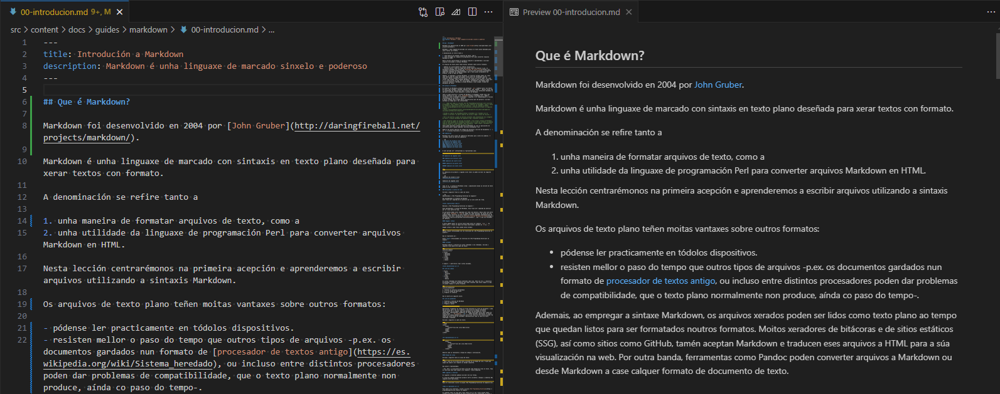

## Que é Markdown?

Markdown foi desenvolvido en 2004 por [John Gruber](http://daringfireball.net/projects/markdown/).

Markdown é unha linguaxe de marcado con sintaxis en texto plano deseñada para xerar textos con formato.

A denominación se refire tanto a

1. unha maneira de formatar arquivos de texto, como a
2. unha utilidade da linguaxe de programación Perl para converter arquivos Markdown en HTML.

Nesta lección centrarémonos na primeira acepción e aprenderemos a escribir arquivos utilizando a sintaxis Markdown.

Os arquivos de texto plano teñen moitas vantaxes sobre outros formatos:

- pódense ler practicamente en tódolos dispositivos.
- resisten mellor o paso do tempo que outros tipos de arquivos -p.ex. os documentos gardados nun formato de [procesador de textos antigo](https://es.wikipedia.org/wiki/Sistema_heredado), ou incluso entre distintos procesadores poden dar problemas de compatibilidade, que o texto plano normalmente non produce, aínda co paso do tempo-.

Ademais, ao empregar a sintaxe Markdown, os arquivos xerados poden ser lidos como texto plano ao tempo que quedan listos para ser formatados noutros formatos. Moitos xeradores de bitácoras e de sitios estáticos (SSG), así como sitios como GitHub, tamén aceptan Markdown e traducen eses arquivos a HTML para a súa visualización na web. Por outra banda, ferramentas como Pandoc poden converter arquivos a Markdown ou desde Markdown a case calquer formato de documento de texto.

## Sintaxe en Markdown

Os arquivos en Markdown gárdanse coa extensión `.md` e pódense abrir nun editor de texto como TextEdit, Notepad, Sublime Text, Vim, VSCode,... Moitos sitios web ou plataformas de publicación tamén ofrecen editores e/ou extensións baseados na web para introducir texto mediante a sintaxe de Markdown.

Tamén se pode practicar a sintaxe de Markdown no navegador usando algún dos moitos editores en liña. p.ex. [StackEdit](https://stackedit.io/). Poderás introducir texto formatado en Markdown á esquerda e ver inmediatamente a versión interpretada ao seu carón, á dereita.

Tamén podes descubrir moitos editores de Markdown en liña ou aplicacións de escritorio para o mesmo cometido: escritura documental áxil.

Ademáis hai moitos editores de código que permiten a escrita de documentos **``*.md``** e incluso facilitan a súa previsualización.

O editor VSCode tamén dispón desta caracteristica que che permitirá escribir markdown ao tempo que o ves interpretado:


<center><small>Mentres o panel da dereita representa a versión máis elegante do texto,&rarr;<br> &larr; o arquivo/código Markdown da esquerda segue sendo aínda moi lexible.</small></center>

### Cabeceiras

Markdown ten **catro niveis de cabeceiras** definidos polo número de simbolos `#` colocados antes do texto da cabeceira:

```md
# Cabeceira de primeiro nivel
## Cabeceira de segundo nivel
### Cabeceira de terceiro nivel
#### Cabeceira de cuarto nivel
```

E este marcado antrior será interpretado ou representado como:

# Cabeceira de primeiro nivel

## Cabeceira de segundo nivel

### Cabeceira de terceiro nivel

#### Cabeceira de cuarto nivel

---
---

As cabeceiras de primeiro e segundo nivel tamén se poden escribir do seguinte xeito:

```md
Cabeceira de primeiro nivel
==========================

Cabeceira de segundo nivel
--------------------------
```

Como se ve, a sintaxe de Markdown aínda é perfectamente lixible e comprensible mesmo na versión de texto plano ou sen interpretar.

### Parágrafos e saltos de liña

Podes probar a escribir unha frase como a seguinte no cadro de texto/código:

```md
Benvida á redación con Markdown!

Hoxe aprenderás a sintaxis de Mardown.
Un único salto de línea servirá para separar frases pero non parágrafos.
```

**Isto represéntase como:**

Benvida á redación con Markdown!

Hoxe aprenderás a sintaxis de Mardown.
Un único salto de línea servirá para separar frases pero non parágrafos.

Os parágrafos deben estar separados por unha liña baleira. Un salto de liña simple debe ir seguido con dous espazos en branco para que, nalgunhas implementacións de Markdown, se represente coma un salto de liña. Noutras implementacións non é necesario e interpretarase tamén coma salto de prarágrafo; como na [variante Flavored Markdown de GitHub](https://help.github.com/articles/github-flavored-markdown/).  
Verifica que módelo é o que usa o teu editor preferido por defecto.

### Engadir énfase

O texto pódese poñer en cursiva encerrándoo entre os símbolos `*` ou `-`. Do mesmo xeito, o texto en negriña escríbese encerrando a palabra entre `**` ou `__`.

Engade énfase a unha frase usando estes métodos:

```md
Estou **moi** contento e animado aprendedo a escribir _Markdown_!
```

**Que se representará así:**

Estou **moi** contento e animado aprendedo a escribir _Markdown_!

### Listados

Markdown admite a creación de listas ordenadas e non ordenadas. Escribe a seguinte lista dentro do cadro de texto:

```md
Lista da compra
---------------
* Frutas
  * Manzáns
  * Laranxas
  * Uvas
* Lácteos
  * Leite
  * Queixo
```

Ao sangrar o símbolo `*` podemos crear listas aniñadas.
Podemos usar o símbolo `-` en vez do símbolo `*`. O uso e resultado será igual.

**E se representará así:**

## Lista da compra

- Froita
  - Mazás
  - Laranxas
  - Uvas
- Lácteos
  - Leite
  - Queixo

As listas ordenadas escríbense numerando cada liña. Unha vez máis, o obxectivo de Markdown é producir documentos que sexan lexibles como texto simple e que tmén se poidan traducir a outros formatos.

```md
Lista de tarefas
------------------
1. Terminar o tutorial de Markdown
2. Ir ao supermercado
3. Preparar o xantar
```

Que se mostra do seguinte xeito:

## Lista de tarefas

1. Terminar o tutorial de Markdown
2. Ir ao supermercado
3. Preparar o xantar

### Representar anacos de código

Representar anacos de código de forma diferente ao resto do documento é unha boa práctica que o fai máis lixible. Para indicarlle a Markdown que distinga as fontes implicadas, representamos fragmentos de código encerrados entre dous signos de acento grave \`\` ... \`\`. Por exemplo: ``<br/>``. Cando queremos representar un bloque completo de código podemos encerralo entre dúas liñas de tres acentos graves.  
Na primeira liña tamén se pode engadir o tipo de código que queremos representar, o que axuda ao interprete a tratar mellor dito bloque:

Escribe o seguinte no teu editor de texto:

````
```html
<html>
    <head>
        <title>Título do sitio Web</title>
    </head>
    <body>
    </body>
</html>
```
````

**E representarase así:**

```html
    <html>
        <head>
            <title>Título do sitio Web</title>
        </head>
        <body>
        </body>
    </html>
```

### Bloque de cita

Escribe o seguinte no teu editor de texto. o simbolo `>` indicaralle ao interprete de Markdown que estas a crear un bloque de cita:

```md
> Ola. Este é un parágrafo de texto incluido nun bloque de cita. Fíxate que se usa un sangrado con respecto ao marxe esquerdo.
```

**E representarase así:**

> Ola. Este é un parágrafo de texto incluido nun bloque de cita. Fíxate que se usa un sangrado con respecto ao marxe esquerdo.

### Ligazóns a Internet

As ligazóns a Internet pódense escribir de dúas formas.

O título da ligazón encóntrase primeiro entre corchetes e despois o enderezo URL completo entre parénteses.

```md
Para ver máis tutoriales visita a páxina [MegaBoot](https://dreary-main-hbb3lk83l-nunhes-gzs-projects.vercel.app/).
```

**Que se representa así:**

Para ver máis tutoriales visita a páxina [MegaBoot](https://dreary-main-hbb3lk83l-nunhes-gzs-projects.vercel.app/).

As ligazóns tamén se usan para crear notas ao pé e son útiles porque tamén axudan a que o teu documento de texto sinxelo quede máis organizado. As **notas a pé de páxina** están escritas cun par adicional de corchetes co número de referencia para establecer a ligazón que identifica a etiqueta.

```md
Atoparás varios exemplos de notas ao pé en *[MegaBoot][^1]*
```

Despois podes incluír a URL noutro lugar (ao pé) do documento:

```md
[^1]: https://dreary-main-hbb3lk83l-nunhes-gzs-projects.vercel.app/
```

**E se representará así:**

Atoparás varios exemplos de notas ao pé en _[MegaBoot][^1]_

### Imaxes

As imaxes pódense referenciar usando `!`, seguido de texto alternativo entre corchetes, seguido da URL da imaxe e un título opcional entre comiñas. Isto non se mostrará como texto no teu documento, pero permitirache incluír a imaxe na visualización dunha páxina HTML.

```md

```

**Isto aparece como:**


### Regras e liñas horizontais

Podes incluír liñas horizontais se escribes na mesma liña algún dos tres signos seguintes: `-`, `*` ou `_`, independentemente dos espazos que deixes entre eles. Calquera destas combinacións xerará unha liña horizontal:

```md
___

* * *
- - - - - -
```

**É representarase:**

___

* * *

- - - - - -

### Táboas

A versión básica de Markdown non inclúe táboas. Non obstante, algúns sitios web e aplicacións usan variantes de Markdown que poden incluír táboas e outras funcións especiais. [GitHub Flavored Markdown](https://help.github.com/articles/github-flavored-markdown/) é unha destas variantes e úsase para ver arquivos `.md` no navegador do sitio GitHub.

Para crear unha táboa en GitHub, usa barras verticais `|` para separar columnas e guións entre as cabeceiras e o resto do contido da táboa. Dado que as barras verticais só son estrictamente necesarias entre as columnas, podes usalas nos extremos da táboa para darlle unha vista máis acabada. As celas poden conter contido de calquera lonxitude e as barras verticais non precisan estar aliñadas verticalmente entre si.

```md
| Encabezado 1 | Encabezado 2 | Encabezado 3 |
| --------- | --------- | --------- |
| renglón 1, columna 1 | renglón 1, columna 2 | renglón 1, columna 3|
| renglón 2, columna 1 | renglón 2, columna 2 | renglón 2, columna 3|
| renglón 3, columna 1 | renglón 3, columna 2 | renglón 3, columna 3|
```

**Isto parece isto:**

| Encabezado 1 | Encabezado 2 | Encabezado 3 |
| --------- | --------- | --------- |
| renglón 1, columna 1 | renglón 1, columna 2 | renglón 1, columna 3|
| renglón 2, columna 1 | renglón 2, columna 2 | renglón 2, columna 3|
| renglón 3, columna 1 | renglón 3, columna 2 | renglón 3, columna 3|

Para especificar o aliñamento do contido de cada columna, pódense engadir dous puntos `:` á fila de cabeceira do seguinte xeito:

```md
| Aliñado á esquerda | Centrado | Aliñado á dereita |
| :----------------- | :------: | ----------------: |
| Mazás              | vermello |                50 |
| Plátanos           | amarelo  |                75 |
```

Que se representa deste xeito:

| Aliñado á esquerda | Centrado | Aliñado á dereita |
| :----------------- | :------: | ----------------: |
| Mazás              | vermello |                50 |
| Plátanos           | amarelo  |                75 |

## Limitacións de Markdown

Aínda que Markdown é cada vez máis popular, especialmente para os documentos con formato que se poden ver na web, moitas persoas e editores aínda solicitan arquivos tradicionais en Word, PDF e outros formatos. Isto pódese solucionar en parte usando ferramentas de conversión en liña como [Pandoc](http://johnmacfarlane.net/pandoc/). Non obstante, algunhas funcións do procesador de textos, como o seguimento dos cambios, aínda non son compatibles. Para obter máis información sobre Pandoc, visita a lección de Historia da programación en español sobre [a escritura sostible en texto plano usando Pandoc e Markdown .](https://programminghistorian.org/es/lecciones/escritura-sostenible-usando-pandoc-y-markdown)

### Conclusións

Markdown é unha vía intermedia útil entre arquivos de texto simple sen estilo e documentos de procesadores de textos. A súa sintaxe sinxela apréndese rapidamente e é moi lexible no mesmo documento e cando se transforma en HTML ou noutro tipo de documentos. En conclusión, escribir os teus documentos en Markdown significa que poderán ser usados e lidos a longo prazo.

---
Notas ao pé:
[1]: <https://dreary-main-hbb3lk83l-nunhes-gzs-projects.vercel.app/>

\_*ref:*

- _<https://programminghistorian.org/es/lecciones/>_
- _[Escritura sostible usando Pandoc e Markdown](https://programminghistorian.org/es/lecciones/escritura-sostenible-usando-pandoc-y-markdown), de Dennise Tenen e Grant Wythoff._
- _[Introdución á liña de comandos en Bash](https://programminghistorian.org/es/lecciones/introduccion-a-bash)_
