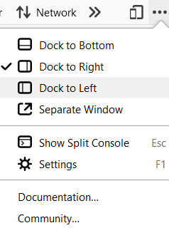
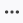
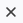
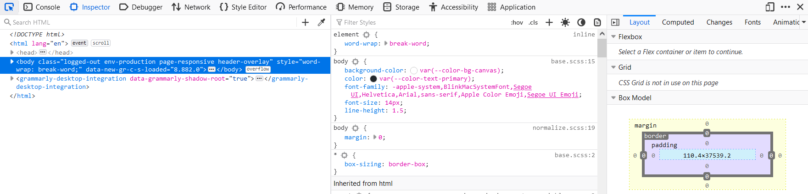
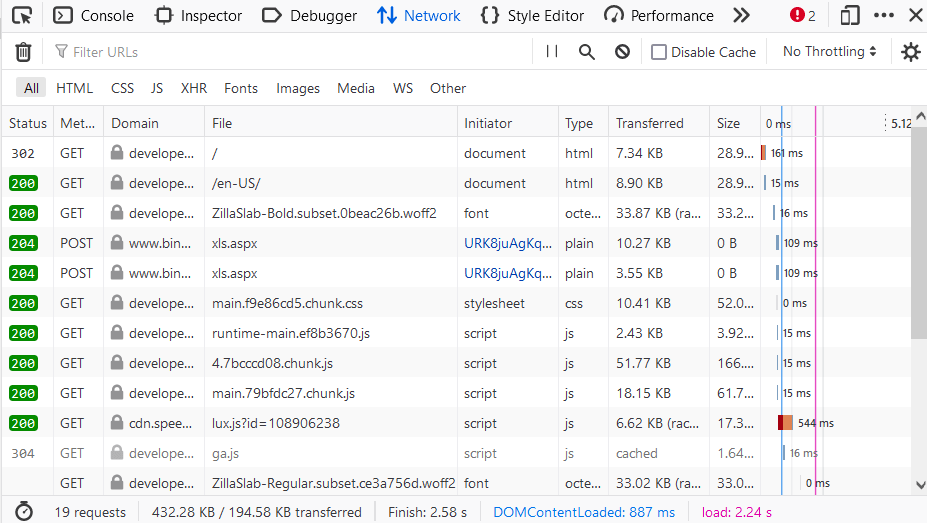

**Firefox Developer Tools** é un conxunto de **ferramentas de desenvolvemento web integradas** en Firefox. Podes úsalos para examinar, editar e depurar HTML, CSS e JavaScript.

## As ferramentas básicas

Podes abrir as **Ferramentas para programadores de Firefox** no menú seleccionando **Ferramentas > Desenvolvedor web > Ferramentas para desenvolvedores web** ou usar o atallo de teclado `Ctrl+Shift+I` ou `F12` en Windows e Linux, ou `Cmd+Opt+I`en macOS.

O menú de puntos suspensivos da parte dereita das **Ferramentas para programadores** contén varios comandos que che permiten realizar accións ou cambiar a configuración da ferramenta.

| Icona | Descrición |
| ------------------------------------------------------------ | ------------------------------------------------------------ |
|  | Este botón só aparece cando hai varios iframes nunha páxina. Fai clic nel para ver a lista dos iframes da páxina actual e selecciona aquel no que queres traballar. |
|  | Fai clic neste botón para facer unha captura de pantalla da páxina actual. ( *Nota:* esta función non está activada por defecto, debe ser activada na configuración para que apareza a icona.) |
|  | Activa o modo de deseño receptivo                            |
|  | Abre o menú que inclúe opcións de acoplamento, a posibilidade de amosar ou agochar a consola dividida e a configuración das Ferramentas para programadores. O menú tamén inclúe ligazóns á documentación de Firefox Web Tools e da comunidade Mozilla. |
|  | Pecha as ferramentas para programadores                      |

### Inspector da páxina

Ver e editar o contido e o deseño da páxina. Visualiza moitos aspectos da páxina, incluíndo o modelo de caixa, animacións e deseños de cuadrícula.

### Consola web

Desde aquí poderás consultar as mensaxes rexistradas por unha páxina web e interactuar coa páxina mediante JavaScript.

### Depurador de JavaScript

Deter, avanzar e examinar o JavaScript que se está executando nunha páxina.

### Monitor de rede

Consultar as solicitudes de rede realizadas cando se carga unha páxina.

### Panel de rendemento

Analizar a capacidade de resposta xeral, JavaScript e o rendemento do deseño do teu sitio.

### Modo de deseño sensible

Consulta como se verá e se comportará o teu sitio web ou aplicación en diferentes dispositivos e tipos de rede.

### Inspector de accesibilidade

Ofrece un medio para acceder á árbore de accesibilidade da páxina, o que che permite comprobar o que falta ou que precisa atención.

### Panel de aplicacións

Ofrece ferramentas para inspeccionar e depurar aplicacións web modernas (tamén coñecidas como [aplicacións web progresivas](https://developer.mozilla.org/en-US/docs/Web/Progressive_web_apps) ). Isto inclúe a inspección dos [traballadores do servizo](https://developer.mozilla.org/en-US/docs/Web/API/Service_Worker_API) e [os manifestos das aplicacións web](https://developer.mozilla.org/en-US/docs/Web/Manifest)

> :spiral_notepad:
>
> O termo colectivo para a interface de usuario no que viven todas as DevTools é a [Caixa de ferramentas](https://firefox-source-docs.mozilla.org/devtools-user/tools_toolbox/index.html)

## Máis Ferramentas

Estas seguintes ferramentas para desenvolvedores tamén están integradas en Firefox. A diferenza das "Ferramentas básicas" anteriores, é posible que non as uses todos os días.

| Ferramenta | Descrición |
| ------------------------------------------------------------ | ------------------------------------------------------------ |
| [Memoria](https://firefox-source-docs.mozilla.org/devtools-user/memory/index.html) | Descubra cales son os obxectos que manteñen a memoria en uso. |
| [Inspector de almacenamento](https://firefox-source-docs.mozilla.org/devtools-user/storage_inspector/index.html) | Inspecciona as cookies, o almacenamento local, a base de datos indexada e o almacenamento de sesións presentes nunha páxina. |
| [Visor de propiedades DOM](https://firefox-source-docs.mozilla.org/devtools-user/dom_property_viewer/index.html) | Inspeccione as propiedades, funcións, etc. do DOM da páxina. |
| [Contagotas](https://firefox-source-docs.mozilla.org/devtools-user/eyedropper/index.html) | Seleccione unha cor da páxina.                               |
| [Editor de estilos](https://firefox-source-docs.mozilla.org/devtools-user/style_editor/index.html) | Ver e editar estilos CSS para a páxina actual.               |
| [Captura de pantalla](https://firefox-source-docs.mozilla.org/devtools-user/taking_screenshots/index.html) | Fai unha captura de pantalla de toda a páxina ou dun só elemento. |
| [Medir unha parte da páxina](https://firefox-source-docs.mozilla.org/devtools-user/measure_a_portion_of_the_page/index.html) | Mide unha área específica dunha páxina web.                  |
| [Regras](https://firefox-source-docs.mozilla.org/devtools-user/rulers/index.html) | Superpoñer regras horizontais e verticais nunha páxina web   |
| [Formatadores personalizados](https://firefox-source-docs.mozilla.org/devtools-user/custom_formatters/index.html) | Personaliza a forma en que se mostran os obxectos dentro de DevTools. |

