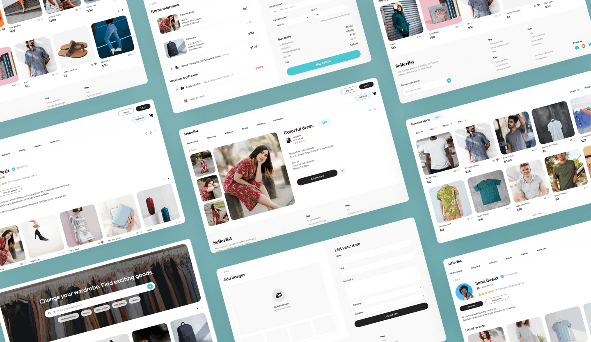
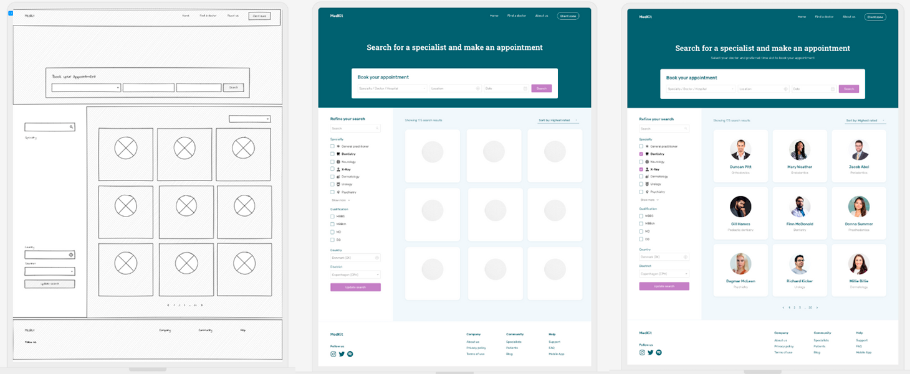
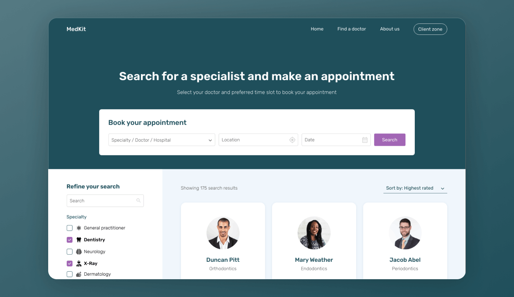
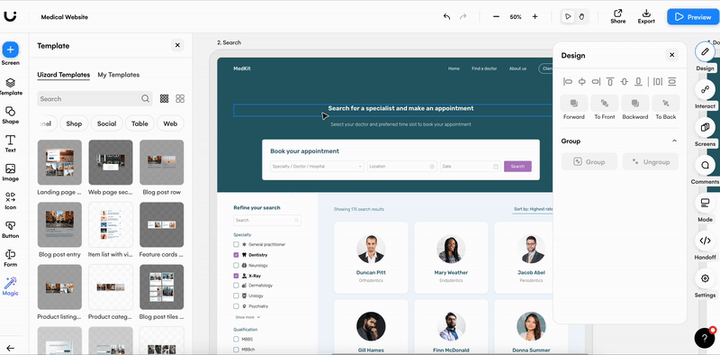
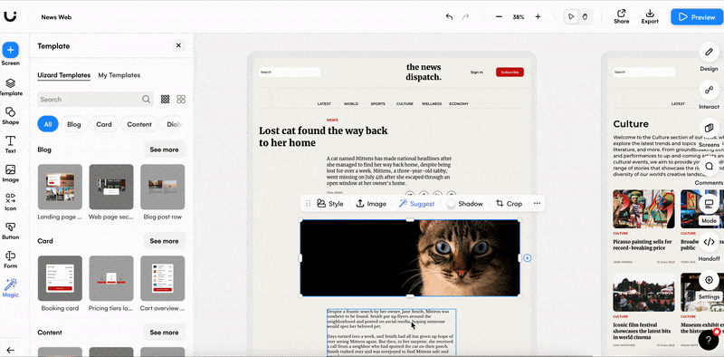
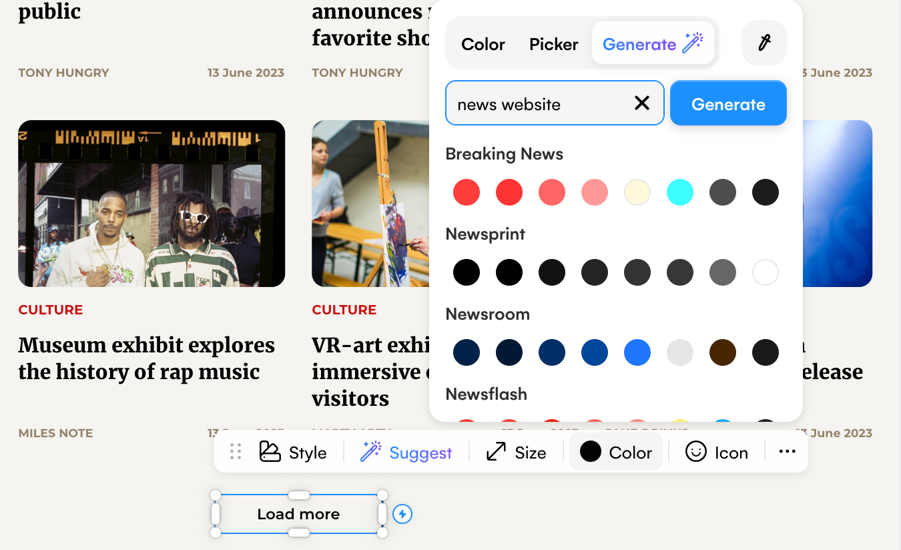
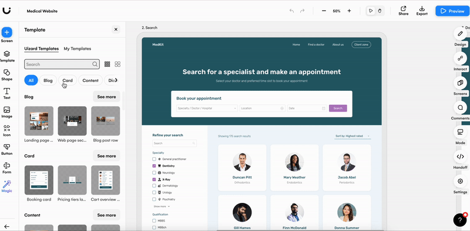

Déamonos conta ou non, o deseño de sitios web é algo ao que a maioría dos usuarios en liña estamos expostos e moi acostumados. Os botóns nos que facemos clic, a barra de navegación que usamos e a estética xeral que nos atrae, foron todos elaborados e deseñados por un deseñador/programador web.

Os usuarios esperan deseños de sitios web de gran calidade, e por que non? Coas moitas ferramentas de deseño web que hai no mercado, calquera podería deseñar un excelente sitio web. Ou iso parece.

Se a túa empresa ten unha presenza en expansión nas redes sociais e estás buscando o seguinte paso, ou se decidiches que finalmente é hora de crear o teu propio blog en liña, entender que é o deseño web será un dos primeiros pasos que terás que dar. 

Vexamos logo, por que o deseño web é tan importante e como podes iniciarte nesta disciplina e na industria.

## Que é o deseño de sitios web?

**O deseño de sitios web é o proceso de deseñar a estética, a funcionalidade e a UX dun sitio web.** 

Moitas empresas usan o deseño web para promocionar os seus produtos, servizos, artigos e moito máis, polo que é importante asegurarse de que un deseño web sexa, ademais de atractivo, fácil de usar e comprensible.

O distribución de contidos, a tipografía, a cor, a marca e as opcións dos compoñentes contribúen ao deseño web. E cando os xuntamos, esperamos ofrecer a mellor experiencia de usuario. 

Os deseñadores web usan ferramentas de deseño de IU para crear deseños web. Comezando cun bosquexo aproximado - wireframe-, os deseñadores web acaban cun prototipo finalizado que poden compartir con desenvolvedores web, clientes e membros do equipo.

### Que é UX no deseño web?

Ao crear un deseño web, terás que ter en conta a UX para crear un sitio amigable. **UX significa *experiencia do usuario* e tense en conta no deseño web para garantir que os usuarios poidan navegar eficazmente por un sitio web, así como dixerir a información que se lles proporciona.** Un bo deseño web de UX comprende as necesidades dun usuario e serve para axudalo a alcanzar o seu obxectivo final - que é tamén o obxectivo da empresa!-.

### Deseño web vs desenvolvemento web: cal é a diferenza?

O deseño web e o desenvolvemento web son dúas etapas distintas na creación dun sitio web. A pesar deste feito, adoitan confundirse entre si ou **agruparse como un proceso**. Despois de que un deseñador web complete o seu proxecto, o deseño do sitio web pasa a un desenvolvedor web que crea o sitio guiado por ese deseño e garante a interactividade total dos usuarios que acceden ao sitio web. 

Mentres que o deseño web se encarga de darlle forma á imaxe total dun sitio web, o desenvolvemento web é o proceso de converter ese deseño nun sitio web utilizable mediante o acceso a través da rede.

## Por que é importante o deseño web?

O deseño web é o primeiro que verán os usuarios cando accedan a un sitio. Tanto se estás a deseñar para a túa propia marca, un proxecto persoal ou para un cliente, as primeiras impresións son clave. 

Un deseño web reflicte a túa marca, produto, servizo e todo o que tes para ofrecer, polo que un deseño web xenial asegurará que os teus usuarios sigan volvendo por máis. 

Outra razón pola que o deseño web é importante é o fluxo de usuarios. Cun deseño web podes trazar con precisión a viaxe do usuario, e isto é esencial para UX: sen o deseño a navegación do sitio web sería inintelixible ou a UX simplemente non existiría.

## Cal é o proceso de deseño web?

Desde [o wireframe ata a maqueta e ata o prototipo](https://uizard.io/blog/wireframe-vs-mockup-vs-prototype/) , o deseño dun sitio web implica unha serie de pasos. E de cada un deles vai a depender que o resultado final sexa óptimo. 

Pero que significan estes termos en relación ao deseño web?

- Os bosquexos ou [wireframes](https://uizard.io/blog/website-wireframing-a-step-by-step-guide/) son só un esbozo aproximado do deseño e actúan como un borrador. Os wireframes poden sufrir todo tipo de cambios e soportar a crítica e admitir os comentarios antes de chegar á fase de maqueta.
- Unha [maqueta web](https://uizard.io/blog/4-ways-to-create-a-website-design-mock-up-even-if-you-have-no-design-experience/) usa máis detalles que un wireframe e inclúe cores, texto e imaxes, así como compoñentes máis definidos. E de novo, as maquetas pasarán por varias fases de iteración antes de chegar á fase de prototipo.
- [A creación de prototipos de deseño web](https://uizard.io/blog/how-to-design-a-website-prototype/) é o paso final antes de completar un deseño web. O prototipo céntrase en presentar como sería un sitio web contando tamén cos cambios ou resultados da interacción dun usuario co deseño.

<small>Do wireframe dun sitio web á maqueta e ao prototipo</small>

## Que fai bo un deseño web?

Que podes facer para diferenciar o teu deseño web dos millóns de persoas en liña? Ben, hai algunhas [prácticas recomendadas de deseño de sitios web](https://uizard.io/blog/five-website-design-best-practices-and-what-they-mean-in-2021/) que podes seguir para garantir que o deseño do teu sitio sexa o mellor posible:  

### - Disposición sen desorde

A maioría dos deseños de sitios web seguen unha estrutura moi similar. A cabeceira está, por suposto, na parte superior coa barra de navegación, o pé de páxina está na parte inferior e todas as seccións intermedias son de xogo libre. O problema con isto xorde cando se pretende engadir demasiada información de golpe ou se desordena o deseño. **O deseño dun sitio web debe ser sinxelo de entender e lóxico.** E o sinxelo non é sempre fácil.

<small>Modelo de sitio web médico de Uizard que demostra un deseño sen desorden</small>

### - Tipografía

A tipografía é simplemente a aparencia do texto e inclúe o tipo de letra, o tamaño do texto, o interliñado ou o aspecto de maiúsculas e minúsculas. A tipografía utilízase no deseño web para distinguir entre títulos, subtítulos e o corpo principal do texto. Sen esta xerarquización, o contido dun deseño web sería moi difícil de ler e entender.

Destacar áreas de texto, como títulos, para garantir que a atención do usuario atenda primeiro certos contidos e elementos. Destacar para os usuarios seccións importantes de texto axuda a que os usuarios coñezan os conceptos básicos da marca ou negocio, e o texto debe facerllo fácil para que se mergulle e coñeza máis sobre a túa marca, produto ou servizo.

Por exemplo, un título debe ser notablemente máis grande que outras áreas de texto, pode estar en negriña, ter letras en maiúscula ou empregar un tipo de letra diferente. 

<small>A tipografía é esencial no deseño web</small>

### - Compoñentes correctamente aliñados

O aliñamento é un aspecto clave do deseño web. Ter títulos non aliñados, ou un formulario nó que non coincide o aliñamento dos elementos ou hai diferenzas nas marxes esquerda e dereita, non só fará que o teu deseño web pareza pouco profesional, senón que tamén afectará á UX. Usando un aliñamento coherente axuda a guiar aos usuarios polas páxinas do sitio web de forma lóxica e a facerlles fáciles as cousas.

<small>Aliñar elementos usando fundamentos de composición visual</small>

### - Opcións de cores

A cor é unha parte esencial de case todos os deseños, e é especialmente importante nó deseño web. Se estás a deseñar un sitio para un cliente, as cores que escollas para o teu sitio deberían aliñarse coa súa marca e cos gustos do público obxectivo. O mesmo pódese dicir para a creación de proxectos persoais de deseño web, polo que sempre debes considerar para quen estás a deseñar.

De aí que sexa moi habitual delimitar a paleta ou cantidade de cores a empregar nun sitio web, reflexionando sobre para que imos a empregar cada un deles, o nivel de contraste, o significado psicolóxico ou cultural da cor,...

<small>A cor é un elemento expresivo decisivo no deseño web</small>

### - Compoñentes e elementos IU axeitados

As compoñentes IU que elixas afectarán a navegación do usuario ao longo do teu deseño web, polo que é importante facelo ben. Por exemplo, a maioría dos deseños de sitios web usan unha combinación de compoñentes de cabeceira e elementos como botóns para ofrecer aos usuarios varias formas de moverse entre páxinas web ou interactuar co contido. As imaxes son outro complemento esencial para o deseño web, só asegúrate de que as túas imaxes sexan de alta calidade e relevantes.

<small>Dispor de modelos ou compoñentes asegura a coherencia do deseño do sitio web</small>

### - Deseño accesibilidade e inclusión

É importante ter en conta que non todos os usuarios son iguais. E aínda que isto poida parecer obvio, moitos deseños web poden acabar alienando a grupos de usuarios porque non atenderon a todas as capacidades. [O deseño web accesible](https://uizard.io/blog/how-to-create-an-accessible-web-design/) é o acto de acoller a todos os usuarios, independentemente das discapacidades, diferenzas culturais ou demográficas e outros factores. Polo tanto, ao deseñar un sitio web importa asegurarse de que sexa accesible e inclusivo para todos os usuarios.

## Como entrar no deseño web

Crear deseños web efectivos require algo de práctica. Non obstante, hai algúns pasos que podes seguir para facer máis rápido o camiño para [converterte nun deseñador de IU](https://uizard.io/blog/how-to-become-a-ui-designer/) .

- **Coñece a materia:** os cursos en liña ou presenciais poden proporcionar unha excelente base para os novos deseñadores web. Ler artigos de expertos tamén pode ser beneficioso.
- **Practica coas ferramentas:** o uso de distintas ferramentas de deseño web é un excelente punto de partida para os novizos. Podes xogar coa tipografía, o aliñamento e a estética sen sentir a presión de deseñar para un cliente.
- **Adquirir experiencia:** a experiencia en deseño web é valiosa en calquera fase, pero especialmente ao comezo. Crea os teus sitios autónomos xa que son unha boa forma de aumentar o teu currículo e tamén de practicar co deseño.

---

_ref:_ [Uizard](https://uizard.io/)
       [Templates]](https://uizard.io/templates/website-templates/) 

---